**Оглавление**

> Введение
> \...\...\...\...\...\...\...\...\...\...\...\...\...\...\...\...\...\...\...\...\...\...\...\...\...\...\...\...\...\...\...\...\...\...\...\...\...\...\...\...\...\...\...\...\.....
> 4
>
> 1\. Исследовательский раздел
> \...\...\...\...\...\...\...\...\...\...\...\...\...\...\...\...\...\...\...\...\...\...\...\...\...\...\...\...\...\...\...\...\...\.....
> 5
>
> 1.1. Исследование предметной области
> \...\...\...\...\...\...\...\...\...\...\...\...\...\...\...\...\...\...\...\...\...\...\...\...\...\...\...\.....
> 5
>
> 1.1.1 Описание типового предприятия
> \...\...\...\...\...\...\...\...\...\...\...\...\...\...\...\...\...\...\...\...\...\...\...\...\...\...\...\...\....
> 5
>
> 1.1.2. Описание существующего предприятия
> \...\...\...\...\...\...\...\...\...\...\...\...\...\...\...\...\...\...\...\...\...\...\...\...\...
> 9
>
> 1.2. Схема информационных потоков
> \...\...\...\...\...\...\...\...\...\...\...\...\...\...\...\...\...\...\...\...\...\...\...\...\...\...\...\...\...
> 13
>
> 1.3. Маршруты документов
> \...\...\...\...\...\...\...\...\...\...\...\...\...\...\...\...\...\...\...\...\...\...\...\...\...\...\...\...\...\...\...\...\...\.....
> 16
>
> 2\. Аналитический раздел
> \...\...\...\...\...\...\...\...\...\...\...\...\...\...\...\...\...\...\...\...\...\...\...\...\...\...\...\...\...\...\...\...\...\...\...\...
> 20
>
> 2.1. Логическая структура базы данных
> \...\...\...\...\...\...\...\...\...\...\...\...\...\...\...\...\...\...\...\...\...\...\...\...\...\...\...\...
> 20
>
> 2.2. Проектирование шаблонов документов
> \...\...\...\...\...\...\...\...\...\...\...\...\...\...\...\...\...\...\...\...\...\...\...\...\.....
> 23
>
> 2.2.1. Текстовый документ «Договор оказания услуг перевозки»
> \...\...\...\...\...\...\...\...\...\...\...\...\..... 24
>
> 2.2.2. Текстовый документ «Отчет по компании»
> \...\...\...\...\...\...\...\...\...\...\...\...\...\...\...\...\...\...\...\...\...\....
> 27
>
> 2.2.3 Табличный документ «Текущая занятость»
> \...\...\...\...\...\...\...\...\...\...\...\...\...\...\...\...\...\...\...\...\...\.....
> 28
>
> 3\. Технологический раздел
> \...\...\...\...\...\...\...\...\...\...\...\...\...\...\...\...\...\...\...\...\...\...\...\...\...\...\...\...\...\...\...\...\...\...\...
> 29
>
> 3.1. Работа с базой
> данных\...\...\...\...\...\...\...\...\...\...\...\...\...\...\...\...\...\...\...\...\...\...\...\...\...\...\...\...\...\...\...\...\...\...\....
> 29
>
> 3.2. Работа веб-приложения
> \...\...\...\...\...\...\...\...\...\...\...\...\...\...\...\...\...\...\...\...\...\...\...\...\...\...\...\...\...\...\...\...\...\.....
> 35
>
> 3.2.1. Отображение данных
> \...\...\...\...\...\...\...\...\...\...\...\...\...\...\...\...\...\...\...\...\...\...\...\...\...\...\...\...\...\...\...\...\...\.....
> 35
>
> 3.2.2. Добавление данных
> \...\...\...\...\...\...\...\...\...\...\...\...\...\...\...\...\...\...\...\...\...\...\...\...\...\...\...\...\...\...\...\...\...\...\.....
> 41
>
> 3.2.3. Генерация текстового документа «Договор оказания услуг
> перевозки» \...\...\...\...\...\...\... 46
>
> 3.2.4. Генерация «Отчета по компании» с настаиваемыми фильтрами.
> \...\...\...\...\...\...\...\...\...\..... 48
>
> 3.2.5. Генерация табличного документа «Текущая занятость»
> \...\...\...\...\...\...\...\...\...\...\...\...\...\...\..... 50
>
> 3.2.6. Редактирование данных
> \...\...\...\...\...\...\...\...\...\...\...\...\...\...\...\...\...\...\...\...\...\...\...\...\...\...\...\...\...\...\...\...\....
> 52
>
> 3.2.7. Отправка электронного письма
> \...\...\...\...\...\...\...\...\...\...\...\...\...\...\...\...\...\...\...\...\...\...\...\...\...\...\...\...\....
> 56
>
> 3.2.8. Корректная аутентификация и ограничение доступа к просмотру
> \...\...\...\...\...\...\...\...\...\... 58
>
> Заключение
> \...\...\...\...\...\...\...\...\...\...\...\...\...\...\...\...\...\...\...\...\...\...\...\...\...\...\...\...\...\...\...\...\...\...\...\...\...\...\...\...\...\...\.....
> 60
>
> Приложение А
> \...\...\...\...\...\...\...\...\...\...\...\...\...\...\...\...\...\...\...\...\...\...\...\...\...\...\...\...\...\...\...\...\...\...\...\...\...\...\...\...\...\...
> 61
>
> Приложение Б
> \...\...\...\...\...\...\...\...\...\...\...\...\...\...\...\...\...\...\...\...\...\...\...\...\...\...\...\...\...\...\...\...\...\...\...\...\...\...\...\...\...\...
> 64
>
> **Введение**

+-------------+-------------+-------------+-------------+-------------+
| >           | компании,   | з           | перевозкой  | > вещей,    |
| Современные |             | анимающиеся |             |             |
+=============+=============+=============+=============+=============+
+-------------+-------------+-------------+-------------+-------------+

> сталкиваются с множеством сложностей, связанных с управлением
> документами и рабочими процессами. Эффективная автоматизация данных
> процессов является ключевым фактором для повышения производительности
> и качества предоставляемых услуг. В условиях растущей конкуренции и

+---------+---------+---------+---------+---------+---------+---------+
| возра   | тре     | кл      | спос    | быстро  | и       | > точно |
| стающих | бований | иентов, | обность |         |         |         |
+=========+=========+=========+=========+=========+=========+=========+
+---------+---------+---------+---------+---------+---------+---------+

> обрабатывать информацию становится критически важной.
>
> Данная курсовая работа посвящена разработке подсистемы управления
> документами и рабочими потоками для службы перевозки вещей. Основной
> целью является создание функционального веб-приложения, которое
> позволит автоматизировать процессы, связанные с обработкой информации
> о сотрудниках, клиентах, договорах и отчетах.
>
> В результате разработки должны создать гибкую и надежную систему
> управления документами и рабочими потоками, которая значительно
> улучшает внутренние процессы службы перевозки вещей. Ожидается, что
> внедрение данной подсистемы приведет к снижению временных и трудовых
> затрат, повышению точности и скорости выполнения операций.

4

> **1. Исследовательский раздел**\
> **1.1. Исследование предметной области**\
> **1.1.1 Описание типового предприятия**\
> Служба перевозки вещей --- это специализированная коммерческая
>
> организация, которая предоставляет услуги по перевозке различных
> грузов,
>
> предметов и вещей. Такие службы могут заниматься как междугородными,
> так
>
> и международными перевозками, а также осуществлять услуги по перевозке
> внутри города или региона.
>
> Характеристика службы перевозки вещей может включать следующие
> основные аспекты:\
> − типы услуг: службы перевозки вещей могут предоставлять
>
> различные типы услуг, включая перевозку крупногабаритных грузов,
> переезды, доставку мебели, перевозку товаров для бизнеса и прочее;\
> − транспортные средства: в зависимости от специфики предприятия, могут
> использоваться различные транспортные средства: грузовики, фургоны,
> специализированные автомобили для перевозки определенных типов грузов;
> − услуги упаковки и погрузки: многие службы перевозки вещей
>
> предоставляют услуги по упаковке и погрузке грузов, чтобы обеспечить
> их безопасность во время транспортировки;\
> − страхование грузов: некоторые службы предлагают услуги по
>
> страхованию грузов для обеспечения компенсации в случае повреждения
> или утраты груза во время перевозки;\
> − услуги отслеживания груза: некоторые службы перевозки
>
> предоставляют возможность отслеживать статус и местоположение груза в
> режиме реального времени для удобства клиентов.
>
> Типовая организационная структура службы перевозки вещей (на уровне
> отделов) представлена на рисунке 1.1.

5

  ---------------------------------------------------------------------------------------------
  {width="5.241666666666666in"
  height="7.408333333333333in"}
  ---------------------------------------------------------------------------------------------

  ---------------------------------------------------------------------------------------------

> Рисунок 1.1 -- Организационная структура службы перевозки вещей
> Типовой перечень бизнес-процессов службы доставки вещей в привязке к
> отделам, реализующим данный процесс, представлен в таблице 1.1.
> Определены основные (ориентированные на оказание услуги, являющейся

+-------------+-------------+-------------+-------------+-------------+
| > целевым   | объектом    | создания    | пр          | > вспо      |
|             |             |             | едприятия), | могательные |
+=============+=============+=============+=============+=============+
+-------------+-------------+-------------+-------------+-------------+

> (предназначенные для жизнеобеспечения основных), обеспечивающие

6

> бизнес-процессы (поддерживающие инфраструктуру компании) и
> бизнес-процессы управления.
>
> Таблица 1.1 ‒ Типовой перечень бизнес-процессов риэлторской компании

+-----------------------+-----------------------+-----------------------+
| > Категория           | > Бизнес-процессы     | > Основной отдел      |
+=======================+=======================+=======================+
| > Основные            | > Прием и обработка   | > Отдел приема        |
| > бизнес-процессы     | > заказов             | > заказов Отдел       |
|                       |                       | > маршрутизации и     |
|                       |                       | > планирования        |
+-----------------------+-----------------------+-----------------------+
|                       | > Планирование и      | > Отдел маршрутизации |
|                       | > организация         | > и планирования\     |
|                       | > перевозок           | > Логистический отдел |
|                       |                       | >                     |
|                       |                       | > Отдел отслеживания  |
|                       |                       | > грузов              |
+-----------------------+-----------------------+-----------------------+
|                       | > Оценка груза и      | <table>               |
|                       | > согласование        | <colgroup>            |
|                       | > стоимости           | <col                  |
|                       |                       | style="width: 33%" /> |
|                       |                       | <col                  |
|                       |                       | style="width: 33%" /> |
|                       |                       | <col                  |
|                       |                       | style="width: 33%" /> |
|                       |                       | </colgroup>           |
|                       |                       | <thead>               |
|                       |                       | <tr class="header">   |
|                       |                       | <th><blockquote>      |
|                       |                       | 
Отдел
          |
|                       |                       | </blockquote></th>    |
|                       |                       | <th>связи</th>        |
|                       |                       | <th>с</th>            |
|                       |                       | </tr>                 |
|                       |                       | </thead>              |
|                       |                       | <tbody>               |
|                       |                       | </tbody>              |
|                       |                       | </table>              |
|                       |                       |                       |
|                       |                       | > клиентами           |
|                       |                       | >                     |
|                       |                       | > Отдел приема        |
|                       |                       | > заказов             |
+-----------------------+-----------------------+-----------------------+
|                       | Подготовка груза к    | > Отдел логистики     |
|                       | перевозке             |                       |
+-----------------------+-----------------------+-----------------------+
|                       | > Страхование груза   | > Финансовый отдел    |
+-----------------------+-----------------------+-----------------------+
| > Вспомогательные     | > Реклама и маркетинг | > Маркетинговый отдел |
| > бизнес-процессы     |                       |                       |
+-----------------------+-----------------------+-----------------------+
|                       | > Финансовое          | > Финансовый отдел    |
|                       | > планирование        |                       |
+-----------------------+-----------------------+-----------------------+
|                       | > Наем и обучение     | > Отдел кадров        |
|                       | > персонала           |                       |
+-----------------------+-----------------------+-----------------------+
|                       | > Обработка платежей  | > Финансовый отдел    |
+-----------------------+-----------------------+-----------------------+
|                       | > Проверка качества   | <table>               |
|                       | > оказанных услуг     | <colgroup>            |
|                       |                       | <col                  |
|                       |                       | style="width: 33%" /> |
|                       |                       | <col                  |
|                       |                       | style="width: 33%" /> |
|                       |                       | <col                  |
|                       |                       | style="width: 33%" /> |
|                       |                       | </colgroup>           |
|                       |                       | <thead>               |
|                       |                       | <tr class="header">   |
|                       |                       | <th><blockquote>      |
|                       |                       | 
Отдел
          |
|                       |                       | </blockquote></th>    |
|                       |                       | <th>связи</th>        |
|                       |                       | <th>с</th>            |
|                       |                       | </tr>                 |
|                       |                       | </thead>              |
|                       |                       | <tbody>               |
|                       |                       | </tbody>              |
|                       |                       | </table>              |
|                       |                       |                       |
|                       |                       | > клиентами           |
+-----------------------+-----------------------+-----------------------+
|                       | <table>               | > Финансовый отдел    |
|                       | <colgroup>            |                       |
|                       | <col                  |                       |
|                       | style="width: 33%" /> |                       |
|                       | <col                  |                       |
|                       | style="width: 33%" /> |                       |
|                       | <col                  |                       |
|                       | style="width: 33%" /> |                       |
|                       | </colgroup>           |                       |
|                       | <thead>               |                       |
|                       | <tr class="header">   |                       |
|                       | <th><blockquote>      |                       |
|                       | 
Формирование
   |                       |
|                       | </blockquote></th>    |                       |
|                       | <th>и</th>            |                       |
|                       | <th><blockquote>      |                       |
|                       | 
анализ
         |                       |
|                       | </blockquote></th>    |                       |
|                       | </tr>                 |                       |
|                       | </thead>              |                       |
|                       | <tbody>               |                       |
|                       | </tbody>              |                       |
|                       | </table>              |                       |
|                       |                       |                       |
|                       | > отчетности          |                       |
+-----------------------+-----------------------+-----------------------+
| > Обеспечивающие      | > Закупки и лизинги   | <table>               |
| > процессы            |                       | <colgroup>            |
|                       |                       | <col                  |
|                       |                       | style="width: 33%" /> |
|                       |                       | <col                  |
|                       |                       | style="width: 33%" /> |
|                       |                       | <col                  |
|                       |                       | style="width: 33%" /> |
|                       |                       | </colgroup>           |
|                       |                       | <thead>               |
|                       |                       | <tr class="header">   |
|                       |                       | <th><blockquote>      |
|                       |                       | 
Отдел
          |
|                       |                       | </blockquote></th>    |
|                       |                       | <th>закупок</th>      |
|                       |                       | <th>и</th>            |
|                       |                       | </tr>                 |
|                       |                       | </thead>              |
|                       |                       | <tbody>               |
|                       |                       | </tbody>              |
|                       |                       | </table>              |
|                       |                       |                       |
|                       |                       | > лизинга             |
|                       |                       | >                     |
|                       |                       | > Финансовый отдел    |
+-----------------------+-----------------------+-----------------------+

7

+-----------------------+-----------------------+-----------------------+
|                       | > Обеспечение         | > Отдел аварийной     |
|                       | > безопасности        |                       |
|                       |                       | помощи и реагирования |
+=======================+=======================+=======================+
|                       | > Поддержка\          | > Отдел\              |
|                       | > ИТ-инфраструктуры   | > информационных      |
|                       |                       | > технологий          |
+-----------------------+-----------------------+-----------------------+
|                       | > Обработка претензий | <table>               |
|                       |                       | <colgroup>            |
|                       |                       | <col                  |
|                       |                       | style="width: 33%" /> |
|                       |                       | <col                  |
|                       |                       | style="width: 33%" /> |
|                       |                       | <col                  |
|                       |                       | style="width: 33%" /> |
|                       |                       | </colgroup>           |
|                       |                       | <thead>               |
|                       |                       | <tr class="header">   |
|                       |                       | <th><blockquote>      |
|                       |                       | 
Отдел
          |
|                       |                       | </blockquote></th>    |
|                       |                       | <th>связи</th>        |
|                       |                       | <th>с</th>            |
|                       |                       | </tr>                 |
|                       |                       | </thead>              |
|                       |                       | <tbody>               |
|                       |                       | </tbody>              |
|                       |                       | </table>              |
|                       |                       |                       |
|                       |                       | > клиентами           |
+-----------------------+-----------------------+-----------------------+
|                       | <table>               | > Технический отдел\  |
|                       | <colgroup>            | > Отдел транспортной  |
|                       | <col                  | > эксплуатации        |
|                       | style="width: 33%" /> |                       |
|                       | <col                  |                       |
|                       | style="width: 33%" /> |                       |
|                       | <col                  |                       |
|                       | style="width: 33%" /> |                       |
|                       | </colgroup>           |                       |
|                       | <thead>               |                       |
|                       | <tr class="header">   |                       |
|                       | <th><blockquote>      |                       |
|                       | 
Ремонт
         |                       |
|                       | </blockquote></th>    |                       |
|                       | <th>и</th>            |                       |
|                       | <th><blockquote>      |                       |
|                       | 
обслуживание
   |                       |
|                       | </blockquote></th>    |                       |
|                       | </tr>                 |                       |
|                       | </thead>              |                       |
|                       | <tbody>               |                       |
|                       | </tbody>              |                       |
|                       | </table>              |                       |
|                       |                       |                       |
|                       | > транспортных        |                       |
|                       | > средств             |                       |
+-----------------------+-----------------------+-----------------------+
| > Бизнес-процессы     | > Управление бюджетом | > Финансовый отдел    |
| > управления          |                       |                       |
+-----------------------+-----------------------+-----------------------+
|                       | > Управление          | > Отдел логистики     |
|                       | > транспортом         | > Технический отел    |
+-----------------------+-----------------------+-----------------------+
|                       | > Управление          | > Отдел клиентского   |
|                       | > клиентским          | >                     |
|                       | >                     | > обслуживания        |
|                       | > сервисом            |                       |
+-----------------------+-----------------------+-----------------------+
|                       | > Стратегическое      | > Администрация\      |
|                       | > планирование        | > Финансовый отдел\   |
|                       |                       | > Бухгалтерия\        |
|                       |                       | > Маркетинговый отдел |
+-----------------------+-----------------------+-----------------------+
|                       | > Контроль качества   | > Администрация       |
+-----------------------+-----------------------+-----------------------+
| > Бизнес-процессы     | > Разработка новых    | > Маркетинговый отдел |
| > развития            | > услуг               | > Администрация       |
+-----------------------+-----------------------+-----------------------+
|                       | Расширение в новые    | > Отдел логистики\    |
|                       | регионы               | > Администрация\      |
|                       |                       | > Маркетинговый отдел |
+-----------------------+-----------------------+-----------------------+
|                       | > Повышение           | > Отдел кадров        |
|                       | > квалификации        |                       |
|                       | >                     |                       |
|                       | > персонала           |                       |
+-----------------------+-----------------------+-----------------------+

8

+-----------------------+-----------------------+-----------------------+
|                       | Внедрение новых       | > Отдел\              |
|                       | технологий            | > информационных      |
|                       |                       | > технологий          |
+=======================+=======================+=======================+
+-----------------------+-----------------------+-----------------------+

> Согласно определенным ранее бизнес-процессам в качестве основного вида
> деятельности (ОКВЭД) можно определить:
>
> ‒ 49.41 Деятельность автомобильного и грузового транспорта.Эта
> группировка включает: все виды перевозок грузов автомобильным
> транспортом по автомобильным дорогам\
> В качестве дополнительных видов деятельности (ОКВЭД) для службы
> перевозки вещей подходят:

+-----------+-----------+-----------+-----------+-----------+-----------+
| ‒         | > 49.41.2 | --        | перевозка | грузов    | > нес     |
|           |           |           |           |           | пециализи |
|           |           |           |           |           | рованными |
+===========+===========+===========+===========+===========+===========+
+-----------+-----------+-----------+-----------+-----------+-----------+

> автотранспортными средствами
>
> ‒ 65.12.2 -- страхование имущества
>
> ‒ 52.10.1 -- деятельность по складированию и хранению грузов
>
> ‒ 52.10.3 -- деятельность по грузоперевозкам на внутригородских и
> пригородных маршрутах

+--------+--------+--------+--------+--------+--------+--------+--------+
| ‒      | > 5    |        |        |        |        | услуг  | по     |
|        | 3.20.3 |        |        |        |        |        |        |
|        | > --   |        |        |        |        |        |        |
|        | >      |        |        |        |        |        |        |
|        | деятел |        |        |        |        |        |        |
|        | ьность |        |        |        |        |        |        |
|        | > курь |        |        |        |        |        |        |
|        | ерская |        |        |        |        |        |        |
+========+========+========+========+========+========+========+========+
| ‒      |        |        |        |        |        |        |        |
+--------+--------+--------+--------+--------+--------+--------+--------+
|        | > 6    |        |        |        |        |        |        |
|        | 3.40.1 |        |        |        |        |        |        |
|        | > --   |        |        |        |        |        |        |
|        | >      |        |        |        |        |        |        |
|        | деятел |        |        |        |        |        |        |
|        | ьность |        |        |        |        |        |        |
|        | > по   |        |        |        |        |        |        |
|        | >      |        |        |        |        |        |        |
|        |  орган |        |        |        |        |        |        |
|        | изации |        |        |        |        |        |        |
|        | > пер  |        |        |        |        |        |        |
|        | евозок |        |        |        |        |        |        |
+--------+--------+--------+--------+--------+--------+--------+--------+
| ‒      | > 7    | --     | деятел | по     | пр     |        |        |
|        | 4.90.1 |        | ьность |        | едоста |        |        |
|        |        |        |        |        | влению |        |        |
+--------+--------+--------+--------+--------+--------+--------+--------+

> сопровождению грузов
>
> ‒ 96.29.1 -- деятельность по организации переездов
>
> **1.1.2. Описание существующего предприятия** В качестве примера
> проанализировано предприятие:

+-----------+-----------+-----------+-----------+-----------+-----------+
| ‒         | > полное  | наим      | ОБЩЕСТВО  | С         | > ОГР     |
|           |           | енование: |           |           | АНИЧЕННОЙ |
+===========+===========+===========+===========+===========+===========+
+-----------+-----------+-----------+-----------+-----------+-----------+

> ОТВЕТСВЕННОСТЬЮ «УЛЬТРА ПЕРЕЕЗД»;
>
> ‒ сокращенное наименование: ООО «УЛЬТРА ПЕРЕЕЗД»;
>
> ‒ ИНН: 7713487630;
>
> ‒ сайт: https://ultra-pereezd.ru\
> Организация предоставляет следующие услуги:

9

> ‒ планирование и организация переезда;
>
> ‒ упаковка и маркировка вещей;
>
> ‒ загрузка и разгрузка грузов;
>
> ‒ транспортировка и доставка;
>
> ‒ распаковка и установка вещей;
>
> ‒ сборка и разборка мебели;
>
> ‒ отключение и подключение бытовой техники о освещения;
>
> ‒ страхование и гарантии на все виды работ.
>
> Основные данные об организации представлены в таблице 1.2.
>
> Таблица 1.2 ‒ Значения некоторых общероссийских классификаторов для
>
> ООО «УЛЬТРА ПЕРЕЕЗД»

+-----------------------+-----------------------+-----------------------+
| > Классификатор       | > Значение            | > Комментарий         |
+=======================+=======================+=======================+
| > ОКВЭД\              | > Основной: 49.41     | > 49.41 Деятельность  |
| > (Общероссийский\    |                       | > автомобильного\     |
| > классификатор видов | Дополнительные:       | > грузового           |
| > экономической\      | 43.32,                | > транспорта\         |
| > деятельности)       |                       | > 43.32 -- Работы     |
|                       | <table>               | > столярные\          |
|                       | <colgroup>            | > и плотничные\       |
|                       | <col                  | > 46.19 --            |
|                       | style="width: 33%" /> | > Деятельность        |
|                       | <col                  |                       |
|                       | style="width: 33%" /> | <table>               |
|                       | <col                  | <colgroup>            |
|                       | style="width: 33%" /> | <col                  |
|                       | </colgroup>           | style="width: 33%" /> |
|                       | <thead>               | <col                  |
|                       | <tr class="header">   | style="width: 33%" /> |
|                       | <th><blockquote>      | <col                  |
|                       | 
46.19,
         | style="width: 33%" /> |
|                       | </blockquote></th>    | </colgroup>           |
|                       | <th>46.90,</th>       | <thead>               |
|                       | <th><blockquote>      | <tr class="header">   |
|                       | 
47.19,
         | <th>агентов</th>      |
|                       | </blockquote></th>    | <th>по</th>           |
|                       | </tr>                 | <th><blockquote>      |
|                       | </thead>              | 
оптовой
        |
|                       | <tbody>               | </blockquote></th>    |
|                       | <tr class="odd">      | </tr>                 |
|                       | <td><blockquote>      | </thead>              |
|                       | 
47.78,
         | <tbody>               |
|                       | </blockquote></td>    | </tbody>              |
|                       | <td>47.99,</td>       | </table>              |
|                       | <td><blockquote>      |                       |
|                       | 
49.42,
         | > торговле\           |
|                       | </blockquote></td>    | > универсальным\      |
|                       | </tr>                 | > ассортиментом       |
|                       | <tr class="even">     | > товаров             |
|                       | <td><blockquote>      |                       |
|                       | 
52.10,
         | <table>               |
|                       | </blockquote></td>    | <colgroup>            |
|                       | <td>52.21,</td>       | <col                  |
|                       | <td><blockquote>      | style="width: 33%" /> |
|                       | 
52.24,
         | <col                  |
|                       | </blockquote></td>    | style="width: 33%" /> |
|                       | </tr>                 | <col                  |
|                       | </tbody>              | style="width: 33%" /> |
|                       | </table>              | </colgroup>           |
|                       |                       | <thead>               |
|                       | 52.29,53.20.31,       | <tr class="header">   |
|                       | 81.10,                | <th><blockquote>      |
|                       |                       | 
46.90
          |
|                       | <table>               | </blockquote></th>    |
|                       | <colgroup>            | <th>–</th>            |
|                       | <col                  | <th><blockquote>      |
|                       | style="width: 33%" /> | 
Торговля
       |
|                       | <col                  | </blockquote></th>    |
|                       | style="width: 33%" /> | </tr>                 |
|                       | <col                  | </thead>              |
|                       | style="width: 33%" /> | <tbody>               |
|                       | </colgroup>           | </tbody>              |
|                       | <thead>               | </table>              |
|                       | <tr class="header">   |                       |
|                       | <th><blockquote>      | > оптовая\            |
|                       | 
81.21,
         | >                     |
|                       | </blockquote></th>    |  неспециализированная |
|                       | <th>81.22,</th>       | > 47.19 -- Торговля   |
|                       | <th><blockquote>      | > розничная прочая в  |
|                       | 
81.29,
         | >                     |
|                       | </blockquote></th>    |  неспециализированных |
|                       | </tr>                 | > магазинах           |
|                       | </thead>              |                       |
|                       | <tbody>               |                       |
|                       | </tbody>              |                       |
|                       | </table>              |                       |
|                       |                       |                       |
|                       | > 82.92,95.24.1       |                       |
+-----------------------+-----------------------+-----------------------+

10

+-----------------------+-----------------------+-----------------------+
|                       |                       | > 47.78 -- Торговля   |
|                       |                       | >                     |
|                       |                       | > розничная прочая в  |
|                       |                       | >                     |
|                       |                       | > специализированных  |
|                       |                       | > магазинах           |
|                       |                       |                       |
|                       |                       | <table>               |
|                       |                       | <colgroup>            |
|                       |                       | <col                  |
|                       |                       | style="width: 33%" /> |
|                       |                       | <col                  |
|                       |                       | style="width: 33%" /> |
|                       |                       | <col                  |
|                       |                       | style="width: 33%" /> |
|                       |                       | </colgroup>           |
|                       |                       | <thead>               |
|                       |                       | <tr class="header">   |
|                       |                       | <th><blockquote>      |
|                       |                       | 
47.99
          |
|                       |                       | </blockquote></th>    |
|                       |                       | <th>–</th>            |
|                       |                       | <th><blockquote>      |
|                       |                       | 
Торговля
       |
|                       |                       | </blockquote></th>    |
|                       |                       | </tr>                 |
|                       |                       | </thead>              |
|                       |                       | <tbody>               |
|                       |                       | </tbody>              |
|                       |                       | </table>              |
|                       |                       |                       |
|                       |                       | розничная прочая вне  |
|                       |                       |                       |
|                       |                       | > магазинов, палаток, |
|                       |                       | > рынков\             |
|                       |                       | > 49.42 --            |
|                       |                       | > Предоставление      |
|                       |                       | > услуг по            |
|                       |                       | > перевозкам\         |
|                       |                       | > 52.10 -             |
|                       |                       | > Деятельность по     |
|                       |                       | >                     |
|                       |                       | > складированию и     |
|                       |                       | > хранению\           |
|                       |                       | > 52.21 --            |
|                       |                       | > Деятельность        |
|                       |                       | >                     |
|                       |                       | > вспомогательная,    |
|                       |                       | >                     |
|                       |                       | > связанная с         |
|                       |                       | > сухопутным          |
|                       |                       | > транспортом\        |
|                       |                       | > 52.24 --            |
|                       |                       | > Транспортная        |
|                       |                       | > обработка грузов\   |
|                       |                       | > 52.29 --            |
|                       |                       | > Деятельность        |
|                       |                       | >                     |
|                       |                       | > вспомогательная     |
|                       |                       |                       |
|                       |                       |   -------             |
|                       |                       | --------------------- |
|                       |                       |   пр                  |
|                       |                       | очая,   связанная   с |
|                       |                       |   -------             |
|                       |                       | -- ----------- ------ |
|                       |                       |                       |
|                       |                       |   -------             |
|                       |                       | --------------------- |
|                       |                       |                       |
|                       |                       | > перевозками\        |
|                       |                       | > 53.20.31 --         |
|                       |                       | > Деятельность        |
|                       |                       |                       |
|                       |                       | по курьерской         |
|                       |                       | доставке              |
|                       |                       |                       |
|                       |                       | > различными видами   |
|                       |                       | > транспорта\         |
|                       |                       | > 81.10 --            |
|                       |                       | > Деятельность по     |
|                       |                       | >                     |
|                       |                       | > комплексному        |
+=======================+=======================+=======================+
+-----------------------+-----------------------+-----------------------+

11

+-----------------------+-----------------------+-----------------------+
|                       |                       | > обслуживанию\       |
|                       |                       | > помещений\          |
|                       |                       | > 81.21 --            |
|                       |                       | > Деятельность по     |
|                       |                       | > общей уборке        |
|                       |                       | > зданий\             |
|                       |                       | > 81.22 --            |
|                       |                       | > Деятельность по     |
|                       |                       |                       |
|                       |                       | чистке и уборке жилых |
|                       |                       |                       |
|                       |                       | <table>               |
|                       |                       | <colgroup>            |
|                       |                       | <col                  |
|                       |                       | style="width: 33%" /> |
|                       |                       | <col                  |
|                       |                       | style="width: 33%" /> |
|                       |                       | <col                  |
|                       |                       | style="width: 33%" /> |
|                       |                       | </colgroup>           |
|                       |                       | <thead>               |
|                       |                       | <tr class="header">   |
|                       |                       | <th><blockquote>      |
|                       |                       | 
зданий
         |
|                       |                       | </blockquote></th>    |
|                       |                       | <th>и</th>            |
|                       |                       | <th><blockquote>      |
|                       |                       | 
нежилых
        |
|                       |                       | </blockquote></th>    |
|                       |                       | </tr>                 |
|                       |                       | </thead>              |
|                       |                       | <tbody>               |
|                       |                       | </tbody>              |
|                       |                       | </table>              |
|                       |                       |                       |
|                       |                       | > помещений прочая\   |
|                       |                       | > 81.29 --            |
|                       |                       | > Деятельность по     |
|                       |                       | > чистке и уборке     |
|                       |                       | > прочая 82.92 --     |
|                       |                       | > Деятельность по     |
|                       |                       | > упаковыванию        |
|                       |                       | > товаров 95.24.1 --  |
|                       |                       | > Ремонт мебели       |
+=======================+=======================+=======================+
| > ИНН\                | > 7713487630          | > Код ИФНС: 7713      |
| > (Идентификационный  |                       | > Наименование:       |
| > номер\              |                       | >                     |
| > налогоплательщика)  |                       | > Инспекция           |
|                       |                       |                       |
|                       |                       | Федеральной налоговой |
|                       |                       |                       |
|                       |                       | <table>               |
|                       |                       | <colgroup>            |
|                       |                       | <col                  |
|                       |                       | style="width: 25%" /> |
|                       |                       | <col                  |
|                       |                       | style="width: 25%" /> |
|                       |                       | <col                  |
|                       |                       | style="width: 25%" /> |
|                       |                       | <col                  |
|                       |                       | style="width: 25%" /> |
|                       |                       | </colgroup>           |
|                       |                       | <thead>               |
|                       |                       | <tr class="header">   |
|                       |                       | <th><blockquote>      |
|                       |                       | 
службы
         |
|                       |                       | </blockquote></th>    |
|                       |                       | <th>№</th>            |
|                       |                       | <th>13</th>           |
|                       |                       | <th>по</th>           |
|                       |                       | </tr>                 |
|                       |                       | </thead>              |
|                       |                       | <tbody>               |
|                       |                       | </tbody>              |
|                       |                       | </table>              |
|                       |                       |                       |
|                       |                       | > г. Москве           |
+-----------------------+-----------------------+-----------------------+
| > ОКПО\               | > 50990918            |                       |
| > (Общероссийский     |                       |                       |
| > классификатор\      |                       |                       |
| > предприятий\        |                       |                       |
| > и организаций)      |                       |                       |
+-----------------------+-----------------------+-----------------------+
| > ОКАТО\              | > 45277574000         | > 45 -- Город Москва, |
| > (Общероссийский     |                       | > столица Российской  |
| > классификатор\      |                       | > Федерации, город    |
| > объектов\           |                       | > федерального        |
| > административно-    |                       | > значения            |
+-----------------------+-----------------------+-----------------------+

12

+-----------------------+-----------------------+-----------------------+
| > территориального    |                       | <table>               |
| > деления)            |                       | <colgroup>            |
|                       |                       | <col                  |
|                       |                       | style="width: 33%" /> |
|                       |                       | <col                  |
|                       |                       | style="width: 33%" /> |
|                       |                       | <col                  |
|                       |                       | style="width: 33%" /> |
|                       |                       | </colgroup>           |
|                       |                       | <thead>               |
|                       |                       | <tr class="header">   |
|                       |                       | <th><blockquote>      |
|                       |                       | 
27 757
         |
|                       |                       | </blockquote></th>    |
|                       |                       | <th>–</th>            |
|                       |                       | <th><blockquote>      |
|                       |                       | 
Северный
       |
|                       |                       | </blockquote></th>    |
|                       |                       | </tr>                 |
|                       |                       | </thead>              |
|                       |                       | <tbody>               |
|                       |                       | </tbody>              |
|                       |                       | </table>              |
|                       |                       |                       |
|                       |                       | > административный    |
|                       |                       | >                     |
|                       |                       | > округ               |
|                       |                       |                       |
|                       |                       | <table>               |
|                       |                       | <colgroup>            |
|                       |                       | <col                  |
|                       |                       | style="width: 33%" /> |
|                       |                       | <col                  |
|                       |                       | style="width: 33%" /> |
|                       |                       | <col                  |
|                       |                       | style="width: 33%" /> |
|                       |                       | </colgroup>           |
|                       |                       | <thead>               |
|                       |                       | <tr class="header">   |
|                       |                       | <th><blockquote>      |
|                       |                       | 
45 277
         |
|                       |                       | </blockquote></th>    |
|                       |                       | <th>574</th>          |
|                       |                       | <th>–</th>            |
|                       |                       | </tr>                 |
|                       |                       | </thead>              |
|                       |                       | <tbody>               |
|                       |                       | </tbody>              |
|                       |                       | </table>              |
|                       |                       |                       |
|                       |                       | > Дмитровский район   |
+=======================+=======================+=======================+
| > ОКФС\               | > 16                  | > Частная             |
| > (Общероссийский\    |                       | > собственность       |
| > классификатор форм  |                       |                       |
| > собственности)      |                       |                       |
+-----------------------+-----------------------+-----------------------+
| > ОКОГУ\              | > 4210014             | > Организации,\       |
| > (Общероссийский\    |                       | > учрежденные\        |
| > классификатор       |                       | > юридическими лицами |
| > органов             |                       | > или гражданами, или |
| > государственного\   |                       | > юридическими лицами |
| > управления)         |                       | > и гражданами\       |
|                       |                       | > совместно           |
+-----------------------+-----------------------+-----------------------+
| > ОКОПФ               | > 12300               | > 1 --                |
|                       |                       | > Организационно-\    |
|                       |                       | > правовые формы\     |
|                       |                       | > юридических лиц,\   |
|                       |                       | > являющихся\         |
|                       |                       | > коммерческими\      |
|                       |                       | > корпоративными\     |
|                       |                       | > организациями\      |
|                       |                       | > 12300 -- Общества с |
|                       |                       | > ограниченной\       |
|                       |                       | > ответственностью    |
+-----------------------+-----------------------+-----------------------+

> **1.2. Схема информационных потоков**
>
> Информационные потоки представляют собой передачу данных, знаний
>
> и сообщений между различными участниками, системами или организациями
>
> в рамках определенного процесса или деятельности. Они являются
> ключевым

13

> элементом в функционировании любой организации или системы и
> обеспечивают передачу информации внутри и между ее частями.Они
> являются ключевым элементом при проектировании информационных систем,
> так как определяют структуру и функциональность всей системы.
>
> Вот основные характеристики информационных потоков:\
> ‒ передача информации: информационные потоки отображают передачу
> данных, сообщений и знаний от одного участника или узла к другому. Эта
> передача может быть односторонней или двусторонней в зависимости от
> характера коммуникации;\
> ‒ форматы и носители: информация может передаваться в различных
> форматах, включая текстовые сообщения, аудио- и видеозаписи,
> изображения, документы, таблицы и другие. Она также может передаваться
> через различные каналы связи, такие как электронная почта, телефонные
> звонки, чаты, видеоконференции и т. д;\
> ‒ цели и направления: информационные потоки могут иметь различные
> цели, такие как передача оперативной информации для принятия решений,
> обмен знаниями и опытом, координация работы между отделами или
> участниками процесса, а также контроль и отслеживание выполнения
> задач; ‒ автоматизация: с развитием информационных технологий многие
> информационные потоки могут быть автоматизированы с помощью
> специализированных систем управления информацией (например, CRM, ERP,
> системы электронного документооборота и т. д.), что упрощает и
> ускоряет их обработку и передачу.
>
> Выделение информационных потоков позволяет:\
> ‒ определить требования к системе: информационные потоки помогают
> определить, какие данные необходимо собирать, обрабатывать и хранить в
> системе;\
> ‒ улучшить понимание системы: выделение информационных потоков
> помогает понять, как информация перемещается внутри системы, какие
> операции выполняются над ней и где она хранится;

14

> ‒ оптимизировать систему: на основе анализа информационных
>
> потоков можно определить «узкие места» в системе, определить
> возможности для улучшения производительности и оптимизации;\
> ‒ обеспечить безопасность данных: выделение информационных
>
> потоков позволяет определить возможные уязвимости системы и принять
> меры по их устранению;\
> ‒ улучшить взаимодействие между компонентами системы:
>
> понимание информационных потоков помогает определить, какая информация
> требуется для выполнения определенных функций и как эта информация
> должна быть передана между компонентами;\
> ‒ повысить эффективность системы: оптимизация информационных
>
> потоков может привести к снижению затрат на обработку, хранение и
> передачу данных, а также улучшению общей производительности системы.
>
> В задании на разработку подсистемы для службы перевозки вещей
> определены следующие объекты:
>
> ‒ таблицы базы данных (сотрудники, клиенты, опись вещей, договоры,
> отчеты);
>
> ‒ документы (договор на оказание услуг, отчет о перевозке,текущая
>
> занятость).
>
> Согласно данным объектам, можно выделить следующие процессы в схеме
> информационных потоков подсистемы:
>
> ‒ подписать договор оказания услуг (клиент обращается в службу
> доставки вещей с тем, что ему надо перевести или доставить; персонал
> заполняет данные о клиенте, адрес отправки и получения; формируют
> договор);
>
> ‒ подготовка отчета (сотрудник вносит информацию о показателях в
> систему, формируется отчет).
>
> Схема информационных потоков в нотации DFD представлена на рисунке
> 1.2.

15

  ---------------------------------------------------------------------------------------------
  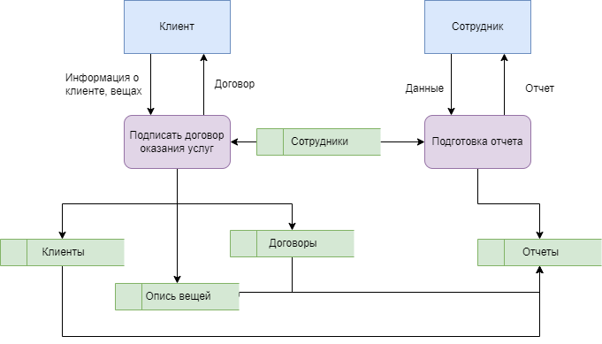{width="6.497221128608924in"
  height="3.7111111111111112in"}
  ---------------------------------------------------------------------------------------------

  ---------------------------------------------------------------------------------------------

> Рисунок 1.2 -- Процессы «Подписать договор», «Подготовка отчета»
> **1.3. Маршруты документов**\
> В процессе деятельности организации возникают различные категории
> документов: внутренние, исходящие, входящие.
>
> Все документы должны быть зарегистрированы в системе (журнал
>
> регистрации документов), при этом у каждого документа появятся
> дополнительные атрибуты:\
> 1) Внутренние документы:\
> − номер документа;\
> − дата создания;\
> − отдел компании (отдел, к которому относиться документ); − подпись
> (сотрудник);\
> − приоритет.
>
> 2\) Исходящие документы:\
> − номер документа;\
> − дата создания;\
> − заголовок;\
> − отправитель (отдел, создавший документ); 16
>
> − получатель;
>
> − метод доставки;
>
> − подпись.
>
> 3\) Входящие документы:
>
> − номер документа;
>
> − дата создания;
>
> − отправитель (внешняя организация или физ. лицо);
>
> − заголовок;
>
> − получатель (отдел или сотрудник компании);
>
> − подпись.
>
> Рассмотрим некоторые документы, которые возникают в деятельности
>
> службы доставки вещей.
>
> 1\) Внутренние документы (составляются, исполняются, храниться в
>
> рамках самого предприятия и не выходят за пределы):
>
> а) Составление расписания доставки груза (маршрут документа
>
> представлен на рисунке 1.3).
>
> 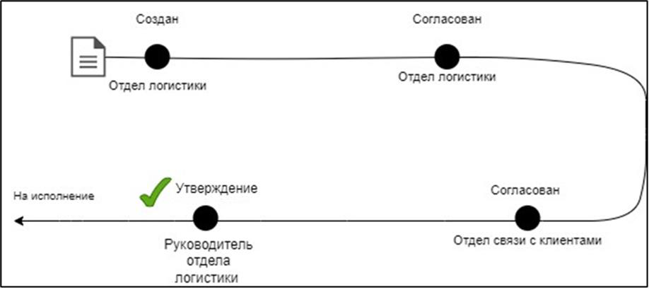{width="6.372221128608924in"
> height="2.866665573053368in"}
>
> Рисунок 1.3 -- Маршрут документа «Расписание доставки груза»
>
> б) Заявка на закупку транспортного оборудования (маршрут
>
> документа представлен на рисунке 1.4).

17

> 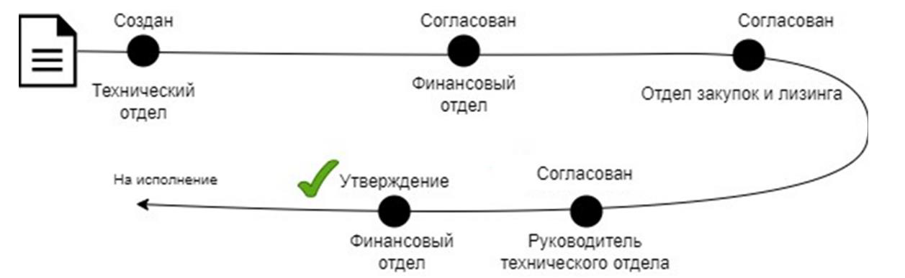{width="6.498611111111111in"
> height="2.0in"}
>
> Рисунок 1.4 -- Маршрут документа «Заявка на закупку транспортного
> оборудования»\
> 2) Исходящие документы (официальные документы, отправляемые из
> организации):\
> a) Запрос на страхование груза в страховую компанию (маршрут документа
> представлен на рисунке 1.5).
>
> 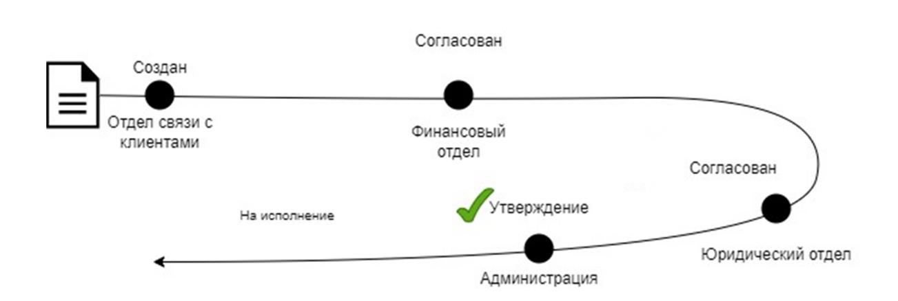{width="6.498611111111111in"
> height="2.183333333333333in"}
>
> Рисунок 1.5 -- Маршрут документа «Заявка на страхование груза» 3)
> Входящие документы (документы, поступившие в организацию): a) Заявка
> на перевозку груза (маршрут документа представлен на рисунке 1.6).

18

> 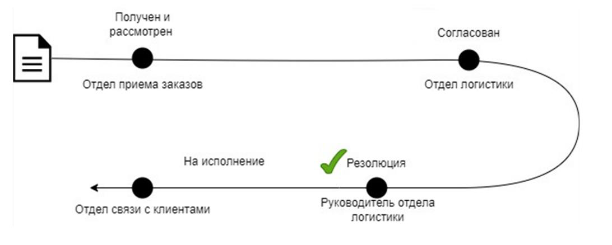{width="6.498611111111111in"
> height="2.6055555555555556in"}
>
> Рисунок 1.6 -- Маршрут документа «Заявка на перевозку груза»

19

> **2. Аналитический раздел**\
> **2.1. Логическая структура базы данных**\
> В подсистеме управления документами и рабочими потоками для
> автоматизации деятельности службы перевозки вещей будут определены
> следующие объекты:\
> 1) сотрудники: информация о сотрудниках службы перевозки,
>
> включая их контактные данные;\
> 2) клиенты: информация о клиентах службы перевозки, включая их
>
> контактные данные;\
> 3) договоры: информация о договорах, которые заключаются между
>
> клиентом и службой перевозки;\
> 4) отчеты: информация о перевозке;\
> 5) опись вещей: общая информация о вещах, которые необходимо
>
> перевести.
>
> В таблицах 2.1 -- 2.5 представлены структуры проектируемых таблиц:
> сотрудники (employees), клиенты (clients), договоры (contracts),
> отчеты (reports), опись вещей (things).

Таблица 2.1 -- Таблица «сотрудники» базы данных службы перевозки вещей

+-----------------------+-----------------------+-----------------------+
| > Название атрибута   | > Тип атрибута        | > Описание            |
+=======================+=======================+=======================+
| > id                  | > integer             | > первичный ключ      |
+-----------------------+-----------------------+-----------------------+
| > name                | > text                | > ФИО сотрудника      |
+-----------------------+-----------------------+-----------------------+
| > email               | > text                | > адрес электронной   |
|                       |                       | >                     |
|                       |                       | > почты сотрудника    |
+-----------------------+-----------------------+-----------------------+
| > phone_number        | > text                | > номер телефона      |
|                       |                       | >                     |
|                       |                       | > сотрудника          |
+-----------------------+-----------------------+-----------------------+
| > position            | > text                | > должность           |
|                       |                       | > сотрудника          |
+-----------------------+-----------------------+-----------------------+
| > department          | > text                | > подразделение       |
|                       |                       | > сотрудника          |
+-----------------------+-----------------------+-----------------------+

20

> Таблица 2.2 -- Таблица «клиенты», базы данных службы перевозки вещей

+-----------------------+-----------------------+-----------------------+
| > Название атрибута   | > Тип атрибута        | > Описание            |
+=======================+=======================+=======================+
| > id                  | > integer             | > первичный ключ      |
+-----------------------+-----------------------+-----------------------+
| > name                | > text                | > ФИО клиента         |
+-----------------------+-----------------------+-----------------------+
| > email               | > text                | > адрес электронной   |
|                       |                       | >                     |
|                       |                       | > почты клиента       |
+-----------------------+-----------------------+-----------------------+
| > phone_number        | > text                | номер телефона        |
|                       |                       | клиента               |
+-----------------------+-----------------------+-----------------------+
| > passport            | > text                | > паспортные данные   |
+-----------------------+-----------------------+-----------------------+

> Таблица 2.3 -- Таблица «договоры», базы данных службы перевозки вещей

+-----------------------+-----------------------+-----------------------+
| > Название атрибута   | > Тип атрибута        | > Описание            |
+=======================+=======================+=======================+
| > id                  | > integer             | > первичный ключ      |
+-----------------------+-----------------------+-----------------------+
| > number              | > text                | > номер договора      |
+-----------------------+-----------------------+-----------------------+
| > date                | > text                | > дата подписания     |
|                       |                       | >                     |
|                       |                       | > договора            |
+-----------------------+-----------------------+-----------------------+
| > start_price         | > integer             | > первоначальная цена |
+-----------------------+-----------------------+-----------------------+
| > discount            | > integer             | > возможная скидка    |
+-----------------------+-----------------------+-----------------------+
| > deal_status         | > blob                | > статус (выполнен/в  |
|                       |                       | >                     |
|                       |                       | > процессе)           |
+-----------------------+-----------------------+-----------------------+
| > finish_price        | > integer             | > итоговая цена       |
+-----------------------+-----------------------+-----------------------+
| > address_start       | > text                | > адрес начала        |
+-----------------------+-----------------------+-----------------------+
| > address_finish      | > text                | > адрес начала        |
+-----------------------+-----------------------+-----------------------+

21

+-----------------------+-----------------------+-----------------------+
| > things_id           | > integer             | > ключ описи вещей    |
+=======================+=======================+=======================+
| > clients_id          | > integer             | > ключ клиента        |
+-----------------------+-----------------------+-----------------------+
| > employee_id         | > integer             | > ключ сотрудника     |
+-----------------------+-----------------------+-----------------------+

> Таблица 2.4 -- Таблица «отчеты», базы данных службы перевозки вещей

+-----------------------+-----------------------+-----------------------+
| > Название атрибута   | > Тип атрибута        | > Описание            |
+=======================+=======================+=======================+
| > id                  | > integer             | > первичный ключ      |
+-----------------------+-----------------------+-----------------------+
| > number              | > text                | > номер отчета        |
+-----------------------+-----------------------+-----------------------+
| > date                | > text                | > дата формирования   |
|                       |                       | >                     |
|                       |                       | > отчета              |
+-----------------------+-----------------------+-----------------------+
| > report_type         | > text                | > тип отчета          |
+-----------------------+-----------------------+-----------------------+
| > description         | > text                | краткое описание      |
|                       |                       | отчета                |
+-----------------------+-----------------------+-----------------------+
| > employee_id         | > integer             | > ключ сотрудника     |
+-----------------------+-----------------------+-----------------------+

> Таблица 2.5 -- Таблица «опись вещей», базы данных службы перевозки
> вещей

+-----------------------+-----------------------+-----------------------+
| > Название атрибута   | > Тип атрибута        | > Описание            |
+=======================+=======================+=======================+
| > id                  | > integer             | > первичный ключ      |
+-----------------------+-----------------------+-----------------------+
| > count               | > integer             | > количество вещей    |
+-----------------------+-----------------------+-----------------------+
| > price               | > float               | > стоимость вещей     |
+-----------------------+-----------------------+-----------------------+
| > insurance           | > blob                | флаг страхования      |
|                       |                       | вещей                 |
+-----------------------+-----------------------+-----------------------+
| > weight              | > integer             | <table>               |
|                       |                       | <colgroup>            |
|                       |                       | <col                  |
|                       |                       | style="width: 33%" /> |
|                       |                       | <col                  |
|                       |                       | style="width: 33%" /> |
|                       |                       | <col                  |
|                       |                       | style="width: 33%" /> |
|                       |                       | </colgroup>           |
|                       |                       | <thead>               |
|                       |                       | <tr class="header">   |
|                       |                       | <th><blockquote>      |
|                       |                       | 
вес
            |
|                       |                       | </blockquote></th>    |
|                       |                       | <th>вещей</th>        |
|                       |                       | <th>в</th>            |
|                       |                       | </tr>                 |
|                       |                       | </thead>              |
|                       |                       | <tbody>               |
|                       |                       | </tbody>              |
|                       |                       | </table>              |
|                       |                       |                       |
|                       |                       | > килограммах         |
+-----------------------+-----------------------+-----------------------+
| > oversized           | > blob                | > флаг негабаритных   |
|                       |                       | >                     |
|                       |                       | > вещей (да/нет)      |
+-----------------------+-----------------------+-----------------------+
| > client_id           | > integer             | > ключ клиента        |
+-----------------------+-----------------------+-----------------------+

22

> На рисунке 2.1 представлена ER-диаграмма базы данных службы
>
> перевозки вещей структуры проектируемых таблиц. Существуют следующие
>
> связи:
>
> − «один-ко-многим»: сотрудники (employees) -- договоры (contracts);
>
> − «один-ко-многим»: сотрудники (employees) -- отчеты (reports);
>
> ‒ «один-ко-многим»: клиенты (clients) -- договоры (contracts);
>
> − «один-к-одному»: договоры (contracts) -- опись вещей (things);
>
> − «один-ко-многим»: клиенты (clients) -- опись вещей (things).
>
> 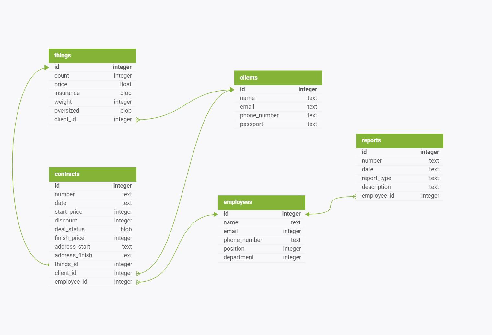{width="6.176388888888889in"
> height="4.215277777777778in"}

Рисунок 2.1 -- ER-диаграмма базы данных

> **2.2. Проектирование шаблонов документов**
>
> В задании на разработку подсистемы для службы перевозки вещей,
>
> которые возникают в процессах «подписать договор», «подготовка
>
> маршрутного листа» и «оформление страхового полиса»:
>
> − договор на оказание услуг (текстовый);
>
> − отчет (текстовый);
>
> − текущая занятость (табличный).

23

> **2.2.1. Текстовый документ «Договор оказания услуг перевозки»**
>
> Договор оказания услуг перевозки вещей представляет собой
>
> соглашение, которое определяет условия и обязательства между
> заказчиком,
>
> требующим перевозки своих вещей, и исполнителем, который предоставляет
>
> услуги перевозки. Этот договор регулирует права и обязанности обеих
> сторон
>
> в процессе перевозки груза, включая организацию, оплату, сроки и
>
> ответственность за выполнение услуг.
>
> Как и любое другое соглашение, договор об оказании услуг перевозки
>
> должен быть составлен в письменной форме и подписан обеими сторонами
>
> или их уполномоченными представителями. Это гарантирует ясность и
>
> прозрачность условий соглашения, а также помогает избежать возможных
>
> конфликтов и споров в будущем.
>
> Структура документа состоит из следующих разделов:
>
> 1\) преамбула -- это вводная часть договора, в которой обозначены:
>
> − название договора, номер;
>
> − дата подписания договора;
>
> − место подписания договора;
>
> − наименования сторон договора;
>
> − документ, на основании которого действует сторона (паспорт,
>
> доверенность);
>
> − реквизиты документов.
>
> 2\) предмет договора -- это часть договора, в котором обозначены
>
> основные действия сторон в отношении определенного объекта:
>
> − описание предоставляемых услуг (грузовые перевозки и погрузо-
>
> разгрузочные работы);
>
> − адрес отправления и адрес назначения груза;
>
> − обязательство Заказчика по оплате услуг.
>
> 3\) права и обязанности сторон:

24

> − права и обязанности Заказчика: обязательство предоставить
>
> полную информацию для оказания услуг. Своевременная оплата услуг.
> Право
>
> контролировать выполнение работ;
>
> − права и обязанности Исполнителя: обязательство по перевозке
>
> груза и выполнению погрузо-разгрузочных работ.
>
> 4\) стоимость услуг и порядок расчетов:
>
> − стоимость услуг и порядок их изменения;
>
> − условия и сроки оплаты услуг Заказчиком.
>
> 5\) ответственность сторон:
>
> − ответственность за неисполнение обязательств;
>
> − штрафные санкции за просрочку оплаты;
>
> − условия освобождения от ответственности (форс-мажор).
>
> 6\) срок действия договора:
>
> − дата начала действия договора;
>
> − условия продления и расторжения договора;
>
> − порядок одностороннего расторжения договора.
>
> 7\) реквизиты и подписи сторон:
>
> − реквизиты Исполнителя и Заказчика;
>
> − подписи сторон и печати.
>
> Примерный шаблон документа представлен в Приложении А, выделены
>
> переменные (атрибуты, заполняемые при генерации документа), которые
>
> описаны в таблице 2.6.
>
> Переменные сгруппированы по категориям, что позволяет определить
>
> исходную таблицу с данными:
>
> − относящиеся к договору (начинаются с CONTRACT\_);
>
> − относящиеся к клиенту (начинаются с CLIENT\_);
>
> − относящиеся к сотруднику (начинаются с EMPLOYEE\_).

25

Таблица 2.6 -- Переменные документа «Договор оказания услуг перевозки»

+-----------------+-----------------+-----------------+-----------------+
| > Раздел        | > Переменная    | > Описание      | > Пример        |
+=================+=================+=================+=================+
| > Преамбула     | >               | номер договора  | > 121           |
|                 | CONTRACT_NUMBER |                 |                 |
+-----------------+-----------------+-----------------+-----------------+
|                 | > CONTRACT_DATE | > Дата\         | > «04» апреля   |
|                 |                 | > подписания    | >               |
|                 |                 |                 | > 2024          |
+-----------------+-----------------+-----------------+-----------------+
|                 | > CONTRACT_CITY | > Город\        | > Москва        |
|                 |                 | > подписания    |                 |
+-----------------+-----------------+-----------------+-----------------+
|                 | > E             | > Представитель | > Иванов Иван   |
|                 | MPLOYEE_FULLNAM | > компании      | >               |
|                 | > E             |                 | > Иванович      |
+-----------------+-----------------+-----------------+-----------------+
|                 | > E             | > Основание\    | > доверенность  |
|                 | MPLOYEE_ATTORNE | > действия\     |                 |
|                 | > Y_POWER       | > представителя | <table>         |
|                 |                 |                 | <colgroup>      |
|                 |                 |                 | <col            |
|                 |                 |                 | style=          |
|                 |                 |                 | "width: 33%" /> |
|                 |                 |                 | <col            |
|                 |                 |                 | style=          |
|                 |                 |                 | "width: 33%" /> |
|                 |                 |                 | <col            |
|                 |                 |                 | style=          |
|                 |                 |                 | "width: 33%" /> |
|                 |                 |                 | </colgroup>     |
|                 |                 |                 | <thead>         |
|                 |                 |                 | <tr             |
|                 |                 |                 | class="header"> |
|                 |                 |                 | <th>№8</th>     |
|                 |                 |                 | <th>от</th>     |
|                 |                 |                 | <               |
|                 |                 |                 | th><blockquote> |
|                 |                 |                 | 
«10»
     |
|                 |                 |                 | </b             |
|                 |                 |                 | lockquote></th> |
|                 |                 |                 | </tr>           |
|                 |                 |                 | </thead>        |
|                 |                 |                 | <tbody>         |
|                 |                 |                 | </tbody>        |
|                 |                 |                 | </table>        |
|                 |                 |                 |                 |
|                 |                 |                 | > января 2022   |
|                 |                 |                 | > г.            |
+-----------------+-----------------+-----------------+-----------------+
|                 | >               | > ФИО клиента   | > Петров Петр   |
|                 | CLIENT_FULLNAME |                 | >               |
|                 |                 |                 | > Сергеевич     |
+-----------------+-----------------+-----------------+-----------------+
|                 | > C             | > дата рождения | > 01.01.1976    |
|                 | LIENT_BIRTHDATE | > клиента       |                 |
+-----------------+-----------------+-----------------+-----------------+
|                 | > CL            | > серия и номер | > 1234 564346   |
|                 | IENT_PASSPORT_N | > паспорта\     |                 |
|                 | > UMBER         | > клиента\      |                 |
|                 |                 | > (заказчика)   |                 |
+-----------------+-----------------+-----------------+-----------------+
|                 | CL              | > место         | > г. Москва     |
|                 | IENT_BIRTHPLACE | > рождения      |                 |
|                 |                 | > клиента       |                 |
+-----------------+-----------------+-----------------+-----------------+
|                 | > CL            | > код\          | > 370-321       |
|                 | IENT_PASSPORT_D | >               |                 |
|                 | > EPCODE        |  подразделения, |                 |
|                 |                 | > выдавшего\    |                 |
|                 |                 | > паспорт\      |                 |
|                 |                 | > клиента       |                 |
+-----------------+-----------------+-----------------+-----------------+
| Предмет         | > ADDRESS_START | > адрес         | > г. Троицк,    |
| договора        |                 | > загрузки      | > ул.           |
|                 |                 | > вещей         | > Полковника    |
+-----------------+-----------------+-----------------+-----------------+

26

+-----------------+-----------------+-----------------+-----------------+
|                 |                 |                 | > милиции\      |
|                 |                 |                 | > Курочкина д.5 |
+=================+=================+=================+=================+
|                 | >               | > адрес         | > г. Троицк,    |
|                 |  ADDRESS_FINISH | > выгрузки      |                 |
|                 |                 | > вещей         | микрорайон В    |
|                 |                 |                 |                 |
|                 |                 |                 | > д. 2          |
+-----------------+-----------------+-----------------+-----------------+
| > Стоимость\    | > CONTRACT_SUM  | > цена          | > 43223         |
| > услуг и       |                 | > перевозки     |                 |
| >               |                 | > груза         |                 |
| > порядок\      |                 |                 |                 |
| > расчетов.     |                 |                 |                 |
+-----------------+-----------------+-----------------+-----------------+
| > Реквизиты и   | > CLIENT_RS     | > Расчетный     |                 |
| > подписи\      |                 | > счет клиента  |                 |
| > сторон        |                 |                 |                 |
+-----------------+-----------------+-----------------+-----------------+
|                 | >               | > ФИО клиента   | > Петров Петр   |
|                 | CLIENT_FULLNAME |                 | >               |
|                 |                 |                 | > Сергеевич     |
+-----------------+-----------------+-----------------+-----------------+
|                 | > CLIENT_BANK   | > банк клиента  | > СБЕРБАНК      |
+-----------------+-----------------+-----------------+-----------------+
|                 | > CLIENT_BIK    | > БИК клиента   | > 044030786     |
+-----------------+-----------------+-----------------+-----------------+

> **2.2.2. Текстовый документ «Отчет по компании»**

+-----------+-----------+-----------+-----------+-----------+-----------+
| В         | отчетные  | документы | попадает  | агрег     | > ин      |
|           |           |           |           | ированная | формация. |
+===========+===========+===========+===========+===========+===========+
+-----------+-----------+-----------+-----------+-----------+-----------+

> Агрегированная информация -- это обобщённые данные, собранные из
> разных
>
> источников и сгруппированные по определенным критериям. Агрегирование
>
> данных происходит путем суммирования, усреднения или группировки
>
> данных на разных уровнях иерархии. Это позволяет выявлять
> закономерности,
>
> тенденции и взаимосвязи между различными показателями, что
> способствует
>
> принятию обоснованных решений и прогнозированию результатов.
>
> В отчете по компании может быть представлена следующая
>
> информация:
>
> − количество заключенных договоров, соответствующих критерию;
>
> − стоимость каждого заключенного договора;
>
> − сотрудник, который реализовал договор;
>
> − суммарная стоимость по всем реализованным договорам;

27

> Критериями (параметрами фильтрации) при составлении отчета будет
>
> период (дата начала и дата окончания).
>
> В приложении Б представлен внешний вид отчета по компании с
>
> примирением фильтра по периоду, выделены подставленные значения.
>
> **2.2.3 Табличный документ «Текущая занятость»**

+---------+---------+---------+---------+---------+---------+---------+
| В       | та      | до      | «       | зан     | на      | >       |
|         | бличном | кументе | Текущая | ятость» |         |  основе |
+=========+=========+=========+=========+=========+=========+=========+
+---------+---------+---------+---------+---------+---------+---------+

> предоставленных таблиц, можно соединить данные из таблиц «сотрудники»,
>
> «договоры». Этот документ будет содержать информацию о текущей
>
> занятости сотрудников, включая их личные данные, информацию о текущих
>
> договорах, которые они ведут. Таким образом, каждая позиция будет
>
> содержать следующую информацию:
>
> − номер договора;
>
> − дата заключение договора;
>
> − сотрудник;
>
> − финальная цена сделки;
>
> − статус (сделка завершена/ в работе);
>
> − начальный адрес;
>
> − адрес доставки.
>
> Критериями (параметрами фильтрации) при формировании табличного
>
> документа будут:
>
> − период заключения договора (даты начала и окончания);
>
> − статус (сделка завершена/ в работе);
>
> − сотрудник.

28

> **3. Технологический раздел**
>
> **3.1. Работа с базой данных**\
> В качестве базы данных будет использоваться SQLite. SQLite -- это
> встраиваемая кроссплатформенная реляционная база данных.
>
> В подсистеме управления документами и рабочими потоками для
> автоматизации деятельности службы доставки вещей будут определены
> следующие таблицы: сотрудники, клиенты, опись вещей, договоры, отчеты.
>
> В таблице 3.1 приведены SQL-запросы для создания таблиц в соответствии
> с ранее определенной структурой.
>
> Таблица 3.1 -- SQL запросы для создания таблиц

+-----------------------------------+-----------------------------------+
| > Таблица                         | > SQL-запрос                      |
+===================================+===================================+
| > сотрудники                      | > CREATE TABLE IF NOT EXISTS      |
|                                   | > \'employees\' (                 |
|                                   |                                   |
|                                   | <table>                           |
|                                   | <colgroup>                        |
|                                   | <col style="width: 25%" />        |
|                                   | <col style="width: 25%" />        |
|                                   | <col style="width: 25%" />        |
|                                   | <col style="width: 25%" />        |
|                                   | </colgroup>                       |
|                                   | <thead>                           |
|                                   | <tr class="header">               |
|                                   | <th><blockquote>                  |
|                                   | 
'id_employee'
              |
|                                   | </blockquote></th>                |
|                                   | <th>INTEGER</th>                  |
|                                   | <th>PRIMARY</th>                  |
|                                   | <th>KEY</th>                      |
|                                   | </tr>                             |
|                                   | </thead>                          |
|                                   | <tbody>                           |
|                                   | </tbody>                          |
|                                   | </table>                          |
|                                   |                                   |
|                                   | > AUTOINCREMENT,\                 |
|                                   | > \'name\' TEXT,\                 |
|                                   | > \'email\' TEXT,\                |
|                                   | > \'phone_number\' TEXT,\         |
|                                   | > \'position\' TEXT,\             |
|                                   | > \'department\' TEXT\            |
|                                   | > )                               |
+-----------------------------------+-----------------------------------+
| > клиенты                         | > CREATE TABLE IF NOT EXISTS      |
|                                   | > \'clients\' (                   |
|                                   |                                   |
|                                   | <table>                           |
|                                   | <colgroup>                        |
|                                   | <col style="width: 25%" />        |
|                                   | <col style="width: 25%" />        |
|                                   | <col style="width: 25%" />        |
|                                   | <col style="width: 25%" />        |
|                                   | </colgroup>                       |
|                                   | <thead>                           |
|                                   | <tr class="header">               |
|                                   | <th><blockquote>                  |
|                                   | 
'id_client'
                |
|                                   | </blockquote></th>                |
|                                   | <th>INTEGER</th>                  |
|                                   | <th>PRIMARY</th>                  |
|                                   | <th>KEY</th>                      |
|                                   | </tr>                             |
|                                   | </thead>                          |
|                                   | <tbody>                           |
|                                   | </tbody>                          |
|                                   | </table>                          |
|                                   |                                   |
|                                   | > AUTOINCREMENT,\                 |
|                                   | > \'name\' TEXT,\                 |
|                                   | > \'email\' TEXT,\                |
|                                   | > \'phone_number\' TEXT,\         |
|                                   | > \'passport\' TEXT\              |
|                                   | > )                               |
+-----------------------------------+-----------------------------------+

29

+-----------------------------------+-----------------------------------+
| > опись вещей                     | > CREATE TABLE IF NOT EXISTS      |
|                                   | > \'things\' (                    |
|                                   |                                   |
|                                   | <table>                           |
|                                   | <colgroup>                        |
|                                   | <col style="width: 25%" />        |
|                                   | <col style="width: 25%" />        |
|                                   | <col style="width: 25%" />        |
|                                   | <col style="width: 25%" />        |
|                                   | </colgroup>                       |
|                                   | <thead>                           |
|                                   | <tr class="header">               |
|                                   | <th><blockquote>                  |
|                                   | 
'id_thing'
                 |
|                                   | </blockquote></th>                |
|                                   | <th>INTEGER</th>                  |
|                                   | <th>PRIMARY</th>                  |
|                                   | <th>KEY</th>                      |
|                                   | </tr>                             |
|                                   | </thead>                          |
|                                   | <tbody>                           |
|                                   | </tbody>                          |
|                                   | </table>                          |
|                                   |                                   |
|                                   | > AUTOINCREMENT,\                 |
|                                   | > \'count\' INTEGER,\             |
|                                   | > \'price\' INTEGER,\             |
|                                   | > \'insurance\' BLOB,\            |
|                                   | > \'weight\' INTEGER,\            |
|                                   | > \'oversized\' BLOB,\            |
|                                   | > \'client_id\' INTEGER\          |
|                                   | > )                               |
+===================================+===================================+
| > договоры                        | > CREATE TABLE IF NOT EXISTS      |
|                                   | > \'contracts\' (                 |
|                                   |                                   |
|                                   | <table>                           |
|                                   | <colgroup>                        |
|                                   | <col style="width: 25%" />        |
|                                   | <col style="width: 25%" />        |
|                                   | <col style="width: 25%" />        |
|                                   | <col style="width: 25%" />        |
|                                   | </colgroup>                       |
|                                   | <thead>                           |
|                                   | <tr class="header">               |
|                                   | <th><blockquote>                  |
|                                   | 
'id_contract'
              |
|                                   | </blockquote></th>                |
|                                   | <th>INTEGER</th>                  |
|                                   | <th>PRIMARY</th>                  |
|                                   | <th>KEY</th>                      |
|                                   | </tr>                             |
|                                   | </thead>                          |
|                                   | <tbody>                           |
|                                   | </tbody>                          |
|                                   | </table>                          |
|                                   |                                   |
|                                   | > AUTOINCREMENT,\                 |
|                                   | > \'number\' TEXT,\               |
|                                   | > \'date\' TEXT,\                 |
|                                   | > \'start_price\' INTEGER,\       |
|                                   | > \'discount\' INTEGER,\          |
|                                   | > \'deal_status\' BLOB,\          |
|                                   | > \'finish_price\' INTEGER,\      |
|                                   | > \'address_start\' TEXT,\        |
|                                   | > \'address_finish\' TEXT,\       |
|                                   | > \'thing_id\' INTEGER UNIQUE,    |
|                                   | > \'client_id\' INTEGER,\         |
|                                   | > \'employee_id\' INTEGER\        |
|                                   | > )                               |
+-----------------------------------+-----------------------------------+
| > отчеты                          | > CREATE TABLE IF NOT EXISTS      |
|                                   | > \'reports\' (                   |
|                                   |                                   |
|                                   | <table>                           |
|                                   | <colgroup>                        |
|                                   | <col style="width: 25%" />        |
|                                   | <col style="width: 25%" />        |
|                                   | <col style="width: 25%" />        |
|                                   | <col style="width: 25%" />        |
|                                   | </colgroup>                       |
|                                   | <thead>                           |
|                                   | <tr class="header">               |
|                                   | <th><blockquote>                  |
|                                   | 
'id_report'
                |
|                                   | </blockquote></th>                |
|                                   | <th>INTEGER</th>                  |
|                                   | <th>PRIMARY</th>                  |
|                                   | <th>KEY</th>                      |
|                                   | </tr>                             |
|                                   | </thead>                          |
|                                   | <tbody>                           |
|                                   | </tbody>                          |
|                                   | </table>                          |
|                                   |                                   |
|                                   | > AUTOINCREMENT,                  |
|                                   | >                                 |
|                                   | > \'number\' TEXT,                |
|                                   | >                                 |
|                                   | > \'date\' TEXT,                  |
+-----------------------------------+-----------------------------------+

30

+-----------------------------------+-----------------------------------+
|                                   | > \'report_type\' TEXT,\          |
|                                   | > \'description\' TEXT,\          |
|                                   | > \'employee_id\' INTEGER)        |
+===================================+===================================+
+-----------------------------------+-----------------------------------+

> В таблице 3.2 приведены SQL-запросы для добавления данных в созданные
> ранее таблицы.
>
> Таблица 3.2 -- Добавление данных в таблицы базы данных

+-----------------------------------+-----------------------------------+
| > Таблица                         | > SQL-запрос                      |
+===================================+===================================+
| > сотрудники                      | > INSERT INTO \'employees\'       |
|                                   | > (name, email, phone_number,     |
|                                   | > position, department) VALUES    |
|                                   | > (?, ?, ?, ?, ?)                 |
+-----------------------------------+-----------------------------------+
| > клиенты                         | > INSERT INTO \'clients\' (name,  |
|                                   | > email, phone_number, passport)  |
|                                   | > VALUES (?, ?, ?, ?)             |
+-----------------------------------+-----------------------------------+
| > опись вещей                     | > INSERT INTO \'things\' (count,  |
|                                   | > price, insurance, weight,       |
|                                   | > oversized, client_id) VALUES    |
|                                   | > (?, ?, ?, ?, ?, ?)              |
+-----------------------------------+-----------------------------------+
| > договоры                        | INSERT INTO \'contracts\'         |
|                                   | (number, date, start_price,       |
|                                   | discount,                         |
|                                   |                                   |
|                                   | <table>                           |
|                                   | <colgroup>                        |
|                                   | <col style="width: 25%" />        |
|                                   | <col style="width: 25%" />        |
|                                   | <col style="width: 25%" />        |
|                                   | <col style="width: 25%" />        |
|                                   | </colgroup>                       |
|                                   | <thead>                           |
|                                   | <tr class="header">               |
|                                   | <th><blockquote>                  |
|                                   | 
deal_status,
               |
|                                   | </blockquote></th>                |
|                                   | <th>finish_price,</th>            |
|                                   | <th>address_start,</th>           |
|                                   | <th><blockquote>                  |
|                                   | 
address_finish,
            |
|                                   | </blockquote></th>                |
|                                   | </tr>                             |
|                                   | </thead>                          |
|                                   | <tbody>                           |
|                                   | </tbody>                          |
|                                   | </table>                          |
|                                   |                                   |
|                                   | thing_id, client_id, employee_id) |
|                                   | VALUES (?, ?, ?, ?, ?, ?, ?,      |
|                                   |                                   |
|                                   | > ?, ?, ?, ?)                     |
+-----------------------------------+-----------------------------------+
| > отчеты                          | <table style="width:100%;">       |
|                                   | <colgroup>                        |
|                                   | <col style="width: 16%" />        |
|                                   | <col style="width: 16%" />        |
|                                   | <col style="width: 16%" />        |
|                                   | <col style="width: 16%" />        |
|                                   | <col style="width: 16%" />        |
|                                   | <col style="width: 16%" />        |
|                                   | </colgroup>                       |
|                                   | <thead>                           |
|                                   | <tr class="header">               |
|                                   | <th>INSERT</th>                   |
|                                   | <th>INTO</th>                     |
|                                   | <th>'reports'</th>                |
|                                   | <th>(number,</th>                 |
|                                   | <th>date,</th>                    |
|                                   | <th><blockquote>                  |
|                                   | 
report_type,
               |
|                                   | </blockquote></th>                |
|                                   | </tr>                             |
|                                   | </thead>                          |
|                                   | <tbody>                           |
|                                   | </tbody>                          |
|                                   | </table>                          |
|                                   |                                   |
|                                   | > description, employee_id)       |
|                                   | > VALUES (?, ?, ?, ?, ?)          |
+-----------------------------------+-----------------------------------+

> В таблице 3.3 приведены SQL-запросы для выборки, фильтрации данных из
> ранее созданных таблиц.
>
> Таблица 3.3 -- Выборка данных из базы данных

+-----------------------------------+-----------------------------------+
| > Задача                          | > SQL-запрос                      |
+===================================+===================================+
| > получение всех договоров        | > SELECT \* FROM contracts,       |
|                                   | > things, clients                 |
|                                   |                                   |
|                                   | <table>                           |
|                                   | <colgroup>                        |
|                                   | <col style="width: 20%" />        |
|                                   | <col style="width: 20%" />        |
|                                   | <col style="width: 20%" />        |
|                                   | <col style="width: 20%" />        |
|                                   | <col style="width: 20%" />        |
|                                   | </colgroup>                       |
|                                   | <thead>                           |
|                                   | <tr class="header">               |
|                                   | <th><blockquote>                  |
|                                   | 
WHERE
                      |
|                                   | </blockquote></th>                |
|                                   | <th>contracts.thing_id</th>       |
|                                   | <th>=</th>                        |
|                                   | <th>things.id_thing</th>          |
|                                   | <th>and</th>                      |
|                                   | </tr>                             |
|                                   | </thead>                          |
|                                   | <tbody>                           |
|                                   | </tbody>                          |
|                                   | </table>                          |
|                                   |                                   |
|                                   | > contracts.client_id =           |
|                                   | > clients.id_client               |
+-----------------------------------+-----------------------------------+

31

+-----------------------------------+-----------------------------------+
| > получение\                      | > SELECT \* FROM contracts,       |
| > одного договора                 | > things, clients, employees      |
|                                   | >                                 |
|                                   | > WHERE contracts.thing_id =      |
|                                   | > things.id_thing and             |
|                                   | >                                 |
|                                   | > contracts.employee_id =         |
|                                   | > employees.id_employee and       |
|                                   | >                                 |
|                                   | > contracts.client_id =           |
|                                   | > clients.id_client and           |
|                                   | >                                 |
|                                   | > contracts.id_contract = ?       |
+===================================+===================================+
| > получение всех клиентов         | > SELECT \* FROM clients          |
+-----------------------------------+-----------------------------------+
| > извлечь\                        | > SELECT \* FROM things WHERE     |
| > элементы из things, не          | > id_thing NOT IN (SELECT         |
| > связанные с contracts           | > thing_id FROM contracts)        |
+-----------------------------------+-----------------------------------+
| > получение всех сотрудников      | > SELECT \* FROM employees        |
+-----------------------------------+-----------------------------------+
| > данные о конкретном\            | > SELECT \* FROM contracts,       |
| > договоре вместе с информацией о | > clients, employees\             |
| > его клиенте и сотруднике        | > WHERE contracts.client_id =     |
|                                   | > clients.id_client and           |
|                                   | > contracts.employee_id =         |
|                                   | > employees.id_employee and       |
|                                   | > contracts.id_contract = ?       |
+-----------------------------------+-----------------------------------+
| > обновить данные конкретного\    | > UPDATE contracts\               |
| > договора по идентификатору      | > SET number = ?, date = ?,       |
|                                   | > start_price = ?, discount = ?,  |
|                                   | > deal_status = ?, finish_price = |
|                                   | > ?, address_start = ?,           |
|                                   | > address_finish = ?, thing_id =  |
|                                   | > ?, client_id = ?, employee_id = |
|                                   | > ? WHERE id_contract = ?         |
+-----------------------------------+-----------------------------------+
| > обновить данные конкретной\     | UPDATE things SET count = ?,      |
| > описи вещей по                  | price = ?, insurance = ?, weight  |
|                                   | = ?, oversized = ?, client_id = ? |
|                                   | WHERE id_thing = ?                |
+-----------------------------------+-----------------------------------+

32

+-----------------------------------+-----------------------------------+
| > его\                            |                                   |
| > идентификатору                  |                                   |
+===================================+===================================+
| > получить данные о конкретном    | > SELECT \* FROM clients WHERE    |
| > клиенте по его идентификатору   | > id_client = ?                   |
+-----------------------------------+-----------------------------------+
| > обновить данные конкретного\    | > UPDATE clients SET name = ?,    |
| > клиента по его идентификатору   | > phone_number = ?, email = ?,    |
|                                   | > passport = ? WHERE id_client =  |
|                                   | > ?                               |
+-----------------------------------+-----------------------------------+
| получить данные                   | > SELECT \* FROM employees WHERE  |
|                                   | > id_employee = ?                 |
| > о конкретном                    |                                   |
| >                                 |                                   |
| > сотруднике по                   |                                   |
| >                                 |                                   |
| > его                             |                                   |
|                                   |                                   |
| идентификатору                    |                                   |
+-----------------------------------+-----------------------------------+
| > обновить данные конкретного\    | > UPDATE employees SET name = ?,  |
| > сотрудника по его\              | > position = ?, phone_number = ?, |
| > идентификатору                  | > email = ?, department = ? WHERE |
|                                   | > id_employee = ?                 |
+-----------------------------------+-----------------------------------+
| > Извлечь данные о контрактах с   | > SELECT\                         |
| > возможностью\                   | > contracts.number,\              |
| > фильтрации по дате начала, дате | > contracts.date,\                |
| > окончания,\                     | > employees.name,\                |
| > статусу сделки и идентификатору | > contracts.finish_price,\        |
| > сотрудника,\                    | > CASE contracts.deal_status\     |
| > включая имя                     | > WHEN 1 THEN \'Сделка            |
|                                   | > завершена\' ELSE \'В работе\'\  |
|                                   | > END as status,\                 |
|                                   | > contracts.address_start,        |
+-----------------------------------+-----------------------------------+

33

+-----------------------------------+-----------------------------------+
| > сотрудника и                    | > contracts.address_finish\       |
|                                   | > FROM contracts\                 |
| дополнительную                    | > LEFT JOIN employees ON          |
|                                   | > contracts.employee_id =         |
| > информацию о                    | > employees.id_employee\          |
| >                                 | > WHERE (? IS NULL OR             |
| > контракте                       | > contracts.date \>= ?) AND (? IS |
|                                   | > NULL OR contracts.date \<= ?)\  |
|                                   | > AND (? = \'all\' OR             |
|                                   | > contracts.deal_status = ?)\     |
|                                   | > AND (? = \'all\' OR             |
|                                   | > contracts.employee_id = ?)      |
+===================================+===================================+
| > получить все                    | > SELECT \* FROM reports          |
| >                                 |                                   |
| > записи из                       |                                   |
|                                   |                                   |
| таблицы отчеты                    |                                   |
+-----------------------------------+-----------------------------------+
| > извлечь данные о конкретном     | > SELECT r.\*, e.name as          |
| > отчете из таблицы отчеты,       | > employee_name\                  |
| > включая имя сотрудника,\        | > FROM reports r\                 |
| > который его создал              | > LEFT JOIN employees e ON        |
|                                   | > r.employee_id = e.id_employee\  |
|                                   | > WHERE r.id_report = ?           |
+-----------------------------------+-----------------------------------+
| > обновить данные конкретного     | > UPDATE reports SET number = ?,  |
|                                   | > date = ?, report_type = ?,      |
| +---------+---------+---------+   | > description = ?, employee_id =  |
| | отчета  | по      | > его   |   | > ? WHERE id_report = ?           |
| +=========+=========+=========+   |                                   |
| +---------+---------+---------+   |                                   |
|                                   |                                   |
| идентификатору                    |                                   |
+-----------------------------------+-----------------------------------+
| > выбор данных                    | > SELECT number, date,            |
| >                                 | > address_start, address_finish,  |
| > контракта в                     | > finish_price, employee_id\      |
| >                                 | > FROM contracts\                 |
| > указанном                       | > WHERE date BETWEEN ? AND ?      |
| >                                 |                                   |
| > диапазоне                       |                                   |
+-----------------------------------+-----------------------------------+

34

> **3.2. Работа веб-приложения**
>
> **3.2.1. Отображение данных**\
> Для отображения данных были созданы следующие html-страницы (таблица
> 3.4), реализованы следующие функции-обработчики (таблица 3.5).
>
> Таблица 3.4 -- Реализованные шаблоны для отображения данных

+-----------------------------------+-----------------------------------+
| > Шаблон                          | > Отображение                     |
+===================================+===================================+
| > base.html                       | > базовый шаблон с реализацией    |
|                                   | > навигационного меню             |
+-----------------------------------+-----------------------------------+
| > client.html                     |   ----------------------          |
|                                   | --------------------------------- |
|                                   |   страница-карточка               |
|                                   |   клиента   с      переходом   на |
|                                   |   ------------------- --          |
|                                   | ------- ------ ----------- ------ |
|                                   |                                   |
|                                   |   ----------------------          |
|                                   | --------------------------------- |
|                                   |                                   |
|                                   | > страницу редактирования         |
+-----------------------------------+-----------------------------------+
| > clients.html                    | > страница-список с отображением  |
|                                   | > всех клиентов со ссылками на    |
|                                   | > конкретных клиентов             |
+-----------------------------------+-----------------------------------+
| > contract.html                   | страница-карточка договора с      |
|                                   | переходом на страницу описи       |
|                                   | вещей, клиента, отправки email,   |
|                                   |                                   |
|                                   | <table>                           |
|                                   | <colgroup>                        |
|                                   | <col style="width: 20%" />        |
|                                   | <col style="width: 20%" />        |
|                                   | <col style="width: 20%" />        |
|                                   | <col style="width: 20%" />        |
|                                   | <col style="width: 20%" />        |
|                                   | </colgroup>                       |
|                                   | <thead>                           |
|                                   | <tr class="header">               |
|                                   | <th>скачивания</th>               |
|                                   | <th>договора</th>                 |
|                                   | <th>с</th>                        |
|                                   | <th>засолением</th>               |
|                                   | <th><blockquote>                  |
|                                   | 
данных,
                    |
|                                   | </blockquote></th>                |
|                                   | </tr>                             |
|                                   | </thead>                          |
|                                   | <tbody>                           |
|                                   | </tbody>                          |
|                                   | </table>                          |
|                                   |                                   |
|                                   | > страницу редактирования         |
+-----------------------------------+-----------------------------------+
| > contracts.html                  | > страница-список с отображением  |
|                                   | > всех договоров со ссылками на   |
|                                   | > конкретные договоры             |
+-----------------------------------+-----------------------------------+
| > employee.html                   | > страница-карточка сотрудника с  |
|                                   | > переходом на страницу           |
|                                   | > редактирования                  |
+-----------------------------------+-----------------------------------+
| > employees.html                  | страница-список с отображением    |
|                                   | всех сотрудников со ссылками на   |
|                                   | конкретных сотрудников, с         |
|                                   |                                   |
|                                   | > переходом на страницу для       |
|                                   | > скачивания текущей занятости    |
+-----------------------------------+-----------------------------------+
| > report.html                     | страница-карточка отчета с        |
|                                   | переходом на страницу             |
|                                   |                                   |
|                                   | <table>                           |
|                                   | <colgroup>                        |
|                                   | <col style="width: 25%" />        |
|                                   | <col style="width: 25%" />        |
|                                   | <col style="width: 25%" />        |
|                                   | <col style="width: 25%" />        |
|                                   | </colgroup>                       |
|                                   | <thead>                           |
|                                   | <tr class="header">               |
|                                   | <th><blockquote>                  |
|                                   | 
редактирования,
            |
|                                   | </blockquote></th>                |
|                                   | <th>настройкой</th>               |
|                                   | <th>фильтров</th>                 |
|                                   | <th>и</th>                        |
|                                   | </tr>                             |
|                                   | </thead>                          |
|                                   | <tbody>                           |
|                                   | </tbody>                          |
|                                   | </table>                          |
|                                   |                                   |
|                                   | > скачивания отчета               |
+-----------------------------------+-----------------------------------+
| > reports.html                    | > страница-список с отображением  |
|                                   | > всех отчетов со ссылками на     |
|                                   | > конкретные отчеты               |
+-----------------------------------+-----------------------------------+

35

+-----------------------------------+-----------------------------------+
| > thing.html                      | > страница-карточка описи вещей с |
|                                   | > переходом к договору, станице   |
|                                   | > редактирования описи            |
+===================================+===================================+
| > things.html                     | > страница-список с отображением  |
|                                   | > всех описей со ссылками на      |
|                                   | > конкретные описи                |
+-----------------------------------+-----------------------------------+

> Таблица 3.5 -- Реализованные функции для отображения данных

+-----------------------+-----------------------+-----------------------+
| > Маршрут             | > Функция             | > Описание            |
+=======================+=======================+=======================+
| > /                   | > index               | > перенаправление на  |
|                       |                       | > /contracts          |
+-----------------------+-----------------------+-----------------------+
| > /contracts          | > contracts           | > отображение         |
|                       |                       | > страницы\           |
|                       |                       | > contracts.html      |
+-----------------------+-----------------------+-----------------------+
| > /contrac            | > contrac             | > отображение         |
| t/\<int:contract_id\> |                       | > страницы\           |
|                       |                       | > contract.html       |
+-----------------------+-----------------------+-----------------------+
| > /things             | > things              | > отображение\        |
|                       |                       | > страницы            |
|                       |                       | > things.html         |
+-----------------------+-----------------------+-----------------------+
| > /t                  | > thing               | > отображение\        |
| hing/\<int:thing_id\> |                       | > страницы thing.html |
+-----------------------+-----------------------+-----------------------+
| > /clients            | > clients             | > отображение\        |
|                       |                       | > страницы            |
|                       |                       | > clients.html        |
+-----------------------+-----------------------+-----------------------+
| > /cli                | > client              | > отображение\        |
| ent/\<int:client_id\> |                       | > страницы            |
|                       |                       | > client.html         |
+-----------------------+-----------------------+-----------------------+
| > /employees          | > employees           | > отображение\        |
|                       |                       | > страницы\           |
|                       |                       | > employees.html      |
+-----------------------+-----------------------+-----------------------+
| > /employe            | > employee            | > отображение         |
| e/\<int:employee_id\> |                       | > страницы\           |
|                       |                       | > employee.html       |
+-----------------------+-----------------------+-----------------------+

36

+-----------------------+-----------------------+-----------------------+
| > /reports            | > reports             | > отображение\        |
|                       |                       | > страницы            |
|                       |                       | > reports.html        |
+=======================+=======================+=======================+
| > /rep                | > report              | > отображение         |
| ort/\<int:report_id\> |                       | > страницы\           |
|                       |                       | > report.html         |
+-----------------------+-----------------------+-----------------------+

> На рисунках 3.1 -- 3.5 представлены страницы-списки для отображения
> объектов БД.
>
> 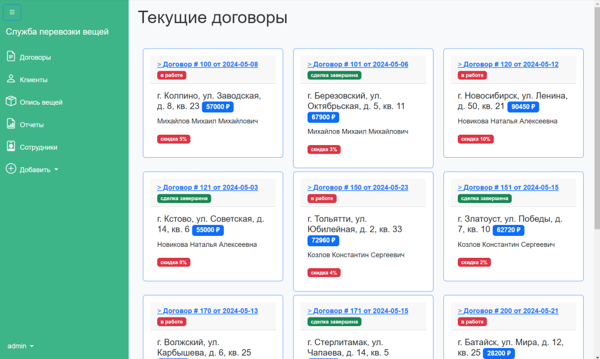{width="5.194444444444445in"
> height="3.1083333333333334in"}
>
> Рисунок 3.1 -- Страница-список «договоры»
>
> 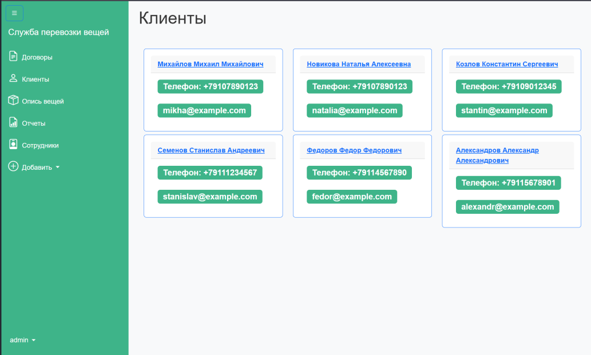{width="5.168055555555555in"
> height="3.1055555555555556in"}
>
> Рисунок 3.2 -- Страница-список «клиенты»

37

> 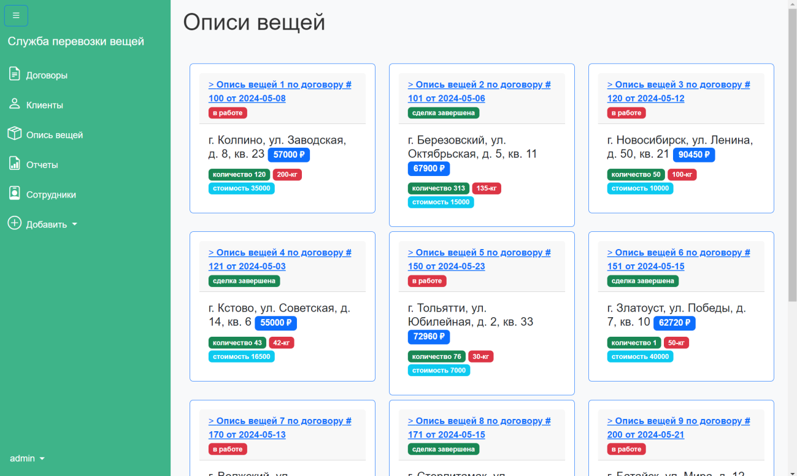{width="6.498611111111111in"
> height="3.8805555555555555in"}
>
> Рисунок 3.3 -- Страница-список «описи вещей»
>
> 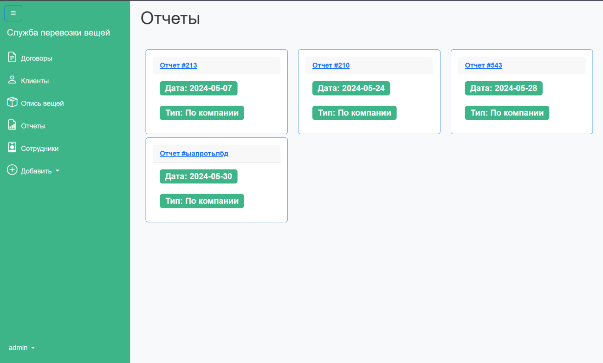{width="6.498611111111111in"
> height="3.911111111111111in"}

Рисунок 3.4 -- Страница-список «отчеты»

38

> 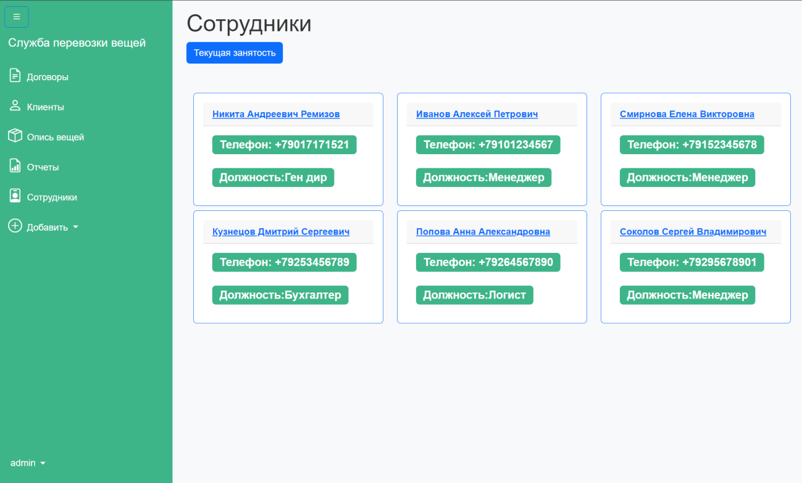{width="6.498611111111111in"
> height="3.9194444444444443in"}
>
> Рисунок 3.5 -- Страница-список «сотрудники»\
> На рисунках 3.6 -- 3.10 показаны страницы карточки для всех объектов
> БД.
>
> 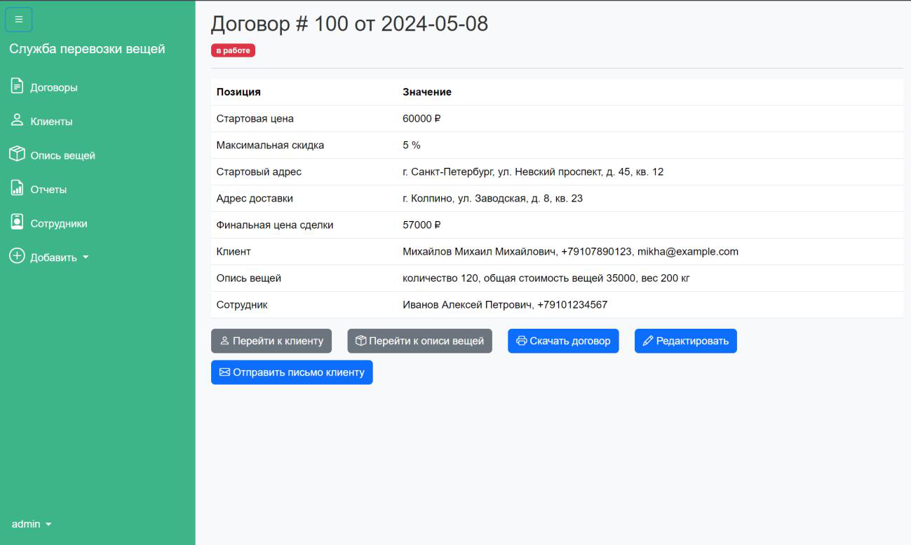{width="6.498611111111111in"
> height="3.897221128608924in"}
>
> Рисунок 3.6 -- Страница-карточка договора

39

> 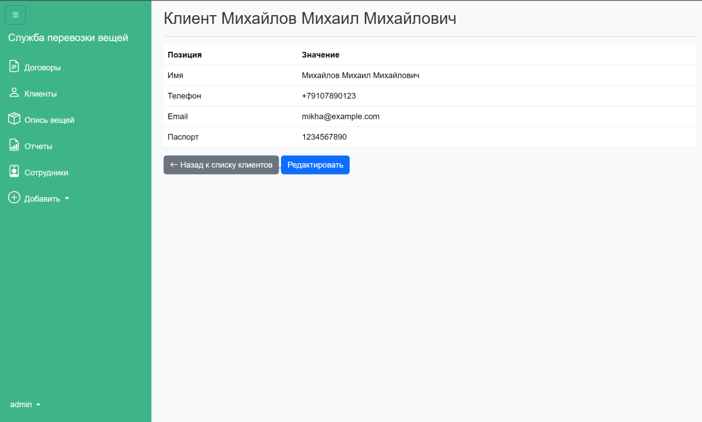{width="6.498611111111111in"
> height="3.9055555555555554in"}

Рисунок 3.7 -- Страница-карточка клиента

> 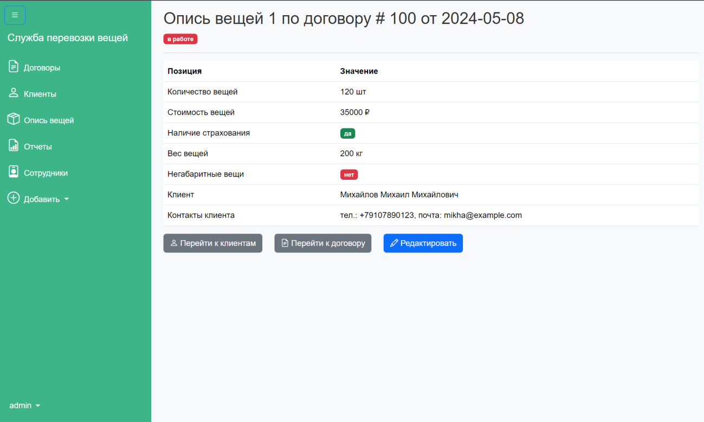{width="6.498611111111111in"
> height="3.9in"}
>
> Рисунок 3.8 -- Страница-карточка описи вещей

40

> 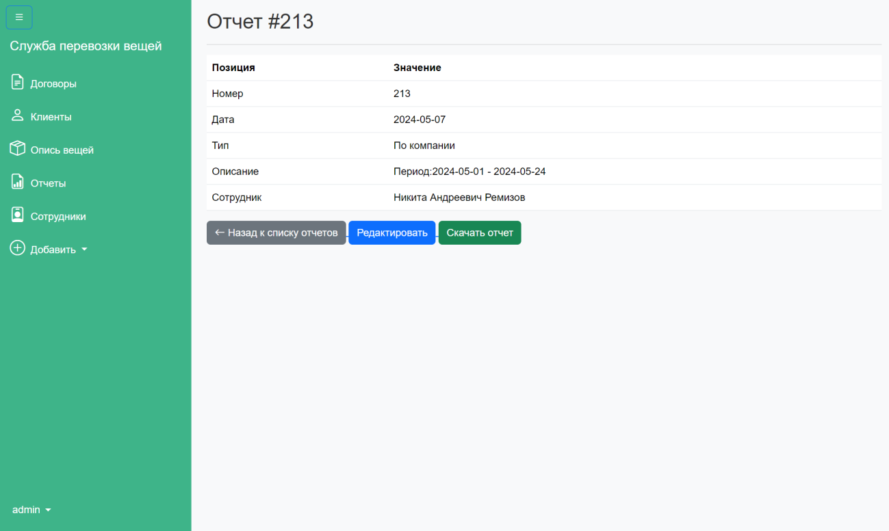{width="6.498611111111111in"
> height="3.8875in"}

Рисунок 3.9 -- Страница-карточка отчета

> {width="6.498611111111111in"
> height="3.9027777777777777in"}
>
> Рисунок 3.10 -- Страница-карточка сотрудника\
> **3.2.2. Добавление данных**\
> Для добавления данных были созданы следующие html-страницы (таблица
> 3.6), реализованы следующие функции-обработчики (таблица 3.7).

41

> Таблица 3.6 -- Реализованные шаблоны для добавления данных

+-----------------------------------+-----------------------------------+
| > Шаблон                          | > Отображение                     |
+===================================+===================================+
| > new_client.html                 | > страница для формы ввода и      |
|                                   | > добавления нового клиента       |
+-----------------------------------+-----------------------------------+
| > new_contract.html               | > страница для формы ввода и      |
|                                   | > добавления нового договора      |
+-----------------------------------+-----------------------------------+
| new_employee.html                 | > страница для формы ввода и      |
|                                   | > добавления нового сотрудника    |
+-----------------------------------+-----------------------------------+
| > new_report.html                 | страница для формы ввода и        |
|                                   | добавления нового отчета          |
+-----------------------------------+-----------------------------------+
| > new_thing.html                  | > страница для формы ввода и      |
|                                   | > добавления новой описи вещей    |
+-----------------------------------+-----------------------------------+

> Таблица 3.7 -- Реализованные функции для отображения данных

+-----------------------+-----------------------+-----------------------+
| > Маршрут             | > Функция             | > Описание            |
+=======================+=======================+=======================+
| > /new_contract       | > new_contract        | > отображение         |
|                       |                       | > страницы            |
|                       |                       |                       |
|                       |                       | new_contract.html с   |
|                       |                       | формой ввода          |
+-----------------------+-----------------------+-----------------------+
| > /new_contract POST  | > new_contract        | <table>               |
|                       |                       | <colgroup>            |
|                       |                       | <col                  |
|                       |                       | style="width: 33%" /> |
|                       |                       | <col                  |
|                       |                       | style="width: 33%" /> |
|                       |                       | <col                  |
|                       |                       | style="width: 33%" /> |
|                       |                       | </colgroup>           |
|                       |                       | <thead>               |
|                       |                       | <tr class="header">   |
|                       |                       | <th><blockquote>      |
|                       |                       | 
проверка
       |
|                       |                       | </blockquote></th>    |
|                       |                       | <th><blockquote>      |
|                       |                       | 
полей,
         |
|                       |                       | </blockquote></th>    |
|                       |                       | <th><blockquote>      |
|                       |                       | 
отображение
    |
|                       |                       | </blockquote></th>    |
|                       |                       | </tr>                 |
|                       |                       | </thead>              |
|                       |                       | <tbody>               |
|                       |                       | <tr class="odd">      |
|                       |                       | <td>сообщения</td>    |
|                       |                       | <td>при</td>          |
|                       |                       | <td><blockquote>      |
|                       |                       | 
ошибочных
      |
|                       |                       | </blockquote></td>    |
|                       |                       | </tr>                 |
|                       |                       | </tbody>              |
|                       |                       | </table>              |
|                       |                       |                       |
|                       |                       | значениях, добавление |
|                       |                       | нового                |
|                       |                       |                       |
|                       |                       | значения в таблицу    |
|                       |                       | contracts базы        |
|                       |                       |                       |
|                       |                       | данных, отображение   |
|                       |                       | страницы              |
|                       |                       |                       |
|                       |                       | > contract.html       |
+-----------------------+-----------------------+-----------------------+
| > /new_thing          | > new_thing           | > отображение         |
|                       |                       | > страницы            |
|                       |                       | >                     |
|                       |                       | > new_thing.html с    |
|                       |                       | > формой ввода        |
+-----------------------+-----------------------+-----------------------+
| > /new_thing POST     | > new_thing           | <table>               |
|                       |                       | <colgroup>            |
|                       |                       | <col                  |
|                       |                       | style="width: 33%" /> |
|                       |                       | <col                  |
|                       |                       | style="width: 33%" /> |
|                       |                       | <col                  |
|                       |                       | style="width: 33%" /> |
|                       |                       | </colgroup>           |
|                       |                       | <thead>               |
|                       |                       | <tr class="header">   |
|                       |                       | <th><blockquote>      |
|                       |                       | 
проверка
       |
|                       |                       | </blockquote></th>    |
|                       |                       | <th><blockquote>      |
|                       |                       | 
полей,
         |
|                       |                       | </blockquote></th>    |
|                       |                       | <th><blockquote>      |
|                       |                       | 
отображение
    |
|                       |                       | </blockquote></th>    |
|                       |                       | </tr>                 |
|                       |                       | </thead>              |
|                       |                       | <tbody>               |
|                       |                       | <tr class="odd">      |
|                       |                       | <td>сообщения</td>    |
|                       |                       | <td>при</td>          |
|                       |                       | <td><blockquote>      |
|                       |                       | 
ошибочных
      |
|                       |                       | </blockquote></td>    |
|                       |                       | </tr>                 |
|                       |                       | </tbody>              |
|                       |                       | </table>              |
|                       |                       |                       |
|                       |                       | > значениях,          |
|                       |                       | > добавление нового   |
|                       |                       | > значения в таблицу  |
|                       |                       | > things базы данных, |
|                       |                       | > отображение         |
|                       |                       | > страницы            |
|                       |                       | > new_thing.html      |
+-----------------------+-----------------------+-----------------------+

42

+-----------------------+-----------------------+-----------------------+
| > /new_employee       | new_employee          | <table>               |
|                       |                       | <colgroup>            |
|                       |                       | <col                  |
|                       |                       | style="width: 33%" /> |
|                       |                       | <col                  |
|                       |                       | style="width: 33%" /> |
|                       |                       | <col                  |
|                       |                       | style="width: 33%" /> |
|                       |                       | </colgroup>           |
|                       |                       | <thead>               |
|                       |                       | <tr class="header">   |
|                       |                       | <th><blockquote>      |
|                       |                       | 
отображение
    |
|                       |                       | </blockquote></th>    |
|                       |                       | <th                   |
|                       |                       | rowspan="2">c</th>    |
|                       |                       | <th>страницы</th>     |
|                       |                       | </tr>                 |
|                       |                       | <tr class="odd">      |
|                       |                       | <th>n                 |
|                       |                       | ew_employee.html</th> |
|                       |                       | <th><blockquote>      |
|                       |                       | 
формой
         |
|                       |                       | </blockquote></th>    |
|                       |                       | </tr>                 |
|                       |                       | </thead>              |
|                       |                       | <tbody>               |
|                       |                       | </tbody>              |
|                       |                       | </table>              |
|                       |                       |                       |
|                       |                       | > ввода               |
+=======================+=======================+=======================+
| > /new_employee POST  | new_employee          | <table>               |
|                       |                       | <colgroup>            |
|                       |                       | <col                  |
|                       |                       | style="width: 33%" /> |
|                       |                       | <col                  |
|                       |                       | style="width: 33%" /> |
|                       |                       | <col                  |
|                       |                       | style="width: 33%" /> |
|                       |                       | </colgroup>           |
|                       |                       | <thead>               |
|                       |                       | <tr class="header">   |
|                       |                       | <th><blockquote>      |
|                       |                       | 
проверка
       |
|                       |                       | </blockquote></th>    |
|                       |                       | <th><blockquote>      |
|                       |                       | 
полей,
         |
|                       |                       | </blockquote></th>    |
|                       |                       | <th><blockquote>      |
|                       |                       | 
отображение
    |
|                       |                       | </blockquote></th>    |
|                       |                       | </tr>                 |
|                       |                       | </thead>              |
|                       |                       | <tbody>               |
|                       |                       | <tr class="odd">      |
|                       |                       | <td>сообщения</td>    |
|                       |                       | <td>при</td>          |
|                       |                       | <td><blockquote>      |
|                       |                       | 
ошибочных
      |
|                       |                       | </blockquote></td>    |
|                       |                       | </tr>                 |
|                       |                       | </tbody>              |
|                       |                       | </table>              |
|                       |                       |                       |
|                       |                       | значениях, добавление |
|                       |                       | нового                |
|                       |                       |                       |
|                       |                       | значения в таблицу    |
|                       |                       | employees             |
|                       |                       |                       |
|                       |                       | <table>               |
|                       |                       | <colgroup>            |
|                       |                       | <col                  |
|                       |                       | style="width: 33%" /> |
|                       |                       | <col                  |
|                       |                       | style="width: 33%" /> |
|                       |                       | <col                  |
|                       |                       | style="width: 33%" /> |
|                       |                       | </colgroup>           |
|                       |                       | <thead>               |
|                       |                       | <tr class="header">   |
|                       |                       | <th><blockquote>      |
|                       |                       | 
базы
           |
|                       |                       | </blockquote></th>    |
|                       |                       | <th>данных,</th>      |
|                       |                       | <th><blockquote>      |
|                       |                       | 
отображение
    |
|                       |                       | </blockquote></th>    |
|                       |                       | </tr>                 |
|                       |                       | </thead>              |
|                       |                       | <tbody>               |
|                       |                       | </tbody>              |
|                       |                       | </table>              |
|                       |                       |                       |
|                       |                       | > страницы            |
|                       |                       | > employee.html       |
+-----------------------+-----------------------+-----------------------+
| > /new_report         | > new_report          | > отображение         |
|                       |                       | > страницы\           |
|                       |                       | > new_report.html с   |
|                       |                       | > формой ввода        |
+-----------------------+-----------------------+-----------------------+
| > /new_report POST    | > new_report          | <table>               |
|                       |                       | <colgroup>            |
|                       |                       | <col                  |
|                       |                       | style="width: 33%" /> |
|                       |                       | <col                  |
|                       |                       | style="width: 33%" /> |
|                       |                       | <col                  |
|                       |                       | style="width: 33%" /> |
|                       |                       | </colgroup>           |
|                       |                       | <thead>               |
|                       |                       | <tr class="header">   |
|                       |                       | <th><blockquote>      |
|                       |                       | 
проверка
       |
|                       |                       | </blockquote></th>    |
|                       |                       | <th><blockquote>      |
|                       |                       | 
полей,
         |
|                       |                       | </blockquote></th>    |
|                       |                       | <th><blockquote>      |
|                       |                       | 
отображение
    |
|                       |                       | </blockquote></th>    |
|                       |                       | </tr>                 |
|                       |                       | </thead>              |
|                       |                       | <tbody>               |
|                       |                       | <tr class="odd">      |
|                       |                       | <td>сообщения</td>    |
|                       |                       | <td>при</td>          |
|                       |                       | <td><blockquote>      |
|                       |                       | 
ошибочных
      |
|                       |                       | </blockquote></td>    |
|                       |                       | </tr>                 |
|                       |                       | </tbody>              |
|                       |                       | </table>              |
|                       |                       |                       |
|                       |                       | значениях, добавление |
|                       |                       | нового                |
|                       |                       |                       |
|                       |                       | значения в таблицу    |
|                       |                       | reports базы          |
|                       |                       |                       |
|                       |                       | данных, отображение   |
|                       |                       | страницы              |
|                       |                       |                       |
|                       |                       | > new_report.html     |
+-----------------------+-----------------------+-----------------------+
| > /new_client         | > new_client          | > отображение         |
|                       |                       | > страницы            |
|                       |                       | >                     |
|                       |                       | > new_client.html с   |
|                       |                       | > формой ввода        |
+-----------------------+-----------------------+-----------------------+
| > /new_client POST    | > new_client          | <table>               |
|                       |                       | <colgroup>            |
|                       |                       | <col                  |
|                       |                       | style="width: 33%" /> |
|                       |                       | <col                  |
|                       |                       | style="width: 33%" /> |
|                       |                       | <col                  |
|                       |                       | style="width: 33%" /> |
|                       |                       | </colgroup>           |
|                       |                       | <thead>               |
|                       |                       | <tr class="header">   |
|                       |                       | <th><blockquote>      |
|                       |                       | 
проверка
       |
|                       |                       | </blockquote></th>    |
|                       |                       | <th><blockquote>      |
|                       |                       | 
полей,
         |
|                       |                       | </blockquote></th>    |
|                       |                       | <th><blockquote>      |
|                       |                       | 
отображение
    |
|                       |                       | </blockquote></th>    |
|                       |                       | </tr>                 |
|                       |                       | </thead>              |
|                       |                       | <tbody>               |
|                       |                       | <tr class="odd">      |
|                       |                       | <td>сообщения</td>    |
|                       |                       | <td>при</td>          |
|                       |                       | <td><blockquote>      |
|                       |                       | 
ошибочных
      |
|                       |                       | </blockquote></td>    |
|                       |                       | </tr>                 |
|                       |                       | </tbody>              |
|                       |                       | </table>              |
|                       |                       |                       |
|                       |                       | значениях, добавление |
|                       |                       | нового                |
|                       |                       |                       |
|                       |                       | значения в таблицу    |
|                       |                       | clients базы          |
|                       |                       |                       |
|                       |                       | данных, отображение   |
|                       |                       | страницы              |
|                       |                       |                       |
|                       |                       | > clients.html        |
+-----------------------+-----------------------+-----------------------+

43

> На рисунках 3.11 -- 3.15 показаны страницы добавления всех объектов
> БД.
>
> 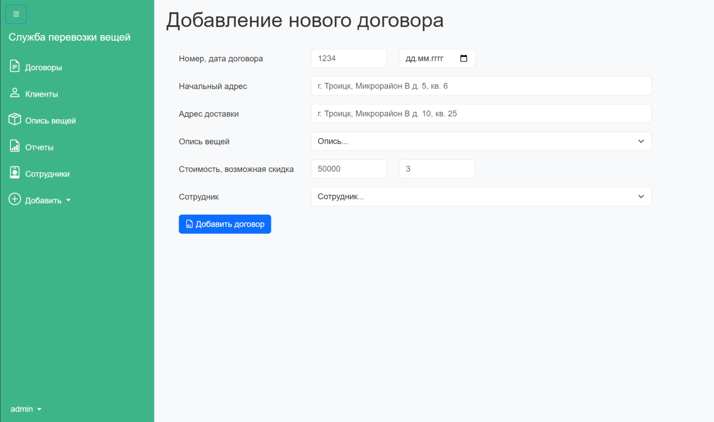{width="6.498611111111111in"
> height="3.85in"}
>
> Рисунок 3.11 -- Страница с формой ввода нового договора
>
> 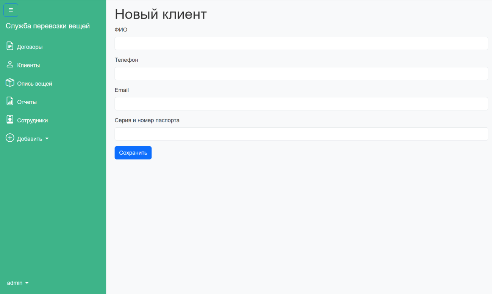{width="6.498611111111111in"
> height="3.8847222222222224in"}
>
> Рисунок 3.12 -- Страница с формой ввода нового клиента

44

> {width="6.498611111111111in"
> height="3.9055555555555554in"}
>
> Рисунок 3.13 -- Страница с формой ввода новой описи вещей
>
> 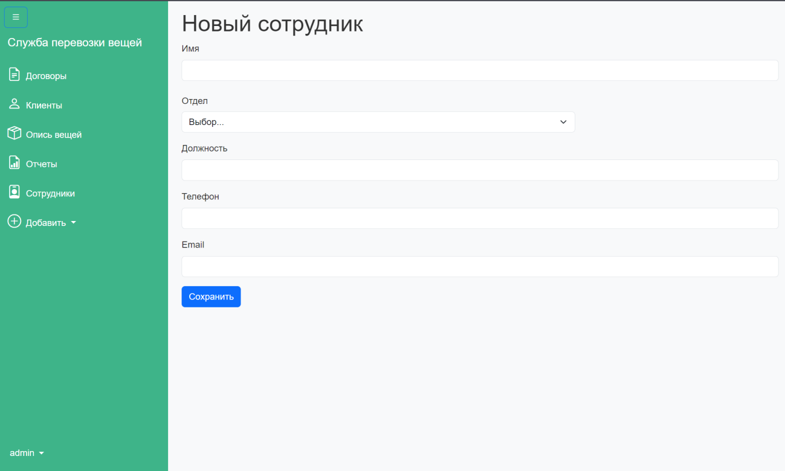{width="6.498611111111111in"
> height="3.9027777777777777in"}
>
> Рисунок 3.14 -- Страница с формой ввода нового сотрудника

45

> 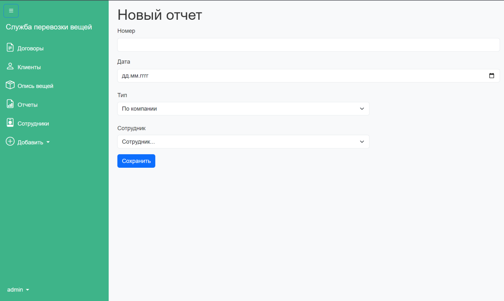{width="6.498611111111111in"
> height="3.888888888888889in"}
>
> Рисунок 3.15 -- Страница с формой ввода нового отчета
>
> **3.2.3. Генерация текстового документа «Договор оказания услуг
> перевозки»**\
> Для генерации текстового документа «Договор оказания услуг перевозки»
> была создана html-страница generate_contract.html с формой ввода
>
> переменных в шаблон документа. При этом часть переменных хранятся в
>
> таблицах базы данных (contracts, clients, employees), а часть вводится
> только
>
> при формировании текстового документа. Реализован следующий сценарий
> работы приложения:\
> − если документ уже сформирован (файл хранится в системе), из
>
> карточки договора скачивается файл с названием «договор №\[НОМЕР\] от
> \[ДАТА\].docx»;\
> − если документ не сформирован открывается форма заполнения; − после
> заполнения формы генерируется документ по шаблону в соответствии с
> веденными данными, открывается карточка договора.\
> Реализованы следующие функции-обработчики (таблица 3.8).

46

> Таблица 3.8 -- Реализованные функции для генерации документа договора

+-----------------------+-----------------------+-----------------------+
| > Маршрут             | > Функция             | > Описание            |
+=======================+=======================+=======================+
| > /generate_contract  | > generate_contract   | отображение страницы  |
|                       |                       | g                     |
|                       |                       | enerate_contract.html |
|                       |                       | c                     |
|                       |                       |                       |
|                       |                       | <table>               |
|                       |                       | <colgroup>            |
|                       |                       | <col                  |
|                       |                       | style="width: 33%" /> |
|                       |                       | <col                  |
|                       |                       | style="width: 33%" /> |
|                       |                       | <col                  |
|                       |                       | style="width: 33%" /> |
|                       |                       | </colgroup>           |
|                       |                       | <thead>               |
|                       |                       | <tr class="header">   |
|                       |                       | <th>формой</th>       |
|                       |                       | <th>ввода,</th>       |
|                       |                       | <th><blockquote>      |
|                       |                       | 
если
           |
|                       |                       | </blockquote></th>    |
|                       |                       | </tr>                 |
|                       |                       | </thead>              |
|                       |                       | <tbody>               |
|                       |                       | </tbody>              |
|                       |                       | </table>              |
|                       |                       |                       |
|                       |                       | документ отсутствует; |
|                       |                       |                       |
|                       |                       | > скачивание          |
|                       |                       | > документа, если он  |
|                       |                       | > существует          |
+-----------------------+-----------------------+-----------------------+
| /generate_contract    | > generate_contract   | > вызов функции       |
| POST                  |                       | >                     |
|                       |                       | > создания документа  |
+-----------------------+-----------------------+-----------------------+
| > \-                  | > create_contract     | > создание документа  |
|                       |                       | > по шаблону в        |
|                       |                       | > соответствии с      |
|                       |                       | > переданными         |
|                       |                       | > параметрами         |
+-----------------------+-----------------------+-----------------------+
| > \-                  | > replace_text        | заполнение параграфов |
+-----------------------+-----------------------+-----------------------+

> На рисунке 3.16 представлена форма заполнения параметра документа в
> приложении.
>
> 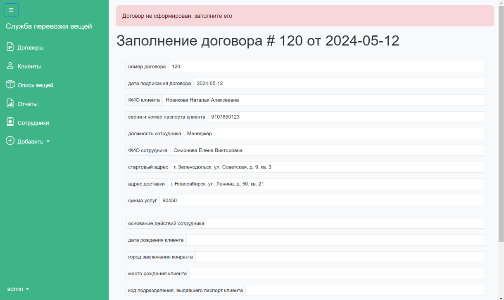{width="6.104166666666667in"
> height="3.640277777777778in"}
>
> Рисунок 3.16 -- Форма заполнения документа 47
>
> Образец сформированного в системе документа договора представлена
>
> на рисунке 3.17.
>
> 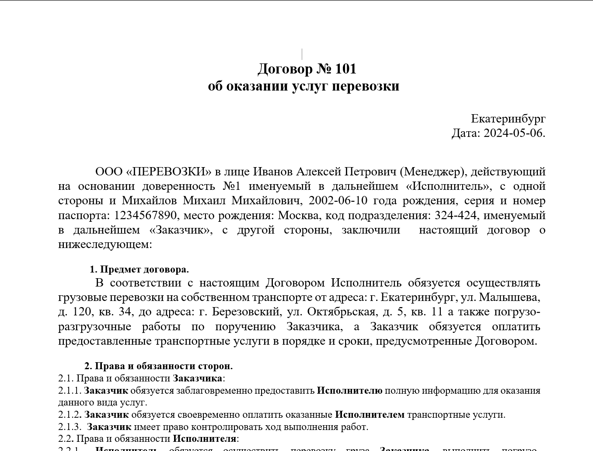{width="5.305555555555555in"
> height="4.036111111111111in"}
>
> Рисунок 3.17 -- Образец сформированного в системе договора
>
> **3.2.4. Генерация «Отчета по компании» с настаиваемыми**
>
> **фильтрами.**
>
> Для генерации текстового документа отчета «Отчет по компании» была
>
> создана html-страница select_period.html с настраиваемыми фильтрами.
> При
>
> этом часть переменных хранятся в таблицах базы данных (contracts,
>
> employees). Реализован следующий сценарий работы приложения:
>
> − если отчет уже сформирован (файл хранится в системе), из
>
> карточки договора скачивается файл с названием
>
> «generated_report_company\_\[НОМЕР\]»;
>
> − если отчет не сформирован, откроется форма для настройки
>
> фильтров;
>
> − после заполнения формы генерируется отчет по шаблону в
>
> соответствии с введенными выставленными фильтрами.
>
> Реализованы следующие функции-обработчики (таблица 3.9).

48

> Таблицы 3.9 -- Реализованные функции для генерации отчета

+-----------------------+-----------------------+-----------------------+
| > Маршрут             | > Функция             | > Описание            |
+=======================+=======================+=======================+
| > /download_report/   | > download_report     | > страница\           |
| > \<int:report_id\>   |                       | > select_period.html  |
|                       |                       | > с настройкой\       |
|                       |                       | > фильтров, для       |
|                       |                       | > составления отчета  |
+-----------------------+-----------------------+-----------------------+
| > /download_report/\  | > download_report     | > вызов функции       |
| > \<int:report_id\>   |                       | >                     |
| > POST                |                       | > создания отчета     |
+-----------------------+-----------------------+-----------------------+
| > \-                  | ge                    | > функция генерации   |
|                       | nerate_company_report | >                     |
|                       |                       | > отчета по фильтрам  |
+-----------------------+-----------------------+-----------------------+

> На рисунке 3.18 представлена форма выставления параметров фильтрации
> для генерации отчета.
>
> 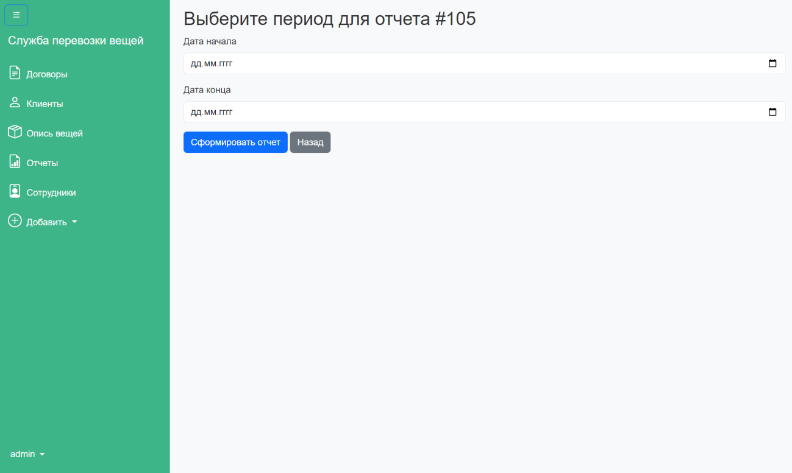{width="6.498611111111111in"
> height="3.8875in"}
>
> Рисунок 3.18 -- Параметры фильтрации для заполнения отчета

49

  --------------------------------------------------------------------------------------
  Образец    сформированного   отчета     в          системе    представлен   на
  ---------- ----------------- ---------- ---------- ---------- ------------- ----------

  --------------------------------------------------------------------------------------

> рисунке 3.19.
>
> 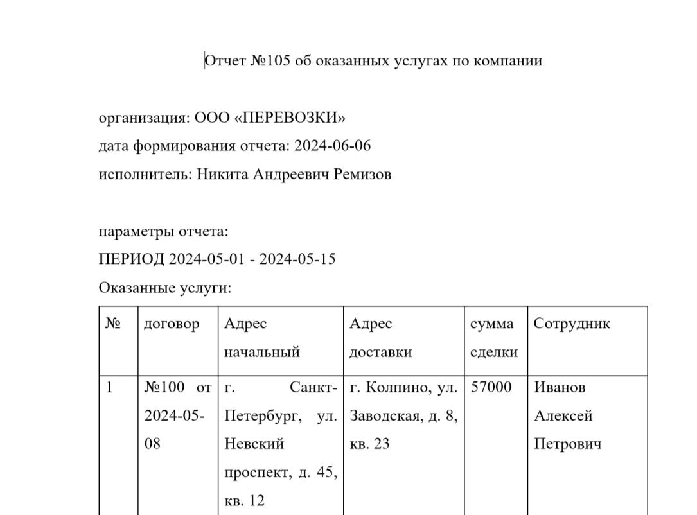{width="5.429166666666666in"
> height="4.013888888888889in"}

Рисунок 3.19 -- Сформированный отчет

> **3.2.5. Генерация табличного документа «Текущая занятость»**
>
> Для генерации текстового документа отчета «Отчет по компании» была
> создана html-страница current_occupancy_filters.html с настраиваемыми
> фильтрами. При этом часть переменных хранятся в таблицах базы данных
> (contracts, employees). Реализован следующий сценарий работы
> приложения:
>
> − открывается форма для настройки параметров фильтрации;
>
> − скачивание документа.
>
> Реализованы следующие функции-обработчики (таблица 3.10).
>
> Таблица 3.10 -- Реализованные функции для генерации табличного
> документа

+-----------------------+-----------------------+-----------------------+
| > Маршрут             | > Функция             | > Описание            |
+=======================+=======================+=======================+
| > /c                  | > current_occupan     | > отображение         |
| urrent_occupancy_filt | > cy_filters          | > страницы            |
| > ers                 |                       | >                     |
|                       |                       | > current_o           |
|                       |                       | ccupancy_filters.html |
|                       |                       | > с                   |
|                       |                       | >                     |
|                       |                       | > настройкой          |
|                       |                       | > фильтров, для       |
+-----------------------+-----------------------+-----------------------+

50

+-----------------------+-----------------------+-----------------------+
|                       |                       | > составления         |
|                       |                       | > табличного          |
|                       |                       | >                     |
|                       |                       | > документа.          |
+=======================+=======================+=======================+
| > /generate_report    | generate_report       | > генерация отчета по |
| > POST                |                       | > фильтрам            |
+-----------------------+-----------------------+-----------------------+

> На рисунке 3.20 представлена форма выставления параметров фильтрации
> для генерации табличного документа.
>
> Образец сформированного табличного документа в системе представлен на
> рисунке 3.21.
>
> 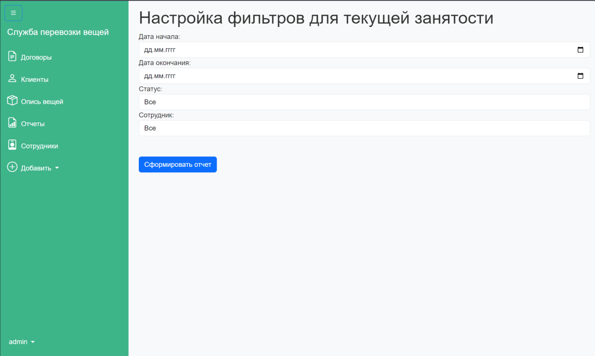{width="6.498611111111111in"
> height="3.9in"}
>
> Рисунок 3.20 -- Форма выставления параметров фильтрации для генерации
> табличного документа

51

> 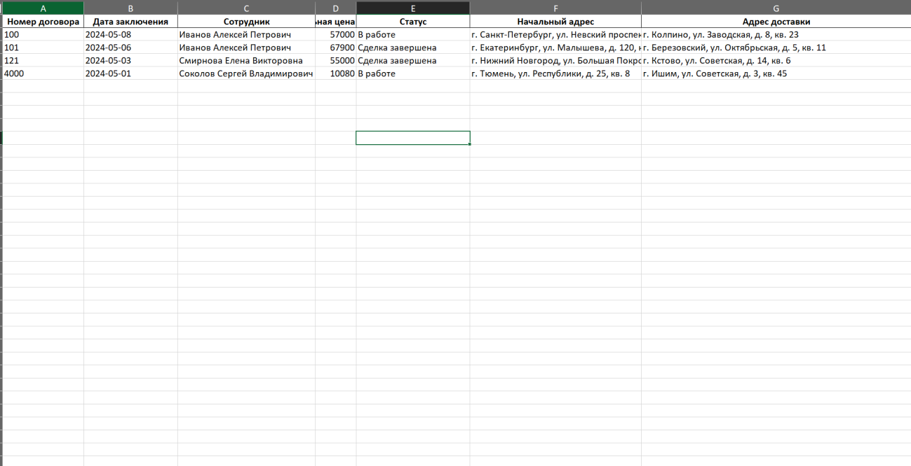{width="6.498611111111111in"
> height="3.3333333333333335in"}
>
> Рисунок 3.21 -- Образец сформированного табличного документа
>
> **3.2.6. Редактирование данных**\
> Для редактирования данных были созданы следующие html-страницы
> (таблица 3.11), реализованы следующие функции-обработчики (таблица
> 3.12).
>
> Таблицы 3.11 -- Реализованные страницы для редактирования данных

+-----------------------------------+-----------------------------------+
| > Шаблон                          | > Отображение                     |
+===================================+===================================+
| > edit_client.html                | +---------+---------+---------+   |
|                                   | | > с     | > для   | >       |   |
|                                   | | траница |         | редакти |   |
|                                   | |         |         | рования |   |
|                                   | +=========+=========+=========+   |
|                                   | | инф     | об      | > опред |   |
|                                   | | ормации |         | еленном |   |
|                                   | +---------+---------+---------+   |
|                                   |                                   |
|                                   | > клиенте                         |
+-----------------------------------+-----------------------------------+
| > edit_contract.html              | +---------+---------+---------+   |
|                                   | | > с     | > для   | >       |   |
|                                   | | траница |         | редакти |   |
|                                   | |         |         | рования |   |
|                                   | +=========+=========+=========+   |
|                                   | | инф     | об      | > опред |   |
|                                   | | ормации |         | еленном |   |
|                                   | +---------+---------+---------+   |
|                                   |                                   |
|                                   | > договоре                        |
+-----------------------------------+-----------------------------------+
| > edit_employee.html              | +---------+---------+---------+   |
|                                   | | > с     | > для   | >       |   |
|                                   | | траница |         | редакти |   |
|                                   | |         |         | рования |   |
|                                   | +=========+=========+=========+   |
|                                   | | инф     | об      | > опред |   |
|                                   | | ормации |         | еленном |   |
|                                   | +---------+---------+---------+   |
|                                   |                                   |
|                                   | > сотруднике                      |
+-----------------------------------+-----------------------------------+
| > edit_report.html                | +---------+---------+---------+   |
|                                   | | > с     | для     | >       |   |
|                                   | | траница |         | редакти |   |
|                                   | |         |         | рования |   |
|                                   | +=========+=========+=========+   |
|                                   | +---------+---------+---------+   |
|                                   |                                   |
|                                   | > определенного отчёта            |
+-----------------------------------+-----------------------------------+
| > edit_things.html                | +---------+---------+---------+   |
|                                   | | > с     | для     | >       |   |
|                                   | | траница |         | редакти |   |
|                                   | |         |         | рования |   |
|                                   | +=========+=========+=========+   |
|                                   | +---------+---------+---------+   |
|                                   |                                   |
|                                   | > определенной описи вещей        |
+-----------------------------------+-----------------------------------+

52

> Таблица 3.12 -- Реализованные функции для отображения данных

+-----------------------+-----------------------+-----------------------+
| > Маршрут             | > Функция             | > Описание            |
+=======================+=======================+=======================+
| > /edit_contrac       | > edit_contract       | > отображение         |
| t/\<int:contract_id\> |                       | >                     |
|                       |                       | > страницы\           |
|                       |                       | > edit_contract.html  |
|                       |                       | > с формой ввода      |
+-----------------------+-----------------------+-----------------------+
| > /edit_contrac       | > edit_contract       | > изменение значении  |
| t/\<int:contract_id\> |                       | > определенного\      |
| > POST                |                       | > объекта БД таблицы  |
|                       |                       | > contracts           |
+-----------------------+-----------------------+-----------------------+
| > /edit_t             | > edit_thing          | > отображение\        |
| hing/\<int:thing_id\> |                       | > страницы\           |
|                       |                       | > edit_thing.html с   |
|                       |                       | > формой ввода        |
+-----------------------+-----------------------+-----------------------+
| > /edit_t             | > edit_thing          | > изменение значении  |
| hing/\<int:thing_id\> |                       | > определенного\      |
| > POST                |                       | > объекта БД таблицы  |
|                       |                       | > things              |
+-----------------------+-----------------------+-----------------------+
| > /edit_cli           | > edit_client         | > отображение\        |
| ent/\<int:client_id\> |                       | > страницы\           |
|                       |                       | > edit_client.html с  |
|                       |                       | > формой ввода        |
+-----------------------+-----------------------+-----------------------+
| > /edit_cli           | > edit_client         | > изменение значении  |
| ent/\<int:client_id\> |                       | > определенного\      |
| > POST                |                       | > объекта БД таблицы  |
|                       |                       | > clients             |
+-----------------------+-----------------------+-----------------------+
| /edit_employe         | > edit_employee       | > отображение         |
| e/\<int:employee_id\> |                       | > страницы            |
+-----------------------+-----------------------+-----------------------+

53

+-----------------------+-----------------------+-----------------------+
|                       |                       | > edit_employee.html  |
|                       |                       | > с формой ввода      |
+=======================+=======================+=======================+
| > /edit_employe       | > edit_employee       | > изменение значении  |
| e/\<int:employee_id\> |                       | > определенного\      |
| > POST                |                       | > объекта БД таблицы  |
|                       |                       | > employees           |
+-----------------------+-----------------------+-----------------------+
| > /edit_rep           | > edit_report         | > отображение         |
| ort/\<int:report_id\> |                       | > страницы            |
|                       |                       | >                     |
|                       |                       | > edit_report.html с  |
|                       |                       | > формой ввода        |
+-----------------------+-----------------------+-----------------------+
| /edit_rep             | > edit_report         | > изменение значении  |
| ort/\<int:report_id\> |                       | > определенного\      |
| POST                  |                       | > объекта БД таблицы  |
|                       |                       | > reports             |
+-----------------------+-----------------------+-----------------------+

> На рисунках 3.22 -- 3.26 представлена формы редактирования всех
> объектов БД.
>
> 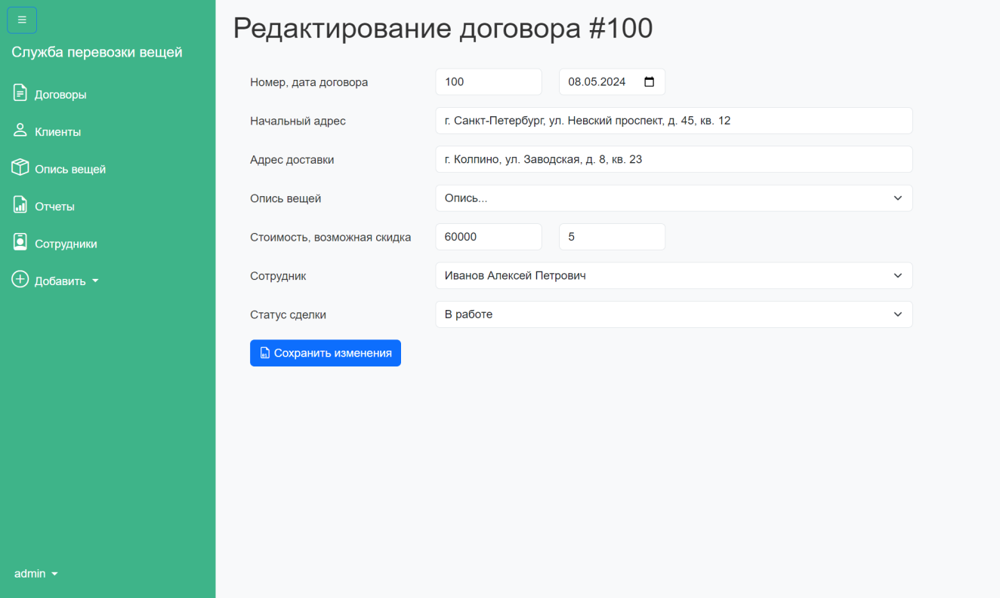{width="6.6194444444444445in"
> height="3.9652777777777777in"}
>
> Рисунок 3.22 -- Форма для редактирования договора 54
>
> {width="6.5152777777777775in"
> height="3.9097222222222223in"}
>
> Рисунок 3.23 -- Форма для редактирования клиента
>
> 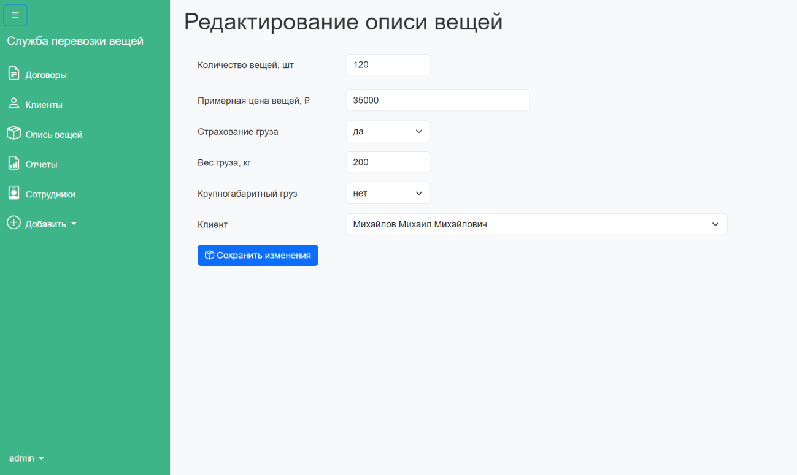{width="6.498611111111111in"
> height="3.876388888888889in"}
>
> Рисунок 3.24 -- Форма для редактирования описи вещей

55

> 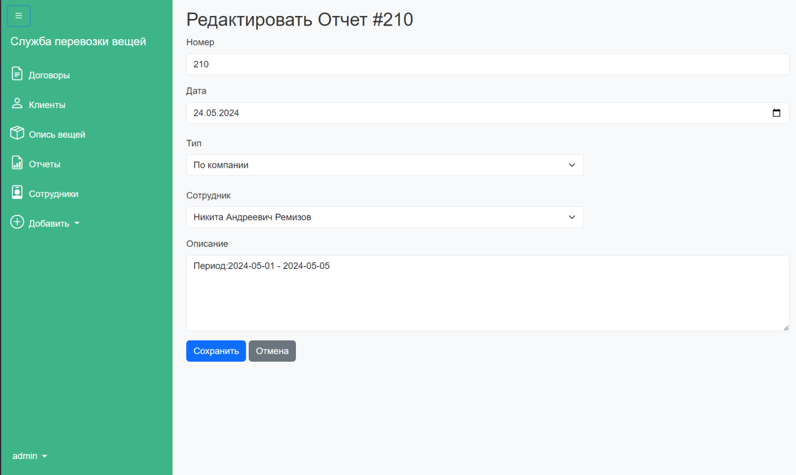{width="6.498611111111111in"
> height="3.8833333333333333in"}
>
> Рисунок 3.25 -- Форма для редактирования отчета
>
> 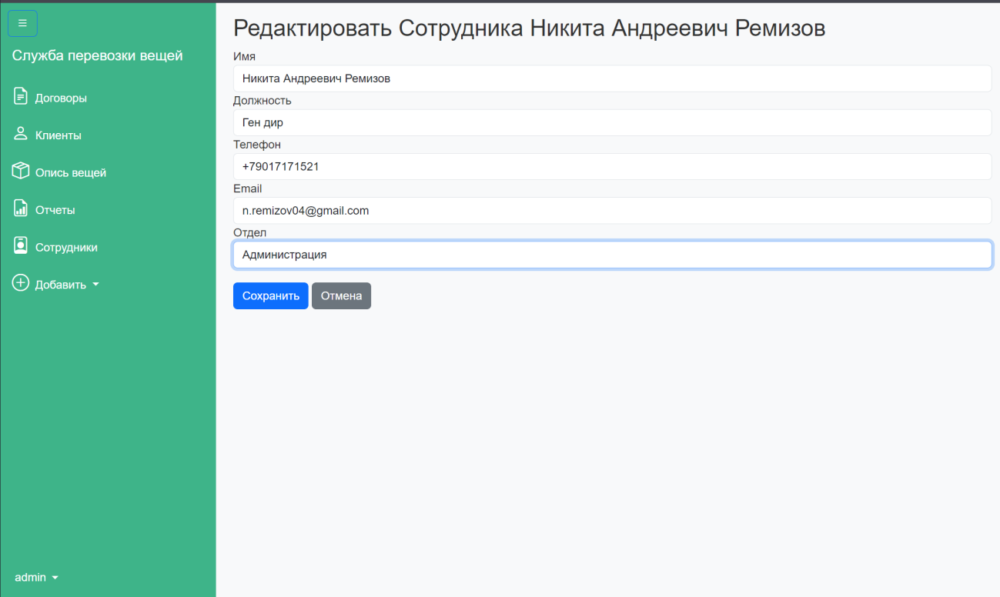{width="6.498611111111111in"
> height="3.8805544619422574in"}
>
> Рисунок 3.26 -- Форма для редактирования сотрудника\
> **3.2.7. Отправка электронного письма**\
> Для отправки электронного письма была создана html-страница
> send_email.html. При переходе на страницу автоматически вставляется
> почта

56

> клиента и генерируется текст письма в таком формате: «Уважаемый \[ФИО
>
> клиента\], ваш договор №\[НОМЕР\] находится в статусе \[СТАТУС\]».

+-------------+-------------+-------------+-------------+-------------+
| >           | следующие   | функции-    | для         | > отправки  |
| Реализованы |             | обработчики |             |             |
+=============+=============+=============+=============+=============+
+-------------+-------------+-------------+-------------+-------------+

> электронного письма (таблица 3.13).
>
> Таблица 3.13 -- Реализованные функции для отправки электронного письма

+-----------------------+-----------------------+-----------------------+
| > Маршрут             | > Функция             | > Описание            |
+=======================+=======================+=======================+
| /send_emai            | > send_email          | > отображение\        |
| l/\<int:contract_id\> |                       | > страницы\           |
|                       |                       | > send_email.html с   |
|                       |                       | > формой ввода        |
+-----------------------+-----------------------+-----------------------+
| > /send_emai          | > send_email          | > вызов функции для   |
| l/\<int:contract_id\> |                       | > отправки письма     |
| > POST                |                       |                       |
+-----------------------+-----------------------+-----------------------+
| > \-                  | >                     | > функция отправки    |
|                       |  send_email_to_client |                       |
|                       |                       | электронного письма   |
+-----------------------+-----------------------+-----------------------+

> На рисунке 3.27 показана форма для отправки письма.
>
> 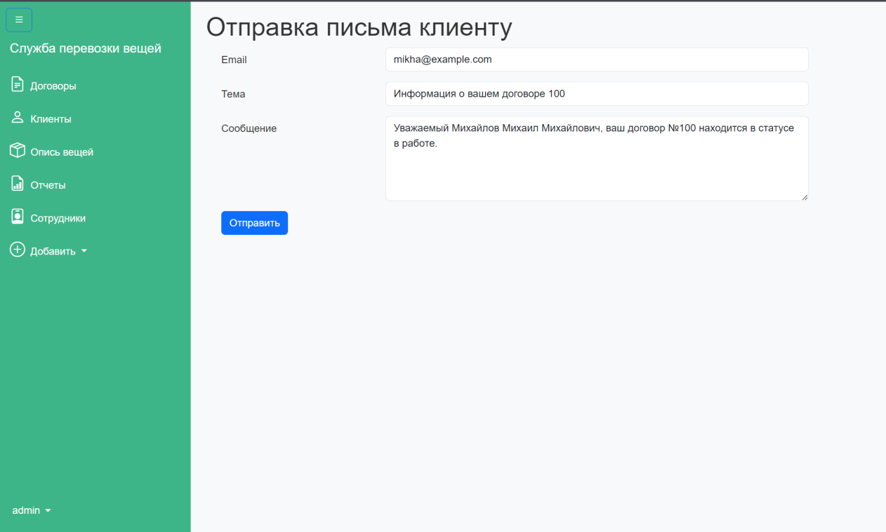{width="6.312498906386701in"
> height="3.798611111111111in"}

Рисунок 3.27 -- Форма отправки письма

57

> **3.2.8. Корректная аутентификация и ограничение доступа к
> просмотру**\
> Для корректной аутентификации и ограничения доступа к просмотру была
> создана html-страница login.html. Реализован следующий сценарий
> работы:\
> − если пользователь авторизуется под ролью admin, то ему доступны все
> функции приложения;\
> − если пользователь авторизуется под ролью user, то ему доступны
> только страницы «договоры» и «опись вещей».
>
> Реализованы следующие функции-обработчики (таблица 3.14).
>
> Таблица 3.14 -- Реализованные функции для авторизации

+-----------------------+-----------------------+-----------------------+
| > Маршрут             | > Функция             | > Описание            |
+=======================+=======================+=======================+
| > /login              | > login               | > отображение         |
|                       |                       | > страницы login.html |
+-----------------------+-----------------------+-----------------------+
| > /login POST         | > login               | <table>               |
|                       |                       | <colgroup>            |
|                       |                       | <col                  |
|                       |                       | style="width: 33%" /> |
|                       |                       | <col                  |
|                       |                       | style="width: 33%" /> |
|                       |                       | <col                  |
|                       |                       | style="width: 33%" /> |
|                       |                       | </colgroup>           |
|                       |                       | <thead>               |
|                       |                       | <tr class="header">   |
|                       |                       | <th><blockquote>      |
|                       |                       | 
проверка
       |
|                       |                       | </blockquote></th>    |
|                       |                       | <th>логина</th>       |
|                       |                       | <th>и</th>            |
|                       |                       | </tr>                 |
|                       |                       | </thead>              |
|                       |                       | <tbody>               |
|                       |                       | </tbody>              |
|                       |                       | </table>              |
|                       |                       |                       |
|                       |                       | > пароля, выдача      |
|                       |                       | > ролей               |
+-----------------------+-----------------------+-----------------------+
| > \-                  | > admin_required      | > декоратор для       |
|                       |                       | > доступа на основе   |
|                       |                       | > ролей               |
+-----------------------+-----------------------+-----------------------+

На рисунке 3.28 показана форма для авторизации пользователя.

> 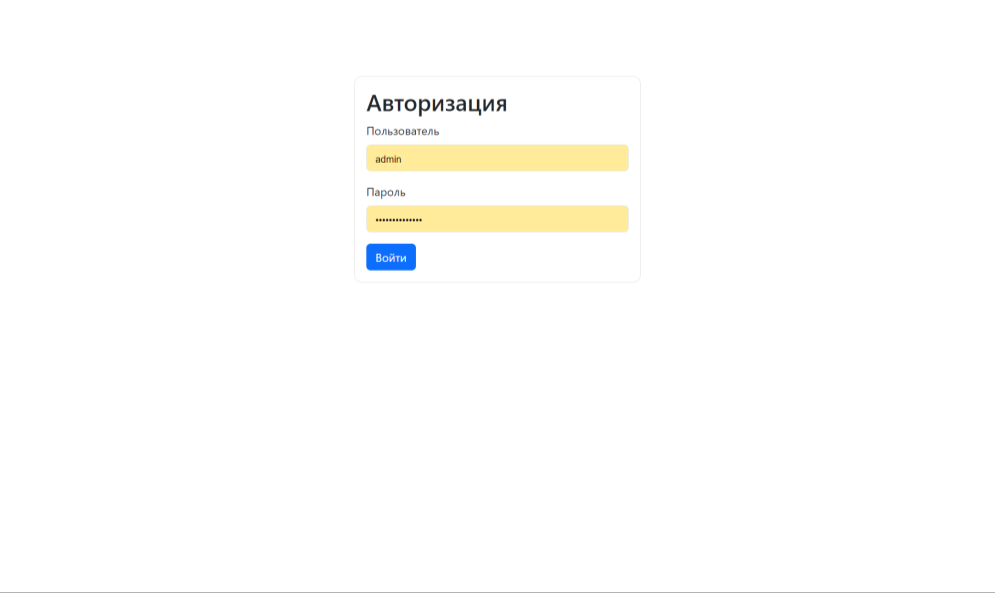{width="4.977777777777778in"
> height="2.966665573053368in"}
>
> Рисунок 3.28 -- Форма авторизации пользователя 58
>
> На рисунке 3.29 показано ограничение права доступа, при попытке зайти
> на страницу отчеты.
>
> 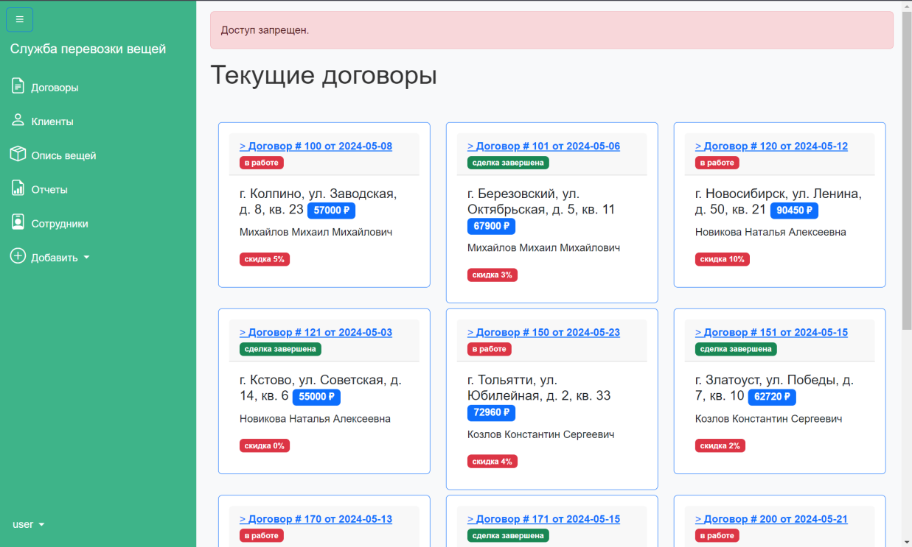{width="6.1875in"
> height="3.7180555555555554in"}
>
> Рисунок 3.29 -- Ограничение права доступа

59

> **Заключение**\
> В ходе выполнения курсовой работы была успешно разработана подсистема
> управления документами и рабочими потоками для службы перевозки вещей,
> что позволило значительно повысить эффективность и

+-----------+-----------+-----------+-----------+-----------+-----------+
| авто      | бизнес-   | компании. | На        | основе    | > д       |
| матизацию | процессов |           |           |           | етального |
+===========+===========+===========+===========+===========+===========+
+-----------+-----------+-----------+-----------+-----------+-----------+

> исследования предметной области и анализа текущих систем, была
> спроектирована и реализована база данных, включающая ключевую
> информацию о сотрудниках, клиентах, договорах и отчетах.
>
> Созданное веб-приложение обеспечило пользователям широкий спектр
> функциональных возможностей, включая добавление, редактирование и
> отображение данных, а также автоматическую генерацию текстовых и

+-----------+-----------+-----------+-----------+-----------+-----------+
| табличных | до        | Допол     | были      | внедрены  | >         |
|           | кументов. | нительно, |           |           | механизмы |
+===========+===========+===========+===========+===========+===========+
+-----------+-----------+-----------+-----------+-----------+-----------+

> аутентификации и защиты данных, что гарантирует безопасность и
> конфиденциальность информации.

+---------+---------+---------+---------+---------+---------+---------+
| > Вн    | данной  | системы | может   | п       | к       | > сущес |
| едрение |         |         |         | ривести |         | твенной |
+=========+=========+=========+=========+=========+=========+=========+
+---------+---------+---------+---------+---------+---------+---------+

> оптимизации процессов управления документами и рабочими потоками, что,
> в свою очередь, может сократить временные затраты на обработку данных,
> но и увеличить производительность компании.

60

> **Приложение А**\
> **Шаблон договора оказания услуг перевозки**

Договор № ==CONTRACT_NUMBER==

об оказании услуг перевозки

> **=**=CONTRACT_CITY==\
> Дата: ==CONTRACT_DATE==.
>
> ООО «ПЕРЕВОЗКИ» в лице ==EMPLOYEE_FULLNAME==(==EMPLOYEE_POSITION==),

+---------+---------+---------+---------+---------+---------+---------+
| дейс    | на      | ос      | ==EMPL  | им      | в       | > дал   |
| твующий |         | новании | OYEE_AT | енуемый |         | ьнейшем |
|         |         |         | TORNEY_ |         |         |         |
|         |         |         | POWER== |         |         |         |
+=========+=========+=========+=========+=========+=========+=========+
+---------+---------+---------+---------+---------+---------+---------+

> **«Исполнитель»,** с одной стороны и ==CLIENT_FULLNAME==,
> ==CLIENT_BIRTHDATE== года рождения,

+---------+---------+---------+---------+---------+---------+---------+
| серия   | и       | номер   | па      | ==CLIE  | место   | > ро    |
|         |         |         | спорта: | NT_PASS |         | ждения: |
|         |         |         |         | PORT_NU |         |         |
|         |         |         |         | MBER==, |         |         |
+=========+=========+=========+=========+=========+=========+=========+
+---------+---------+---------+---------+---------+---------+---------+

> ==CLIENT_BIRTHPLACE==, код подразделения: ==CLIENT_PASSPORT_DEPCODE==,
> именуемый в дальнейшем **«Заказчик»**, с другой стороны, заключили
> настоящий договор о нижеследующем:
>
> **1. Предмет договора.**
>
> В соответствии с настоящим Договором **Исполнитель** обязуется
> осуществлять грузовые перевозки на собственном транспорте от адреса:
> ==ADDRESS_START==, до адреса: ==ADDRESS_FINISH== а также
> погрузо-разгрузочные работы по поручению **Заказчика**, а **Заказчик**
> обязуется оплатить предоставленные транспортные услуги в порядке и
> сроки, предусмотренные Договором.
>
> **2. Права и обязанности сторон.**
>
> 2.1. Права и обязанности **Заказчика**:\
> 2.1.1. **Заказчик** обязуется заблаговременно предоставить
> **Исполнителю** полную информацию для оказания данного вида услуг.
>
> 2.1.2**. Заказчик** обязуется своевременно оплатить оказанные
> **Исполнителем** транспортные услуги. 2.1.3. **Заказчик** имеет право
> контролировать ход выполнения работ.
>
> 2.2**.** Права и обязанности **Исполнителя**:\
> **Исполнитель** обязуется осуществить перевозку груза **Заказчика**,
> выполнить погрузо-2.2.1.
>
> разгрузочные работы.
>
> **3.Стоимость услуг и порядок расчетов.**
>
> 3.1. Стоимость услуг по настоящему
> Договорусоставляет**==**CONTRACT_SUM== рублей **(без налога
> НДС)[.]{.underline}**
>
> 3.2. Расчет за оказанные услуги осуществляется на основании
> действующего Договора, при этом **Исполнитель** оставляет за собой
> право на изменение стоимости услуг, в зависимости от изменения цен на
> рынке транспортных услуг. Новый тарифный план предоставляется
> **Заказчику** в уведомительном порядке. 3.3. Оплата услуг **Заказчиком
> Исполнителю** производится до/в процессе/после окончания выполнения
> работ.

61

> **4.Ответственность сторон.**
>
> 4.1. За неисполнение или ненадлежащее исполнение обязательств по
> настоящему Договору Стороны несут ответственность в соответствии с
> законодательством Российской Федерации.
>
> 4.2. **Заказчик** несет ответственность за несвоевременную оплату
> оказанных **Исполнителем** услуг в размере **1%** за каждый день
> просрочки.
>
> 4.3. Стороны освобождаются от ответственности за частичное или полное
> невыполнение своих обязательств
>
> по настоящему Договору, если оно является следствием обстоятельств
> непреодолимой силы. Срок
>
> исполнения договорных обязательств автоматически пролонгируется на
> период действия этих обстоятельств.
>
> По окончании действия обстоятельств непреодолимой силы стороны
> восстанавливают отношения до полного
>
> выполнения своих обязательств по настоящему Договору.
>
> 4.4. Сторона, для которой создалась невозможность выполнения
> обязательств по Договору, обязана
>
> немедленно известить другую сторону о наступлении или прекращении
> вышеуказанных обязательств.
>
> Несвоевременное извещение об обстоятельствах непреодолимой силы лишает
> соответствующую сторону права считать их причиной невыполнения условий
> настоящего Договора.
>
> **5.Срок действия договора.**
>
> 5.1. Договор действует с момента подписания до момента окончания
> работ, оплаты счета и подписания сторонами акта выполненных работ.
>
> 5.2. Если ни одна из сторон не расторгла договор до истечения срока
> действия, договор пролонгируется. 5.3. **Заказчик** в праве
> расторгнуть договор в одностороннем порядке после завершения всех
> расчетов с **Исполнителем**.
>
> 5.4. **Исполнитель** в праве расторгнуть договор в одностороннем
> порядке в случае несвоевременной оплаты **Заказчиком** оказанных
> услуг.
>
> 5.5. **Исполнитель** в праве расторгнуть договор в одностороннем
> порядке с уведомлением **Заказчика** за **10 (десять)** суток.
>
> **6. Реквизиты и подписи сторон.**
>
> **Исполнитель:**
>
> **ООО «ПЕРЕВОЗКИ»**\
> ИНН: 782570148860\
> КПП : 771301001\
> Расчетный счет: 40802810332410001244\
> Название Банка: АЛЬФА-БАНК
> \_\_\_\_\_\_\_\_\_\_\_\_\_\_\_\_\_\_\_\_\_\_\_\_
>
> Кор.счет: 30101810600000000786 подпись БИК банка: 044030786
>
> **Заказчик:**\
> ФИО: ==CLIENT_FULLNAME==\
> РС: ==CLIENT_RS==

62

> Банк: ==CLIENT_BANK==\
> БИК: ==CLIENT_BIK==

\_\_\_\_\_\_\_\_\_\_\_\_\_\_\_\_\_\_\_\_

подпись

63

**Приложение Б**

**Пример отчета по компании**

> Отчет №213 об оказанных услугах по компании
>
> организация: ООО «ПЕРЕВОЗКИ»
>
> дата формирования отчета: 2024-05-07
>
> исполнитель: Никита Андреевич Ремизов
>
> параметры отчета:
>
> ПЕРИОД 2024-05-01 - 2024-05-24
>
> Оказанные услуги:

+-----------+-----------+-----------+-----------+-----------+-----------+
| > №       | > договор | > Адрес\  | > Адрес\  | сумма\    | >         |
|           |           | >         | >         | сделки    | Сотрудник |
|           |           | начальный |  доставки |           |           |
+===========+===========+===========+===========+===========+===========+
| > 1       | > №100    |   ----    | > г.      | > 57000   | > Иванов\ |
|           | > от      | --------- | >         |           | >         |
|           | 2024-05-\ |   г.      |  Колпино, |           |  Алексей\ |
|           | > 08      |    Санкт- | > ул.З    |           | >         |
|           |           |   ----    | аводская, |           |  Петрович |
|           |           |  -------- | > д.      |           |           |
|           |           |           | > 8,кв.   |           |           |
|           |           |   ----    | > 23      |           |           |
|           |           | --------- |           |           |           |
|           |           |           |           |           |           |
|           |           | П         |           |           |           |
|           |           | етербург, |           |           |           |
|           |           | ул.       |           |           |           |
|           |           |           |           |           |           |
|           |           | >         |           |           |           |
|           |           |  Невский\ |           |           |           |
|           |           | >         |           |           |           |
|           |           | проспект, |           |           |           |
|           |           | > д.      |           |           |           |
|           |           | > 45,кв.  |           |           |           |
|           |           | > 12      |           |           |           |
+-----------+-----------+-----------+-----------+-----------+-----------+
| > 2       | > №101    | > г.      | > г.      | > 67900   | > Иванов\ |
|           | > от      | >         | > Березо  |           | >         |
|           | 2024-05-\ | > Екатери | вский,ул. |           |  Алексей\ |
|           | > 06      | нбург,ул. | >         |           | >         |
|           |           | > Ма      | > Октяб   |           |  Петрович |
|           |           | лышева,д. | рьская,д. |           |           |
|           |           | > 120,    | > 5, кв.  |           |           |
|           |           | > кв. 34  | > 11      |           |           |
+-----------+-----------+-----------+-----------+-----------+-----------+
| > 3       | > №120    | > г.      | > г.      | > 90450   | >         |
|           | > от      | >         | >         |           | Смирнова\ |
|           | 2024-05-\ | > Зелен   | > Новоси  |           | > Елена\  |
|           | > 12      | одольск,\ | бирск,ул. |           | > В       |
|           |           | > ул.     | > Ленина, |           | икторовна |
|           |           | > Сов     | > д.      |           |           |
|           |           | етская,д. | >         |           |           |
|           |           | > 9, кв.  | > 50, кв. |           |           |
|           |           | > 3       | > 21      |           |           |
+-----------+-----------+-----------+-----------+-----------+-----------+
| > 4       | > №121    | <table>   | г.        | > 55000   | >         |
|           | > от      | <         | Кстово,   |           | Смирнова\ |
|           | 2024-05-\ | colgroup> | ул.       |           | > Елена\  |
|           | > 03      | <col      |           |           | > В       |
|           |           | sty       |           |           | икторовна |
|           |           | le="width |  -------- |           |           |
|           |           | : 33%" /> | --------- |           |           |
|           |           | <col      |   Советс  |           |           |
|           |           | sty       | кая,   д. |           |           |
|           |           | le="width |           |           |           |
|           |           | : 33%" /> |  -------- |           |           |
|           |           | <col      | ---- ---- |           |           |
|           |           | sty       |           |           |           |
|           |           | le="width |           |           |           |
|           |           | : 33%" /> |  -------- |           |           |
|           |           | </        | --------- |           |           |
|           |           | colgroup> |           |           |           |
|           |           | <thead>   | > 14, кв. |           |           |
|           |           | <tr       | > 6       |           |           |
|           |           | class=    |           |           |           |
|           |           | "header"> |           |           |           |
|           |           | <t        |           |           |           |
|           |           | h>г.</th> |           |           |           |
|           |           | <th       |           |           |           |
|           |           | colspa    |           |           |           |
|           |           | n="2"><bl |           |           |           |
|           |           | ockquote> |           |           |           |
|           |           | 
Н      |           |           |           |
|           |           | ижний
 |           |           |           |
|           |           | </blockqu |           |           |           |
|           |           | ote></th> |           |           |           |
|           |           | </tr>     |           |           |           |
|           |           | </thead>  |           |           |           |
|           |           | <tbody>   |           |           |           |
|           |           | <tr       |           |           |           |
|           |           | cla       |           |           |           |
|           |           | ss="odd"> |           |           |           |
|           |           | <td       |           |           |           |
|           |           | c         |           |           |           |
|           |           | olspan="2 |           |           |           |
|           |           | "><table> |           |           |           |
|           |           | <         |           |           |           |
|           |           | colgroup> |           |           |           |
|           |           | <col      |           |           |           |
|           |           | styl      |           |           |           |
|           |           | e="width: |           |           |           |
|           |           |  100%" /> |           |           |           |
|           |           | </        |           |           |           |
|           |           | colgroup> |           |           |           |
|           |           | <thead>   |           |           |           |
|           |           | <tr       |           |           |           |
|           |           | class=    |           |           |           |
|           |           | "header"> |           |           |           |
|           |           | <th>Новго |           |           |           |
|           |           | род,</th> |           |           |           |
|           |           | </tr>     |           |           |           |
|           |           | </thead>  |           |           |           |
|           |           | <tbody>   |           |           |           |
|           |           | </tbody>  |           |           |           |
|           |           | </ta      |           |           |           |
|           |           | ble></td> |           |           |           |
|           |           | <td       |           |           |           |
|           |           | >ул.</td> |           |           |           |
|           |           | </tr>     |           |           |           |
|           |           | </tbody>  |           |           |           |
|           |           | </table>  |           |           |           |
|           |           |           |           |           |           |
|           |           | > Большая |           |           |           |
+-----------+-----------+-----------+-----------+-----------+-----------+

64

+-----------+-----------+-----------+-----------+-----------+-----------+
|           |           | > По      |           |           |           |
|           |           | кровская, |           |           |           |
|           |           | > д.30,   |           |           |           |
|           |           | > кв. 45  |           |           |           |
+===========+===========+===========+===========+===========+===========+
| > 5       | > №150    | > г.      | г.        | > 72960   | > Кузнецо |
|           | > от      | > Самара, | Тольятти, |           | вДмитрий\ |
|           | 2024-05-\ | > у       | ул.Ю      |           | >         |
|           | > 23      | л.Ленингр | билейная, |           | Сергеевич |
|           |           | адская,д. | д.        |           |           |
|           |           | > 5, кв.  |           |           |           |
|           |           | > 22      | > 2, кв.  |           |           |
|           |           |           | > 33      |           |           |
+-----------+-----------+-----------+-----------+-----------+-----------+
| > 6       | > №151    | <table>   | > г.      | > 62720   | > Кузнецо |
|           | > от      | <         | >         |           | вДмитрий\ |
|           | 2024-05-\ | colgroup> | Златоуст, |           | >         |
|           | > 15      | <col      | > у       |           | Сергеевич |
|           |           | sty       | л.Победы, |           |           |
|           |           | le="width | > д.      |           |           |
|           |           | : 50%" /> | > 7,кв.   |           |           |
|           |           | <col      | > 10      |           |           |
|           |           | sty       |           |           |           |
|           |           | le="width |           |           |           |
|           |           | : 50%" /> |           |           |           |
|           |           | </        |           |           |           |
|           |           | colgroup> |           |           |           |
|           |           | <thead>   |           |           |           |
|           |           | <tr       |           |           |           |
|           |           | class=    |           |           |           |
|           |           | "header"> |           |           |           |
|           |           | <t        |           |           |           |
|           |           | h>г.</th> |           |           |           |
|           |           | <th><bl   |           |           |           |
|           |           | ockquote> |           |           |           |
|           |           | 
Челяб  |           |           |           |
|           |           | инск,
 |           |           |           |
|           |           | </blockqu |           |           |           |
|           |           | ote></th> |           |           |           |
|           |           | </tr>     |           |           |           |
|           |           | </thead>  |           |           |           |
|           |           | <tbody>   |           |           |           |
|           |           | </tbody>  |           |           |           |
|           |           | </table>  |           |           |           |
|           |           |           |           |           |           |
|           |           | > ул.     |           |           |           |
|           |           | > Кирова, |           |           |           |
|           |           | > д.55,   |           |           |           |
|           |           | > кв. 11  |           |           |           |
+-----------+-----------+-----------+-----------+-----------+-----------+
| > 7       | > №170    | <table>   | <table>   | > 17000   | <table>   |
|           | > от      | <         | <         |           | <         |
|           | 2024-05-\ | colgroup> | colgroup> |           | colgroup> |
|           | > 13      | <col      | <col      |           | <col      |
|           |           | sty       | sty       |           | sty       |
|           |           | le="width | le="width |           | le="width |
|           |           | : 50%" /> | : 50%" /> |           | : 50%" /> |
|           |           | <col      | <col      |           | <col      |
|           |           | sty       | sty       |           | sty       |
|           |           | le="width | le="width |           | le="width |
|           |           | : 50%" /> | : 50%" /> |           | : 50%" /> |
|           |           | </        | </        |           | </        |
|           |           | colgroup> | colgroup> |           | colgroup> |
|           |           | <thead>   | <thead>   |           | <thead>   |
|           |           | <tr       | <tr       |           | <tr       |
|           |           | class=    | class=    |           | class=    |
|           |           | "header"> | "header"> |           | "header"> |
|           |           | <t        | <t        |           | <th>По    |
|           |           | h>г.</th> | h>г.</th> |           | пова</th> |
|           |           | <th><bl   | <th><bl   |           | <th><bl   |
|           |           | ockquote> | ockquote> |           | ockquote> |
|           |           | 
Волго  | 
Волж   |           | 
 | ский,
 |           | >Анна
 |
|           |           | </blockqu | </blockqu |           | </blockqu |
|           |           | ote></th> | ote></th> |           | ote></th> |
|           |           | </tr>     | </tr>     |           | </tr>     |
|           |           | </thead>  | </thead>  |           | </thead>  |
|           |           | <tbody>   | <tbody>   |           | <tbody>   |
|           |           | <tr       | </tbody>  |           | </tbody>  |
|           |           | cla       | </table>  |           | </table>  |
|           |           | ss="odd"> |           |           |           |
|           |           | <t        | > ул.     |           | Алек      |
|           |           | d><table> |           |           | сандровна |
|           |           | <         | К         |           |           |
|           |           | colgroup> | арбышева, |           |           |
|           |           | <col      | д.        |           |           |
|           |           | styl      |           |           |           |
|           |           | e="width: | > 6, кв.  |           |           |
|           |           |  100%" /> | > 25      |           |           |
|           |           | </        |           |           |           |
|           |           | colgroup> |           |           |           |
|           |           | <thead>   |           |           |           |
|           |           | <tr       |           |           |           |
|           |           | class=    |           |           |           |
|           |           | "header"> |           |           |           |
|           |           | <th       |           |           |           |
|           |           | >ул.</th> |           |           |           |
|           |           | </tr>     |           |           |           |
|           |           | </thead>  |           |           |           |
|           |           | <tbody>   |           |           |           |
|           |           | </tbody>  |           |           |           |
|           |           | </ta      |           |           |           |
|           |           | ble></td> |           |           |           |
|           |           | <td>А     |           |           |           |
|           |           | ллея</td> |           |           |           |
|           |           | </tr>     |           |           |           |
|           |           | </tbody>  |           |           |           |
|           |           | </table>  |           |           |           |
|           |           |           |           |           |           |
|           |           | > Героев, |           |           |           |
|           |           | > д.      |           |           |           |
|           |           | > 23,кв.  |           |           |           |
|           |           | > 9       |           |           |           |
+-----------+-----------+-----------+-----------+-----------+-----------+
| > 8       | > №171    |           | > г.      | > 15000   | <table>   |
|           | > от      |  -------- | >         |           | <         |
|           | 2024-05-\ | --------- | > Стер    |           | colgroup> |
|           | > 15      |   г.   У  | литамак,\ |           | <col      |
|           |           | фа,   ул. | > ул.     |           | sty       |
|           |           |           | >         |           | le="width |
|           |           |  ---- --- |  Чапаева, |           | : 50%" /> |
|           |           | --- ----- | > д.      |           | <col      |
|           |           |           | >         |           | sty       |
|           |           |           | > 14, кв. |           | le="width |
|           |           |  -------- | > 5       |           | : 50%" /> |
|           |           | --------- |           |           | </        |
|           |           |           |           |           | colgroup> |
|           |           | > Ленина, |           |           | <thead>   |
|           |           | > д.      |           |           | <tr       |
|           |           | > 12,кв.  |           |           | class=    |
|           |           | > 37      |           |           | "header"> |
|           |           |           |           |           | <th>По    |
|           |           |           |           |           | пова</th> |
|           |           |           |           |           | <th><bl   |
|           |           |           |           |           | ockquote> |
|           |           |           |           |           | 
Анна
 |
|           |           |           |           |           | </blockqu |
|           |           |           |           |           | ote></th> |
|           |           |           |           |           | </tr>     |
|           |           |           |           |           | </thead>  |
|           |           |           |           |           | <tbody>   |
|           |           |           |           |           | </tbody>  |
|           |           |           |           |           | </table>  |
|           |           |           |           |           |           |
|           |           |           |           |           | Алек      |
|           |           |           |           |           | сандровна |
+-----------+-----------+-----------+-----------+-----------+-----------+
| > 9       | > №200    | <table>   | г.        | > 28200   | >         |
|           | > от      | <         | Батайск,  |           |  Соколов\ |
|           | 2024-05-\ | colgroup> | ул.Мира,  |           | > Сергей\ |
|           | > 21      | <col      | д. 12,    |           | > Вла     |
|           |           | sty       | кв.       |           | димирович |
|           |           | le="width |           |           |           |
|           |           | : 33%" /> | > 25      |           |           |
|           |           | <col      |           |           |           |
|           |           | sty       |           |           |           |
|           |           | le="width |           |           |           |
|           |           | : 33%" /> |           |           |           |
|           |           | <col      |           |           |           |
|           |           | sty       |           |           |           |
|           |           | le="width |           |           |           |
|           |           | : 33%" /> |           |           |           |
|           |           | </        |           |           |           |
|           |           | colgroup> |           |           |           |
|           |           | <thead>   |           |           |           |
|           |           | <tr       |           |           |           |
|           |           | class=    |           |           |           |
|           |           | "header"> |           |           |           |
|           |           | <t        |           |           |           |
|           |           | h>г.</th> |           |           |           |
|           |           | <th       |           |           |           |
|           |           | colspa    |           |           |           |
|           |           | n="2"><bl |           |           |           |
|           |           | ockquote> |           |           |           |
|           |           | 
Росто  |           |           |           |
|           |           | в-на-
 |           |           |           |
|           |           | </blockqu |           |           |           |
|           |           | ote></th> |           |           |           |
|           |           | </tr>     |           |           |           |
|           |           | </thead>  |           |           |           |
|           |           | <tbody>   |           |           |           |
|           |           | <tr       |           |           |           |
|           |           | cla       |           |           |           |
|           |           | ss="odd"> |           |           |           |
|           |           | <td       |           |           |           |
|           |           | c         |           |           |           |
|           |           | olspan="2 |           |           |           |
|           |           | "><table> |           |           |           |
|           |           | <         |           |           |           |
|           |           | colgroup> |           |           |           |
|           |           | <col      |           |           |           |
|           |           | styl      |           |           |           |
|           |           | e="width: |           |           |           |
|           |           |  100%" /> |           |           |           |
|           |           | </        |           |           |           |
|           |           | colgroup> |           |           |           |
|           |           | <thead>   |           |           |           |
|           |           | <tr       |           |           |           |
|           |           | class=    |           |           |           |
|           |           | "header"> |           |           |           |
|           |           | <th>Д     |           |           |           |
|           |           | ону,</th> |           |           |           |
|           |           | </tr>     |           |           |           |
|           |           | </thead>  |           |           |           |
|           |           | <tbody>   |           |           |           |
|           |           | </tbody>  |           |           |           |
|           |           | </ta      |           |           |           |
|           |           | ble></td> |           |           |           |
|           |           | <td       |           |           |           |
|           |           | >ул.</td> |           |           |           |
|           |           | </tr>     |           |           |           |
|           |           | </tbody>  |           |           |           |
|           |           | </table>  |           |           |           |
|           |           |           |           |           |           |
|           |           | > Пу      |           |           |           |
|           |           | шкинская, |           |           |           |
|           |           | > д.45,   |           |           |           |
|           |           | > кв. 7   |           |           |           |
+-----------+-----------+-----------+-----------+-----------+-----------+
| > 10      | > №201    | > г.      | > г.      | > 11760   | >         |
|           | > от      | >         | >         |           |  Соколов\ |
|           | 2024-05-\ |  Воронеж, | > Новово  |           | > Сергей\ |
|           | > 12      | >         | ронеж,ул. |           | > Вла     |
|           |           | ул.Плехан | >         |           | димирович |
|           |           | овская,д. | > Энерг   |           |           |
|           |           | > 42, кв. | етиков,д. |           |           |
|           |           | > 26      | > 5, кв.  |           |           |
|           |           |           | > 18      |           |           |
+-----------+-----------+-----------+-----------+-----------+-----------+

65

> итоги:

+-----------------------+-----------------------+-----------------------+
| > №                   | > Итог                | > Параметр            |
+=======================+=======================+=======================+
| > 1                   | > 10                  | > общее количество    |
+-----------------------+-----------------------+-----------------------+
| > 2                   | > 477990              | > суммарная стоимость |
|                       |                       | > сделок              |
+-----------------------+-----------------------+-----------------------+

66
