# **Оглавление**
[Введение	4](#_toc168573505)

[1. Исследовательский раздел	5](#_toc168573506)

[1.1. Исследование предметной области	5](#_toc168573507)

[1.1.1 Описание типового предприятия	5](#_toc168573508)

[1.1.2. Описание существующего предприятия	9](#_toc168573509)

[1.2. Схема информационных потоков	13](#_toc168573510)

[1.3. Маршруты документов	16](#_toc168573511)

[2. Аналитический раздел	20](#_toc168573512)

[2.1. Логическая структура базы данных	20](#_toc168573513)

[2.2. Проектирование шаблонов документов	23](#_toc168573514)

[2.2.1. Текстовый документ «Договор оказания услуг перевозки»	24](#_toc168573515)

[2.2.2. Текстовый документ «Отчет по компании»	27](#_toc168573516)

[2.2.3 Табличный документ «Текущая занятость»	28](#_toc168573517)

[3. Технологический раздел	29](#_toc168573518)

[3.1. Работа с базой данных	29](#_toc168573519)

[3.2. Работа веб-приложения	35](#_toc168573520)

[3.2.1. Отображение данных	35](#_toc168573521)

[3.2.2. Добавление данных	41](#_toc168573522)

[3.2.3. Генерация текстового документа «Договор оказания услуг перевозки»	46](#_toc168573523)

[3.2.4. Генерация «Отчета по компании» с настаиваемыми фильтрами.	48](#_toc168573524)

[3.2.5. Генерация табличного документа «Текущая занятость»	50](#_toc168573525)

[3.2.6. Редактирование данных	52](#_toc168573526)

[3.2.7. Отправка электронного письма	56](#_toc168573527)

[3.2.8. Корректная аутентификация и ограничение доступа к просмотру	58](#_toc168573528)

[Заключение	60](#_toc168573529)

[Приложение А	61](#_toc168573530)

[Приложение Б	64](#_toc168573531)

# **Введение**
Современные компании, занимающиеся перевозкой вещей, сталкиваются с множеством сложностей, связанных с управлением документами и рабочими процессами. Эффективная автоматизация данных процессов является ключевым фактором для повышения производительности и качества предоставляемых услуг. В условиях растущей конкуренции и возрастающих требований клиентов, способность быстро и точно обрабатывать информацию становится критически важной.

Данная курсовая работа посвящена разработке подсистемы управления документами и рабочими потоками для службы перевозки вещей. Основной целью является создание функционального веб-приложения, которое позволит автоматизировать процессы, связанные с обработкой информации о сотрудниках, клиентах, договорах и отчетах.

В результате разработки должны создать гибкую и надежную систему управления документами и рабочими потоками, которая значительно улучшает внутренние процессы службы перевозки вещей. Ожидается, что внедрение данной подсистемы приведет к снижению временных и трудовых затрат, повышению точности и скорости выполнения операций.

# **1. Исследовательский раздел**
## **1.1. Исследование предметной области**
### **1.1.1. Описание типового предприятия** 
Служба перевозки вещей — это специализированная коммерческая организация, которая предоставляет услуги по перевозке различных грузов, предметов и вещей. Такие службы могут заниматься как междугородными, так и международными перевозками, а также осуществлять услуги по перевозке внутри города или региона.

Характеристика службы перевозки вещей может включать следующие основные аспекты:

- типы услуг: службы перевозки вещей могут предоставлять различные типы услуг, включая перевозку крупногабаритных грузов, переезды, доставку мебели, перевозку товаров для бизнеса и прочее;
- транспортные средства: в зависимости от специфики предприятия, могут использоваться различные транспортные средства: грузовики, фургоны, специализированные автомобили для перевозки определенных типов грузов;
- услуги упаковки и погрузки: многие службы перевозки вещей предоставляют услуги по упаковке и погрузке грузов, чтобы обеспечить их безопасность во время транспортировки;
- страхование грузов: некоторые службы предлагают услуги по страхованию грузов для обеспечения компенсации в случае повреждения или утраты груза во время перевозки;
- услуги отслеживания груза: некоторые службы перевозки предоставляют возможность отслеживать статус и местоположение груза в режиме реального времени для удобства клиентов.

  Типовая организационная структура службы перевозки вещей (на уровне отделов) представлена на рисунке 1.1.

  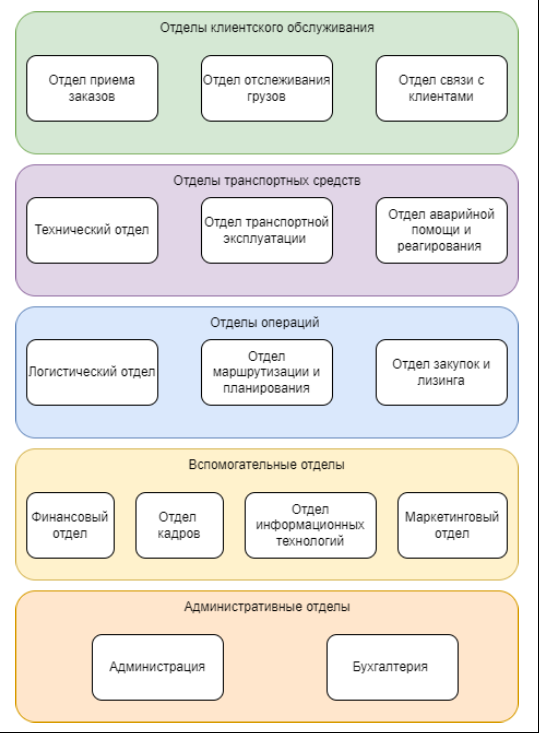

  Рисунок 1.1 – Организационная структура службы перевозки вещей

  Типовой перечень бизнес-процессов службы доставки вещей в привязке к отделам, реализующим данный процесс, представлен в таблице 1.1. Определены основные (ориентированные на оказание услуги, являющейся целевым объектом создания предприятия), вспомогательные (предназначенные для жизнеобеспечения основных), обеспечивающие бизнес-процессы (поддерживающие инфраструктуру компании) и бизнес-процессы управления.

  Таблица 1.1 ‒ Типовой перечень бизнес-процессов риэлторской компании

<table>  <tr><th valign="top">Категория</th><th valign="top">Бизнес-процессы</th><th valign="top">Основной отдел</th></tr>
  <tr><td rowspan="5" valign="top">Основные бизнес-процессы</td><td valign="top">Прием и обработка заказов</td><td valign="top">
Отдел приема заказов

Отдел маршрутизации и планирования 
</td></tr>
  <tr><td valign="top">Планирование и организация перевозок</td><td valign="top">
Отдел маршрутизации и планирования

Логистический отдел

Отдел отслеживания грузов
</td></tr>
  <tr><td valign="top">Оценка груза и согласование стоимости</td><td valign="top">
Отдел связи с клиентами

Отдел приема заказов
</td></tr>
  <tr><td valign="top">Подготовка груза к перевозке</td><td valign="top">Отдел логистики</td></tr>
  <tr><td valign="top">Страхование груза</td><td valign="top">Финансовый отдел</td></tr>
  <tr><td rowspan="6" valign="top">Вспомогательные бизнес-процессы</td><td valign="top">Реклама и маркетинг</td><td valign="top">Маркетинговый отдел</td></tr>
  <tr><td valign="top">Финансовое планирование</td><td valign="top">Финансовый отдел</td></tr>
  <tr><td valign="top">Наем и обучение персонала </td><td valign="top">Отдел кадров</td></tr>
  <tr><td valign="top">Обработка платежей</td><td valign="top">Финансовый отдел</td></tr>
  <tr><td valign="top">Проверка качества оказанных услуг</td><td valign="top">Отдел связи с клиентами</td></tr>
  <tr><td valign="top">Формирование и анализ отчетности</td><td valign="top">Финансовый отдел</td></tr>
  <tr><td rowspan="5" valign="top">Обеспечивающие процессы</td><td valign="top">Закупки и лизинги</td><td valign="top">
Отдел закупок и лизинга

Финансовый отдел
</td></tr>
  <tr><td valign="top">Обеспечение безопасности </td><td valign="top">Отдел аварийной помощи и реагирования</td></tr>
  <tr><td valign="top">Поддержка  ИТ-инфраструктуры</td><td valign="top">Отдел информационных технологий</td></tr>
  <tr><td valign="top">Обработка претензий </td><td valign="top">Отдел связи с клиентами</td></tr>
  <tr><td valign="top">Ремонт и обслуживание транспортных средств </td><td valign="top">
Технический отдел

Отдел транспортной эксплуатации
</td></tr>
  <tr><td rowspan="5" valign="top">Бизнес-процессы управления</td><td valign="top">Управление бюджетом</td><td valign="top">Финансовый отдел</td></tr>
  <tr><td valign="top">Управление транспортом </td><td valign="top">
Отдел логистики

Технический отел
</td></tr>
  <tr><td valign="top">Управление клиентским сервисом </td><td valign="top">Отдел клиентского обслуживания</td></tr>
  <tr><td valign="top">Стратегическое планирование </td><td valign="top">
Администрация

Финансовый отдел

Бухгалтерия

Маркетинговый отдел
</td></tr>
  <tr><td valign="top">Контроль качества</td><td valign="top">Администрация</td></tr>
  <tr><td rowspan="4" valign="top">Бизнес-процессы развития</td><td valign="top">Разработка новых услуг</td><td valign="top">
Маркетинговый отдел

Администрация
</td></tr>
  <tr><td valign="top">Расширение в новые регионы </td><td valign="top">
Отдел логистики

Администрация

Маркетинговый отдел
</td></tr>
  <tr><td valign="top">Повышение квалификации персонала </td><td valign="top">Отдел кадров</td></tr>
  <tr><td valign="top">Внедрение новых технологий</td><td valign="top">Отдел информационных технологий</td></tr>
</table>

  Согласно определенным ранее бизнес-процессам в качестве основного вида деятельности (ОКВЭД) можно определить:

- 49.41 Деятельность автомобильного и грузового транспорта. Эта группировка включает: все виды перевозок грузов автомобильным транспортом по автомобильным дорогам

  В качестве дополнительных видов деятельности (ОКВЭД) для службы перевозки вещей подходят:

- 49.41.2 – перевозка грузов неспециализированными автотранспортными средствами
- 65.12.2 – страхование имущества
- 52.10.1 – деятельность по складированию и хранению грузов
- 52.10.3 – деятельность по грузоперевозкам на внутригородских и пригородных маршрутах
- 53.20.3 – деятельность курьерская
- 63.40.1 – деятельность по организации перевозок
- 74.90.1 – деятельность по предоставлению услуг по сопровождению грузов
- 96.29.1 – деятельность по организации переездов
  ### **1.1.2. Описание существующего предприятия**
  В качестве примера проанализировано предприятие: 

- полное наименование: ОБЩЕСТВО С ОГРАНИЧЕННОЙ ОТВЕТСВЕННОСТЬЮ «УЛЬТРА ПЕРЕЕЗД»;
- сокращенное наименование: ООО «УЛЬТРА ПЕРЕЕЗД»;
- ИНН: 7713487630;
- сайт: https://ultra-pereezd.ru

  Организация предоставляет следующие услуги:

- планирование и организация переезда;
- упаковка и маркировка вещей;
- загрузка и разгрузка грузов;
- транспортировка и доставка;
- распаковка и установка вещей;
- сборка и разборка мебели;
- отключение и подключение бытовой техники о освещения;
- страхование и гарантии на все виды работ.

  Основные данные об организации представлены в таблице 1.2.

  Таблица 1.2 ‒ Значения некоторых общероссийских классификаторов для ООО «УЛЬТРА ПЕРЕЕЗД»

  |Классификатор|Значение|Комментарий|
  | - | - | - |
  |ОКВЭД (Общероссийский классификатор видов экономической деятельности)|
Основной: 49.41

Дополнительные: 43.32, 46.19, 46.90, 47.19, 47.78, 47.99, 49.42, 52.10, 52.21, 52.24, 52.29, 53.20.31, 81.10, 81.21, 81.22, 81.29, 82.92, 95.24.1
|
49\.41 Деятельность автомобильного грузового транспорта

43\.32 – Работы столярные и плотничные

46\.19 – Деятельность агентов по оптовой торговле универсальным ассортиментом товаров

46\.90 – Торговля оптовая неспециализированная

47\.19 – Торговля розничная прочая в неспециализированных магазинах

47\.78 – Торговля розничная прочая в специализированных магазинах

47\.99 – Торговля розничная прочая вне магазинов, палаток, рынков

49\.42 – Предоставление услуг по перевозкам

52\.10 - Деятельность по складированию и хранению

52\.21 – Деятельность вспомогательная, связанная с сухопутным транспортом

52\.24 – Транспортная обработка грузов

52\.29 – Деятельность вспомогательная прочая, связанная с перевозками

53\.20.31 – Деятельность по курьерской доставке различными видами транспорта

81\.10 – Деятельность по комплексному обслуживанию помещений

81\.21 – Деятельность по общей уборке зданий

81\.22 – Деятельность по чистке и уборке жилых зданий и нежилых помещений прочая

81\.29 – Деятельность по чистке и уборке прочая

82\.92 – Деятельность по упаковыванию товаров

95\.24.1 – Ремонт мебели
|
  |ИНН (Идентификационный номер налогоплательщика)|7713487630|
Код ИФНС: 7713

Наименование: Инспекция Федеральной налоговой службы № 13 по  г. Москве

|
  |ОКПО (Общероссийский классификатор предприятий  и организаций)|50990918||
  |ОКАТО (Общероссийский классификатор объектов административно-территориального деления)|45277574000|
45 – Город Москва, столица Российской Федерации, город федерального значения

27 757 – Северный административный округ

45 277 574 – Дмитровский район 
|
  |ОКФС (Общероссийский классификатор форм собственности)|16|Частная собственность|
  |ОКОГУ (Общероссийский классификатор органов государственного управления)|4210014|
Организации, учрежденные юридическими лицами или гражданами, или юридическими лицами и гражданами

совместно
|
  |ОКОПФ|12300|
1 – Организационно-правовые формы юридических лиц, являющихся коммерческими корпоративными организациями

12300 – Общества с ограниченной ответственностью
|
  ## **1.2. Схема информационных потоков**
  Информационные потоки представляют собой передачу данных, знаний и сообщений между различными участниками, системами или организациями в рамках определенного процесса или деятельности. Они являются ключевым элементом в функционировании любой организации или системы и обеспечивают передачу информации внутри и между ее частями. Они являются ключевым элементом при проектировании информационных систем, так как определяют структуру и функциональность всей системы.

  `	`Вот основные характеристики информационных потоков:

- передача информации: информационные потоки отображают передачу данных, сообщений и знаний от одного участника или узла к другому. Эта передача может быть односторонней или двусторонней в зависимости от характера коммуникации;
- форматы и носители: информация может передаваться в различных форматах, включая текстовые сообщения, аудио- и видеозаписи, изображения, документы, таблицы и другие. Она также может передаваться через различные каналы связи, такие как электронная почта, телефонные звонки, чаты, видеоконференции и т. д;
- цели и направления: информационные потоки могут иметь различные цели, такие как передача оперативной информации для принятия решений, обмен знаниями и опытом, координация работы между отделами или участниками процесса, а также контроль и отслеживание выполнения задач;
- автоматизация: с развитием информационных технологий многие информационные потоки могут быть автоматизированы с помощью специализированных систем управления информацией (например, CRM, ERP, системы электронного документооборота и т. д.), что упрощает и ускоряет их обработку и передачу.

  Выделение информационных потоков позволяет:

  ‒	определить требования к системе: информационные потоки помогают определить, какие данные необходимо собирать, обрабатывать и хранить в системе;

  ‒	улучшить понимание системы: выделение информационных потоков помогает понять, как информация перемещается внутри системы, какие операции выполняются над ней и где она хранится;

  ‒	оптимизировать систему: на основе анализа информационных потоков можно определить «узкие места» в системе, определить возможности для улучшения производительности и оптимизации;

  ‒	обеспечить безопасность данных: выделение информационных потоков позволяет определить возможные уязвимости системы и принять меры по их устранению;

  ‒	улучшить взаимодействие между компонентами системы: понимание информационных потоков помогает определить, какая информация требуется для выполнения определенных функций и как эта информация должна быть передана между компонентами;

  ‒	повысить эффективность системы: оптимизация информационных потоков может привести к снижению затрат на обработку, хранение и передачу данных, а также улучшению общей производительности системы.

  В задании на разработку подсистемы для службы перевозки вещей определены следующие объекты:

- таблицы базы данных (сотрудники, клиенты, опись вещей, договоры, отчеты);
- документы (договор на оказание услуг, отчет о перевозке, текущая занятость).

  Согласно данным объектам, можно выделить следующие процессы в схеме информационных потоков подсистемы:

- подписать договор оказания услуг (клиент обращается в службу доставки вещей с тем, что ему надо перевести или доставить; персонал заполняет данные о клиенте, адрес отправки и получения; формируют договор);
- подготовка отчета (сотрудник вносит информацию о показателях в систему, формируется отчет).

  Схема информационных потоков в нотации DFD представлена на рисунке 1.2.

  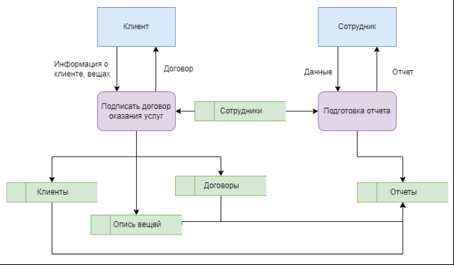

  Рисунок 1.2 – Процессы «Подписать договор», «Подготовка отчета» 
  ## **1.3. Маршруты документов**
  В процессе деятельности организации возникают различные категории документов: внутренние, исходящие, входящие.

  Все документы должны быть зарегистрированы в системе (журнал регистрации документов), при этом у каждого документа появятся дополнительные атрибуты:

1) Внутренние документы:
- номер документа;
- дата создания;
- отдел компании (отдел, к которому относиться документ);
- подпись (сотрудник);
- приоритет.
1) Исходящие документы:
- номер документа;
- дата создания;
- заголовок;
- отправитель (отдел, создавший документ);
- получатель;
- метод доставки;
- подпись.
1) Входящие документы:
- номер документа;
- дата создания;
- отправитель (внешняя организация или физ. лицо);
- заголовок;
- получатель (отдел или сотрудник компании);
- подпись.

  Рассмотрим некоторые документы, которые возникают в деятельности службы доставки вещей.

1) Внутренние документы (составляются, исполняются, храниться в рамках самого предприятия и не выходят за пределы):
1) Составление расписания доставки груза (маршрут документа представлен на рисунке 1.3).

   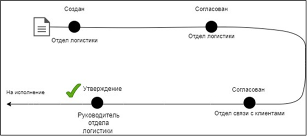

   Рисунок 1.3 – Маршрут документа «Расписание доставки груза»

1) Заявка на закупку транспортного оборудования (маршрут документа представлен на рисунке 1.4).

   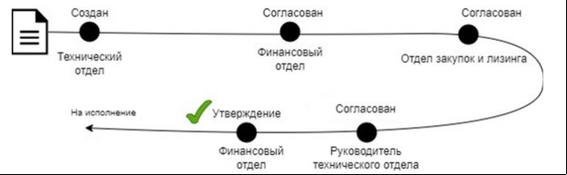

   Рисунок 1.4 – Маршрут документа «Заявка на закупку транспортного оборудования»

1) Исходящие документы (официальные документы, отправляемые из организации):
1) Запрос на страхование груза в страховую компанию (маршрут документа представлен на рисунке 1.5).

   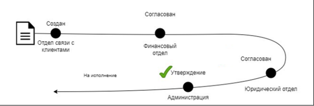

   Рисунок 1.5 – Маршрут документа «Заявка на страхование груза»

1) Входящие документы (документы, поступившие в организацию):
1) Заявка на перевозку груза (маршрут документа представлен на рисунке 1.6).

   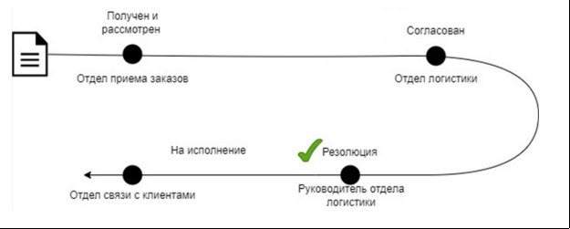

   Рисунок 1.6 – Маршрут документа «Заявка на перевозку груза»

   # **2. Аналитический раздел**
   ## **2.1. Логическая структура базы данных**
   В подсистеме управления документами и рабочими потоками для автоматизации деятельности службы перевозки вещей будут определены следующие объекты:

1) сотрудники: информация о сотрудниках службы перевозки, включая их контактные данные;
1) клиенты: информация о клиентах службы перевозки, включая их контактные данные;
1) договоры: информация о договорах, которые заключаются между клиентом и службой перевозки;
1) отчеты: информация о перевозке;
1) опись вещей: общая информация о вещах, которые необходимо перевести.

   В таблицах 2.1 – 2.5 представлены структуры проектируемых таблиц: сотрудники (employees), клиенты (clients), договоры (contracts), отчеты (reports), опись вещей (things).

   Таблица 2.1 – Таблица «сотрудники» базы данных службы перевозки вещей

   |Название атрибута|Тип атрибута|Описание|
   | :- | :- | :- |
   |id |integer|первичный ключ|
   |name|text|ФИО сотрудника|
   |email|text|адрес электронной почты сотрудника|
   |phone\_number|text|номер телефона сотрудника|
   |position|text|должность сотрудника|
   |department|text|подразделение сотрудника|

   Таблица 2.2 – Таблица «клиенты», базы данных службы перевозки вещей

   |Название атрибута|Тип атрибута|Описание|
   | - | - | - |
   |id |integer|первичный ключ|
   |name|text|ФИО клиента|
   |email|text|адрес электронной почты клиента|
   |phone\_number|text|номер телефона клиента|
   |passport|text|паспортные данные|

   Таблица 2.3 – Таблица «договоры», базы данных службы перевозки вещей

   |Название атрибута|Тип атрибута|Описание|
   | - | - | - |
   |id |integer|первичный ключ|
   |number|text|номер договора|
   |date|text|дата подписания договора|
   |start\_price|integer|первоначальная цена|
   |discount|integer|возможная скидка|
   |deal\_status|blob|статус (выполнен/в процессе)|
   |finish\_price|integer|итоговая цена|
   |address\_start|text|адрес начала|
   |address\_finish|text|адрес начала|
   |things\_id|integer|ключ описи вещей|
   |clients\_id|integer|ключ клиента|
   |employee\_id|integer|ключ сотрудника|

   Таблица 2.4 – Таблица «отчеты», базы данных службы перевозки вещей

   |Название атрибута|Тип атрибута|Описание|
   | - | - | - |
   |id |integer|первичный ключ|
   |number|text|номер отчета|
   |date|text|дата формирования отчета|
   |report\_type |text|тип отчета|
   |description|text|краткое описание отчета|
   |employee\_id|integer|ключ сотрудника|

   Таблица 2.5 – Таблица «опись вещей», базы данных службы перевозки вещей

   |Название атрибута|Тип атрибута|Описание|
   | :- | :- | :- |
   |id|integer|первичный ключ|
   |count|integer|количество вещей|
   |price|float|стоимость вещей|
   |insurance|blob|флаг страхования вещей|
   |weight|integer|вес вещей в килограммах|
   |oversized|blob|флаг негабаритных вещей (да/нет)|
   |client\_id|integer|ключ клиента|

   На рисунке 2.1 представлена ER-диаграмма базы данных службы перевозки вещей структуры проектируемых таблиц. Существуют следующие связи:

- «один-ко-многим»: сотрудники (employees) – договоры (contracts);
- «один-ко-многим»: сотрудники (employees) – отчеты (reports);
- «один-ко-многим»: клиенты (clients) – договоры (contracts);
- «один-к-одному»: договоры (contracts) – опись вещей (things);
- «один-ко-многим»: клиенты (clients) – опись вещей (things).

  Рисунок 2.1 – ER-диаграмма базы данных
  ## **2.2. Проектирование шаблонов документов**
  В задании на разработку подсистемы для службы перевозки вещей, которые возникают в процессах «подписать договор», «подготовка маршрутного листа» и «оформление страхового полиса»:

- договор на оказание услуг (текстовый);
- отчет (текстовый);
- текущая занятость (табличный).
  ### **2.2.1. Текстовый документ «Договор оказания услуг перевозки»**
  Договор оказания услуг перевозки вещей представляет собой соглашение, которое определяет условия и обязательства между заказчиком, требующим перевозки своих вещей, и исполнителем, который предоставляет услуги перевозки. Этот договор регулирует права и обязанности обеих сторон в процессе перевозки груза, включая организацию, оплату, сроки и ответственность за выполнение услуг.

  Как и любое другое соглашение, договор об оказании услуг перевозки должен быть составлен в письменной форме и подписан обеими сторонами или их уполномоченными представителями. Это гарантирует ясность и прозрачность условий соглашения, а также помогает избежать возможных конфликтов и споров в будущем.

  Структура документа состоит из следующих разделов:

1) преамбула – это вводная часть договора, в которой обозначены:
- название договора, номер;
- дата подписания договора;
- место подписания договора;
- наименования сторон договора;
- документ, на основании которого действует сторона (паспорт, доверенность);
- реквизиты документов.
1) предмет договора – это часть договора, в котором обозначены основные действия сторон в отношении определенного объекта:
- описание предоставляемых услуг (грузовые перевозки и погрузо-разгрузочные работы);
- адрес отправления и адрес назначения груза;
- обязательство Заказчика по оплате услуг.
1) права и обязанности сторон:
- права и обязанности Заказчика: обязательство предоставить полную информацию для оказания услуг. Своевременная оплата услуг. Право контролировать выполнение работ;
- права и обязанности Исполнителя: обязательство по перевозке груза и выполнению погрузо-разгрузочных работ.
1) стоимость услуг и порядок расчетов:
- стоимость услуг и порядок их изменения;
- условия и сроки оплаты услуг Заказчиком.
1) ответственность сторон:
- ответственность за неисполнение обязательств;
- штрафные санкции за просрочку оплаты;
- условия освобождения от ответственности (форс-мажор).
1) срок действия договора:
- дата начала действия договора;
- условия продления и расторжения договора;
- порядок одностороннего расторжения договора.
1) реквизиты и подписи сторон:
- реквизиты Исполнителя и Заказчика;
- подписи сторон и печати.

  Примерный шаблон документа представлен в Приложении А, выделены переменные (атрибуты, заполняемые при генерации документа), которые описаны в таблице 2.6.

  Переменные сгруппированы по категориям, что позволяет определить исходную таблицу с данными:

- относящиеся к договору (начинаются с CONTRACT\_);
- относящиеся к клиенту (начинаются с CLIENT\_);
- относящиеся к сотруднику (начинаются с EMPLOYEE\_).

Таблица 2.6 – Переменные документа «Договор оказания услуг перевозки»

<table><tr><th colspan="1" valign="top">Раздел</th><th colspan="1" valign="top">Переменная</th><th colspan="1" valign="top">Описание</th><th colspan="1" valign="top">Пример</th></tr>
<tr><td colspan="1" rowspan="10" valign="top">Преамбула</td><td colspan="1" valign="top">CONTRACT_NUMBER</td><td colspan="1" valign="top">номер договора</td><td colspan="1" valign="top">121</td></tr>
<tr><td colspan="1" valign="top">CONTRACT_DATE</td><td colspan="1" valign="top">Дата подписания</td><td colspan="1" valign="top">«04» апреля 2024 </td></tr>
<tr><td colspan="1" valign="top">CONTRACT_CITY</td><td colspan="1" valign="top">Город подписания</td><td colspan="1" valign="top">Москва</td></tr>
<tr><td colspan="1" valign="top">EMPLOYEE_FULLNAME</td><td colspan="1" valign="top">Представитель компании</td><td colspan="1" valign="top">Иванов Иван Иванович</td></tr>
<tr><td colspan="1" valign="top">EMPLOYEE_ATTORNEY_POWER</td><td colspan="1" valign="top">Основание действия представителя</td><td colspan="1" valign="top">доверенность №8 от «10» января 2022 г.</td></tr>
<tr><td colspan="1" valign="top">CLIENT_FULLNAME</td><td colspan="1" valign="top">ФИО клиента</td><td colspan="1" valign="top">Петров Петр Сергеевич</td></tr>
<tr><td colspan="1" valign="top">CLIENT_BIRTHDATE</td><td colspan="1" valign="top">дата рождения клиента </td><td colspan="1" valign="top">01\.01.1976</td></tr>
<tr><td colspan="1" valign="top">CLIENT_PASSPORT_NUMBER</td><td colspan="1" valign="top">серия и номер паспорта клиента (заказчика)</td><td colspan="1" valign="top">1234 564346</td></tr>
<tr><td colspan="1" valign="top">CLIENT_BIRTHPLACE</td><td colspan="1" valign="top">место рождения клиента </td><td colspan="1" valign="top">г. Москва</td></tr>
<tr><td colspan="1" valign="top">CLIENT_PASSPORT_DEPCODE</td><td colspan="1" valign="top">код подразделения, выдавшего паспорт клиента </td><td colspan="1" valign="top">370-321</td></tr>
<tr><td colspan="1" rowspan="2" valign="top">
Предмет договора

</td><td colspan="1" valign="top">ADDRESS_START</td><td colspan="1" valign="top">адрес загрузки вещей</td><td colspan="1" valign="top">г. Троицк, ул. Полковника милиции Курочкина д.5</td></tr>
<tr><td colspan="1" valign="top">ADDRESS_FINISH</td><td colspan="1" valign="top">адрес выгрузки вещей</td><td colspan="1" valign="top">г. Троицк, микрорайон В д. 2</td></tr>
<tr><td colspan="1" valign="top">Стоимость услуг и порядок расчетов.</td><td colspan="1" valign="top">CONTRACT_SUM</td><td colspan="1" valign="top">цена перевозки груза</td><td colspan="1" valign="top">` `43223</td></tr>
<tr><td colspan="1" rowspan="4" valign="top">Реквизиты и подписи сторон</td><td colspan="1" valign="top">CLIENT_RS</td><td colspan="1" valign="top">Расчетный счет клиента</td><td colspan="1" valign="top"></td></tr>
<tr><td colspan="1" valign="top">CLIENT_FULLNAME</td><td colspan="1" valign="top">ФИО клиента</td><td colspan="1" valign="top">Петров Петр Сергеевич</td></tr>
<tr><td colspan="1" valign="top">CLIENT_BANK</td><td colspan="1" valign="top">банк клиента</td><td colspan="1" valign="top">СБЕРБАНК</td></tr>
<tr><td colspan="1" valign="top">CLIENT_BIK</td><td colspan="1" valign="top">БИК клиента</td><td colspan="1" valign="top">044030786</td></tr>
</table>

### **2.2.2. Текстовый документ «Отчет по компании»**
В отчетные документы попадает агрегированная информация. Агрегированная информация – это обобщённые данные, собранные из разных источников и сгруппированные по определенным критериям. Агрегирование данных происходит путем суммирования, усреднения или группировки данных на разных уровнях иерархии. Это позволяет выявлять закономерности, тенденции и взаимосвязи между различными показателями, что способствует принятию обоснованных решений и прогнозированию результатов.

В отчете по компании может быть представлена следующая информация:

- количество заключенных договоров, соответствующих критерию;
- стоимость каждого заключенного договора;
- сотрудник, который реализовал договор;
- суммарная стоимость по всем реализованным договорам;

  Критериями (параметрами фильтрации) при составлении отчета будет период (дата начала и дата окончания).

  В приложении Б представлен внешний вид отчета по компании с примирением фильтра по периоду, выделены подставленные значения.
  ### **2.2.3 Табличный документ «Текущая занятость»**
  В табличном документе «Текущая занятость» на основе предоставленных таблиц, можно соединить данные из таблиц «сотрудники», «договоры». Этот документ будет содержать информацию о текущей занятости сотрудников, включая их личные данные, информацию о текущих договорах, которые они ведут. Таким образом, каждая позиция будет содержать следующую информацию:

- номер договора;
- дата заключение договора;
- сотрудник;
- финальная цена сделки;
- статус (сделка завершена/ в работе);
- начальный адрес;
- адрес доставки.

  Критериями (параметрами фильтрации) при формировании табличного документа будут:

- период заключения договора (даты начала и окончания);
- статус (сделка завершена/ в работе);
- сотрудник.

  # **3. Технологический раздел**
  ## **3.1. Работа с базой данных**
  В качестве базы данных будет использоваться SQLite. SQLite – это встраиваемая кроссплатформенная реляционная база данных.

  В подсистеме управления документами и рабочими потоками для автоматизации деятельности службы доставки вещей будут определены следующие таблицы: сотрудники, клиенты, опись вещей, договоры, отчеты.

  В таблице 3.1 приведены SQL-запросы для создания таблиц в соответствии с ранее определенной структурой.

  Таблица 3.1 – SQL запросы для создания таблиц

  |Таблица|SQL-запрос|
  | - | - |
  |сотрудники|
CREATE TABLE IF NOT EXISTS 'employees' (

`	`'id\_employee' INTEGER PRIMARY KEY AUTOINCREMENT,

`	`'name' TEXT,

`	`'email' TEXT,

`	`'phone\_number' TEXT,

`	`'position' TEXT,

`	`'department' TEXT

)
|
  |клиенты|
CREATE TABLE IF NOT EXISTS 'clients' (

`	`'id\_client' INTEGER PRIMARY KEY AUTOINCREMENT,

`	`'name' TEXT,

`	`'email' TEXT,

`	`'phone\_number' TEXT,

`	`'passport' TEXT

)

|
  |опись вещей|
CREATE TABLE IF NOT EXISTS 'things' (

`	`'id\_thing' INTEGER PRIMARY KEY AUTOINCREMENT,

`	`'count' INTEGER,

`	`'price' INTEGER,

'insurance' BLOB,

`	`'weight' INTEGER,

`	`'oversized' BLOB,

`	`'client\_id' INTEGER

)
|
  |договоры|
CREATE TABLE IF NOT EXISTS 'contracts' (

`	`'id\_contract' INTEGER PRIMARY KEY AUTOINCREMENT,

`	`'number' TEXT,

`	`'date' TEXT,

`	`'start\_price' INTEGER,

`	`'discount' INTEGER,

`	`'deal\_status' BLOB,

`	`'finish\_price' INTEGER,

`	`'address\_start' TEXT,

`	`'address\_finish' TEXT,

`	`'thing\_id' INTEGER UNIQUE,

`	`'client\_id' INTEGER,

`	`'employee\_id' INTEGER

)
|
  |отчеты|
CREATE TABLE IF NOT EXISTS 'reports' (

`	`'id\_report' INTEGER PRIMARY KEY AUTOINCREMENT,

`	`'number' TEXT,

`	`'date' TEXT,

`	`'report\_type' TEXT,

`	`'description' TEXT,

`	`'employee\_id' INTEGER)
|

  В таблице 3.2 приведены SQL-запросы для добавления данных в созданные ранее таблицы.

  Таблица 3.2 – Добавление данных в таблицы базы данных

  |Таблица|SQL-запрос|
  | - | - |
  |сотрудники|INSERT INTO 'employees' (name, email, phone\_number, position, department) VALUES (?, ?, ?, ?, ?)|
  |клиенты|INSERT INTO 'clients' (name, email, phone\_number, passport) VALUES (?, ?, ?, ?)|
  |опись вещей|INSERT INTO 'things' (count, price, insurance, weight, oversized, client\_id) VALUES (?, ?, ?, ?, ?, ?)|
  |договоры|INSERT INTO 'contracts' (number, date, start\_price, discount, deal\_status, finish\_price, address\_start, address\_finish, thing\_id, client\_id, employee\_id) VALUES (?, ?, ?, ?, ?, ?, ?, ?, ?, ?, ?)|
  |отчеты|INSERT INTO 'reports' (number, date, report\_type, description, employee\_id) VALUES (?, ?, ?, ?, ?)|

  В таблице 3.3 приведены SQL-запросы для выборки, фильтрации данных из ранее созданных таблиц.

  Таблица 3.3 – Выборка данных из базы данных

  |Задача|SQL-запрос|
  | - | - |
  |получение всех договоров|
SELECT \* FROM contracts, things, clients

WHERE contracts.thing\_id = things.id\_thing and contracts.client\_id = clients.id\_client
|
  |получение одного договора|
SELECT \* FROM contracts, things, clients, employees

`    `WHERE contracts.thing\_id = things.id\_thing and contracts.employee\_id = employees.id\_employee and contracts.client\_id = clients.id\_client and contracts.id\_contract = ?
|
  |получение всех клиентов|SELECT \* FROM clients|
  |извлечь элементы из things, не связанные с contracts|SELECT \* FROM things WHERE id\_thing NOT IN (SELECT thing\_id FROM contracts)|
  |получение всех сотрудников|SELECT \* FROM employees|
  |данные о конкретном договоре вместе с информацией о его клиенте и сотруднике|
SELECT \* FROM contracts, clients, employees

WHERE contracts.client\_id = clients.id\_client and 

contracts.employee\_id = employees.id\_employee and

contracts.id\_contract = ?
|
  |обновить данные конкретного договора по идентификатору |
UPDATE contracts

SET number = ?, date = ?, start\_price = ?, discount = ?, deal\_status = ?, finish\_price = ?, address\_start = ?, address\_finish = ?, thing\_id = ?, client\_id = ?, employee\_id = ? WHERE id\_contract = ?
|
  |обновить данные конкретной описи вещей по его идентификатору|
UPDATE things SET count = ?, price = ?, insurance = ?, weight = ?, oversized = ?, client\_id = ? WHERE id\_thing = ?

|
  |получить данные о конкретном клиенте по его идентификатору|SELECT \* FROM clients WHERE id\_client = ?|
  |обновить данные конкретного клиента по его идентификатору|UPDATE clients SET name = ?, phone\_number = ?, email = ?, passport = ? WHERE id\_client = ?|
  |получить данные о конкретном сотруднике по его идентификатору|SELECT \* FROM employees WHERE id\_employee = ?|
  |обновить данные конкретного сотрудника по его идентификатору|UPDATE employees SET name = ?, position = ?, phone\_number = ?, email = ?, department = ? WHERE id\_employee = ?|
  |Извлечь данные о контрактах с возможностью фильтрации по дате начала, дате окончания, статусу сделки и идентификатору сотрудника, включая имя сотрудника и дополнительную информацию о контракте|
SELECT 

`                    `contracts.number,

`                    `contracts.date,

`                    `employees.name,

`                    `contracts.finish\_price,

`                    `CASE contracts.deal\_status

`                        `WHEN 1 THEN 'Сделка завершена'

`                        `ELSE 'В работе'

`                    `END as status,

`                    `contracts.address\_start,

`                    `contracts.address\_finish

`                `FROM contracts

`                `LEFT JOIN employees ON contracts.employee\_id = employees.id\_employee

`                `WHERE (? IS NULL OR contracts.date >= ?)

`                `AND (? IS NULL OR contracts.date <= ?)

`                `AND (? = 'all' OR contracts.deal\_status = ?)

`                `AND (? = 'all' OR contracts.employee\_id = ?)
|
  |получить все записи из таблицы отчеты|SELECT \* FROM reports|
  |извлечь данные о конкретном отчете из таблицы отчеты, включая имя сотрудника, который его создал|
SELECT r.\*, e.name as employee\_name

`        `FROM reports r

`        `LEFT JOIN employees e ON r.employee\_id = e.id\_employee

`        `WHERE r.id\_report = ?
|
  |обновить данные конкретного отчета по его идентификатору|
UPDATE reports SET number = ?, date = ?, report\_type = ?, description = ?, employee\_id = ? WHERE id\_report = ?

|
  |выбор данных контракта в указанном диапазоне |
`        `SELECT number, date, address\_start, address\_finish, finish\_price, employee\_id

`        `FROM contracts

`        `WHERE date BETWEEN ? AND ?
|

  ## **3.2. Работа веб-приложения**
  ### **3.2.1. Отображение данных**
  Для отображения данных были созданы следующие html-страницы (таблица 3.4), реализованы следующие функции-обработчики (таблица 3.5). 

  Таблица 3.4 – Реализованные шаблоны для отображения данных

  |Шаблон|Отображение|
  | - | - |
  |base.html|базовый шаблон с реализацией навигационного меню|
  |client.html|страница-карточка клиента с переходом на страницу редактирования|
  |clients.html|страница-список с отображением всех клиентов со ссылками на конкретных клиентов|
  |contract.html|страница-карточка договора с переходом на страницу описи вещей, клиента, отправки email, скачивания договора с засолением данных, страницу редактирования|
  |contracts.html|страница-список с отображением всех договоров со ссылками на конкретные договоры|
  |employee.html|страница-карточка сотрудника с переходом на страницу редактирования|
  |employees.html|страница-список с отображением всех сотрудников со ссылками на конкретных сотрудников, с переходом на страницу для скачивания текущей занятости|
  |report.html|страница-карточка отчета с переходом на страницу редактирования, настройкой фильтров и скачивания отчета|
  |reports.html|страница-список с отображением всех отчетов со ссылками на конкретные отчеты|
  |thing.html|страница-карточка описи вещей с переходом к договору, станице редактирования описи|
  |things.html|страница-список с отображением всех описей со ссылками на конкретные описи|

  Таблица 3.5 – Реализованные функции для отображения данных

  |Маршрут|Функция|Описание|
  | - | - | - |
  |/|index|перенаправление на /contracts|
  |/contracts|contracts|отображение страницы contracts.html|
  |/contract/<int:contract\_id>|contrac|отображение страницы contract.html|
  |/things|things|отображение страницы things.html|
  |/thing/<int:thing\_id>|thing|отображение страницы thing.html|
  |/clients|clients|отображение страницы clients.html|
  |/client/<int:client\_id>|client|отображение страницы client.html|
  |/employees|employees|отображение страницы employees.html|
  |/employee/<int:employee\_id>|employee|отображение страницы employee.html|
  |/reports|reports|отображение страницы reports.html|
  |/report/<int:report\_id>|report|
отображение страницы

report.html
|

  На рисунках 3.1 – 3.5 представлены страницы-списки для отображения объектов БД.

  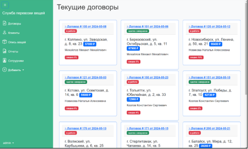

  Рисунок 3.1 – Страница-список «договоры»

  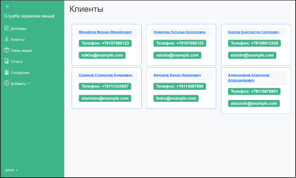

  Рисунок 3.2 – Страница-список «клиенты»

  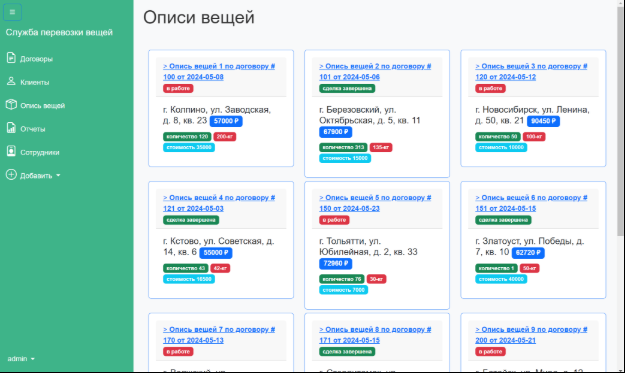

  Рисунок 3.3 – Страница-список «описи вещей»

  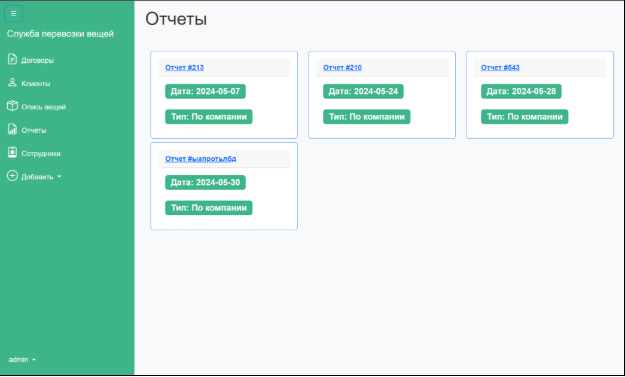

  Рисунок 3.4 – Страница-список «отчеты»

  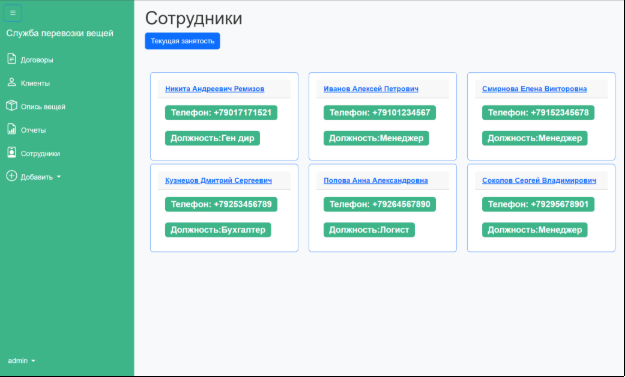

  Рисунок 3.5 – Страница-список «сотрудники»

  На рисунках 3.6 – 3.10 показаны страницы карточки для всех объектов БД.

  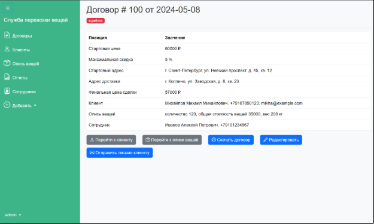

  Рисунок 3.6 – Страница-карточка договора

  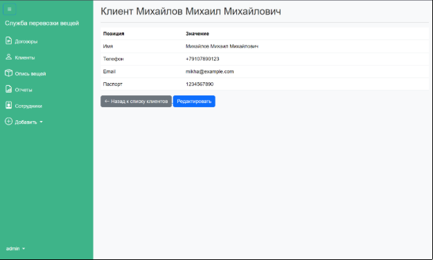

  Рисунок 3.7 – Страница-карточка клиента

  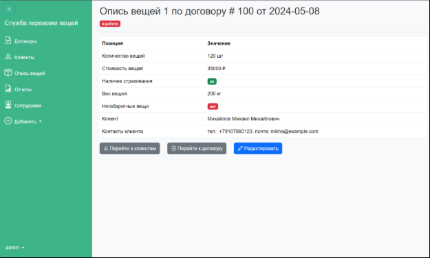

  Рисунок 3.8 – Страница-карточка описи вещей

  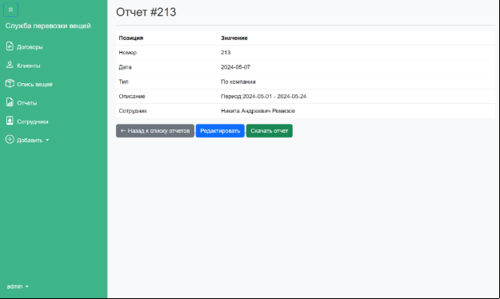

  Рисунок 3.9 – Страница-карточка отчета

  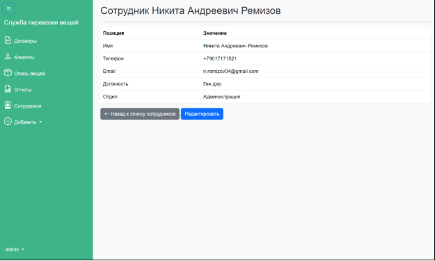

  Рисунок 3.10 – Страница-карточка сотрудника
  ### **3.2.2. Добавление данных**
  Для добавления данных были созданы следующие html-страницы (таблица 3.6), реализованы следующие функции-обработчики (таблица 3.7). 

  Таблица 3.6 – Реализованные шаблоны для добавления данных

  |Шаблон|Отображение|
  | - | - |
  |new\_client.html|страница для формы ввода и добавления нового клиента|
  |new\_contract.html|страница для формы ввода и добавления нового договора|
  |new\_employee.html|страница для формы ввода и добавления нового сотрудника|
  |new\_report.html|страница для формы ввода и добавления нового отчета|
  |new\_thing.html|страница для формы ввода и добавления новой описи вещей|

  Таблица 3.7 – Реализованные функции для отображения данных

  |Маршрут|Функция|Описание|
  | - | - | - |
  |/new\_contract|new\_contract|отображение страницы new\_contract.html с формой ввода|
  |/new\_contract POST|new\_contract|проверка полей, отображение сообщения при ошибочных значениях, добавление нового значения в таблицу contracts базы данных, отображение страницы contract.html|
  |/new\_thing|new\_thing|отображение страницы new\_thing.html с формой ввода|
  |/new\_thing POST|new\_thing|проверка полей, отображение сообщения при ошибочных значениях, добавление нового значения в таблицу things базы данных, отображение страницы new\_thing.html|
  |/new\_employee|new\_employee|отображение страницы new\_employee.html c формой ввода|
  |/new\_employee POST|new\_employee|проверка полей, отображение сообщения при ошибочных значениях, добавление нового значения в таблицу employees базы данных, отображение страницы employee.html|
  |/new\_report|new\_report|
отображение страницы

new\_report.html с формой ввода 
|
  |/new\_report POST|new\_report|проверка полей, отображение сообщения при ошибочных значениях, добавление нового значения в таблицу reports базы данных, отображение страницы new\_report.html|
  |/new\_client|new\_client|отображение страницы new\_client.html с формой ввода|
  |/new\_client POST|new\_client|проверка полей, отображение сообщения при ошибочных значениях, добавление нового значения в таблицу clients базы данных, отображение страницы clients.html|

  На рисунках 3.11 – 3.15 показаны страницы добавления всех объектов БД.

  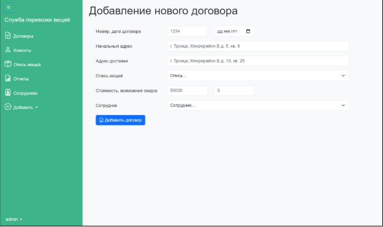

  Рисунок 3.11 – Страница с формой ввода нового договора

  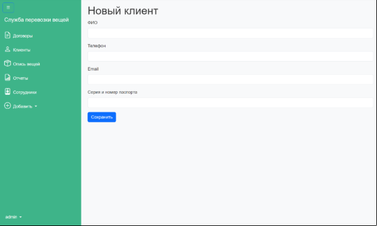

  Рисунок 3.12 – Страница с формой ввода нового клиента

  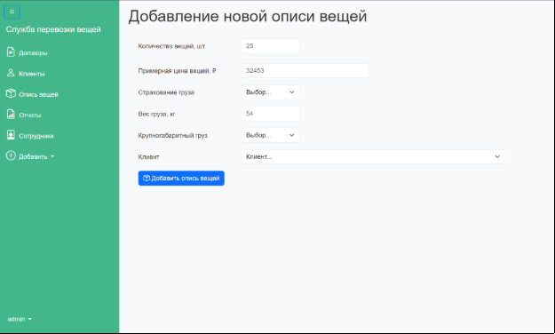

  Рисунок 3.13 – Страница с формой ввода новой описи вещей

  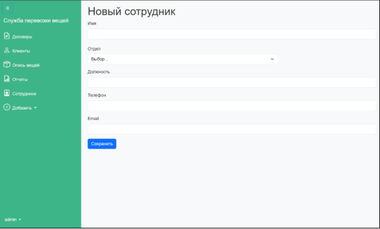

  Рисунок 3.14 – Страница с формой ввода нового сотрудника

  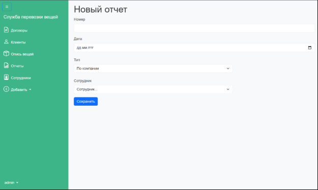

  Рисунок 3.15 – Страница с формой ввода нового отчета
  ### **3.2.3. Генерация текстового документа «Договор оказания услуг перевозки»**
  Для генерации текстового документа «Договор оказания услуг перевозки» была создана html-страница generate\_contract.html с формой ввода переменных в шаблон документа. При этом часть переменных хранятся в таблицах базы данных (contracts, clients, employees), а часть вводится только при формировании текстового документа. Реализован следующий сценарий работы приложения:

- если документ уже сформирован (файл хранится в системе), из карточки договора скачивается файл с названием «договор №[НОМЕР] от [ДАТА].docx»;
- если документ не сформирован открывается форма заполнения;
- после заполнения формы генерируется документ по шаблону в соответствии с веденными данными, открывается карточка договора.

  Реализованы следующие функции-обработчики (таблица 3.8).

  Таблица 3.8 – Реализованные функции для генерации документа договора

  |Маршрут|Функция|Описание|
  | - | - | - |
  |/generate\_contract|generate\_contract|отображение страницы generate\_contract.html c формой ввода, если документ отсутствует; скачивание документа, если он существует|
  |/generate\_contract POST|generate\_contract|вызов функции создания документа|
  |-|create\_contract|создание документа по шаблону в соответствии с переданными параметрами|
  |-|replace\_text|заполнение параграфов|

  На рисунке 3.16 представлена форма заполнения параметра документа в приложении.

  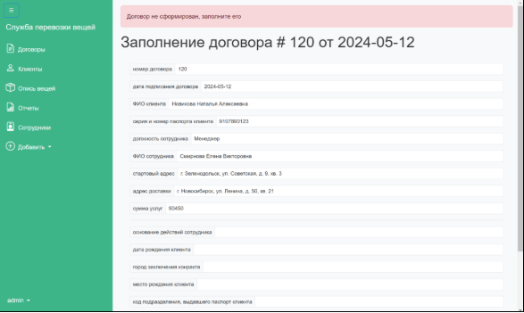

  Рисунок 3.16 – Форма заполнения документа

  Образец сформированного в системе документа договора представлена на рисунке 3.17.

  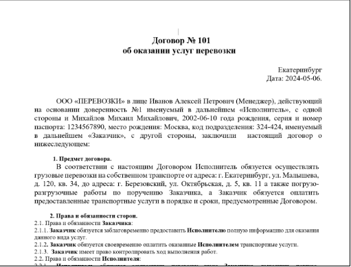

  Рисунок 3.17 – Образец сформированного в системе договора
  ### **3.2.4. Генерация «Отчета по компании» с настаиваемыми фильтрами.**
  Для генерации текстового документа отчета «Отчет по компании» была создана html-страница select\_period.html с настраиваемыми фильтрами. При этом часть переменных хранятся в таблицах базы данных (contracts, employees). Реализован следующий сценарий работы приложения:

- если отчет уже сформирован (файл хранится в системе), из карточки договора скачивается файл с названием «generated\_report\_company\_[НОМЕР]»;
- если отчет не сформирован, откроется форма для настройки фильтров;
- после заполнения формы генерируется отчет по шаблону в соответствии с введенными выставленными фильтрами.

Реализованы следующие функции-обработчики (таблица 3.9).

Таблицы 3.9 – Реализованные функции для генерации отчета

|Маршрут|Функция|Описание|
| - | - | - |
|
/download\_report/

<int:report\_id>
|download\_report|страница select\_period.html с настройкой фильтров, для составления отчета |
|
/download\_report/

<int:report\_id> POST
|download\_report|вызов функции создания отчета|
|-|generate\_company\_report|функция генерации отчета по фильтрам|

На рисунке 3.18 представлена форма выставления параметров фильтрации для генерации отчета.

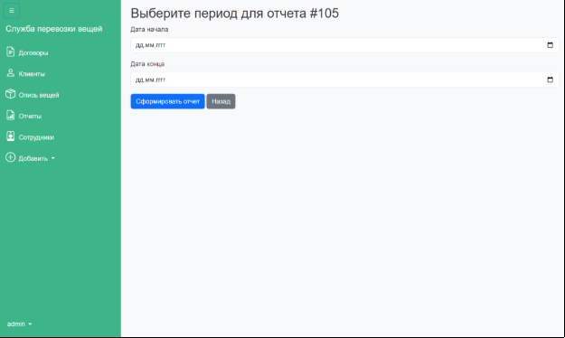

Рисунок 3.18 – Параметры фильтрации для заполнения отчета

Образец сформированного отчета в системе представлен на рисунке 3.19.

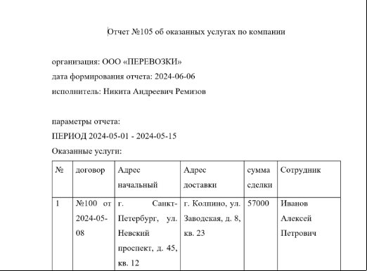

Рисунок 3.19 – Сформированный отчет
### **3.2.5. Генерация табличного документа «Текущая занятость»**
Для генерации текстового документа отчета «Отчет по компании» была создана html-страница current\_occupancy\_filters.html с настраиваемыми фильтрами. При этом часть переменных хранятся в таблицах базы данных (contracts, employees). Реализован следующий сценарий работы приложения:

- открывается форма для настройки параметров фильтрации;
- скачивание документа.

Реализованы следующие функции-обработчики (таблица 3.10).

Таблица 3.10 – Реализованные функции для генерации табличного документа

|Маршрут|Функция|Описание|
| - | - | - |
|/current\_occupancy\_filters|current\_occupancy\_filters|отображение страницы current\_occupancy\_filters.html с настройкой фильтров, для составления табличного документа.|
|/generate\_report POST|generate\_report|генерация отчета по фильтрам|

На рисунке 3.20 представлена форма выставления параметров фильтрации для генерации табличного документа.

Образец сформированного табличного документа в системе представлен на рисунке 3.21.

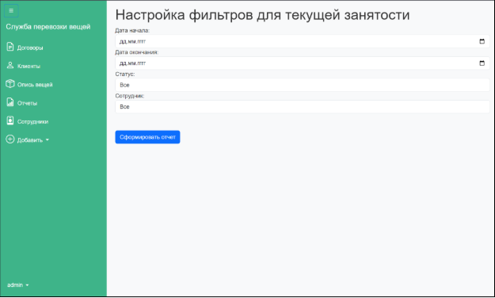

Рисунок 3.20 – Форма выставления параметров фильтрации для генерации табличного документа

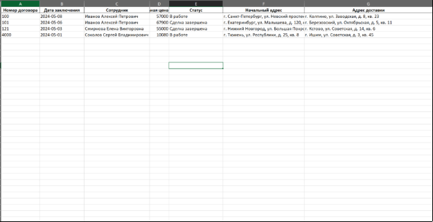

Рисунок 3.21 – Образец сформированного табличного документа
### **3.2.6. Редактирование данных**
Для редактирования данных были созданы следующие html-страницы (таблица 3.11), реализованы следующие функции-обработчики (таблица 3.12).

Таблицы 3.11 – Реализованные страницы для редактирования данных

|Шаблон|Отображение|
| - | - |
|edit\_client.html|страница для редактирования информации об определенном клиенте|
|edit\_contract.html|страница для редактирования информации об определенном договоре|
|edit\_employee.html|страница для редактирования информации об определенном сотруднике|
|edit\_report.html|страница для редактирования определенного отчёта|
|edit\_things.html|страница для редактирования определенной описи вещей|

Таблица 3.12 – Реализованные функции для отображения данных

|Маршрут|Функция|Описание|
| - | - | - |
|/edit\_contract/<int:contract\_id>|edit\_contract|отображение страницы edit\_contract.html с формой ввода|
|/edit\_contract/<int:contract\_id> POST|edit\_contract|изменение значении определенного объекта БД таблицы contracts|
|/edit\_thing/<int:thing\_id>|edit\_thing|отображение страницы edit\_thing.html с формой ввода|
|/edit\_thing/<int:thing\_id> POST|edit\_thing|изменение значении определенного объекта БД таблицы things|
|/edit\_client/<int:client\_id>|edit\_client|отображение страницы edit\_client.html с формой ввода|
|/edit\_client/<int:client\_id> POST|edit\_client|изменение значении определенного объекта БД таблицы clients|
|/edit\_employee/<int:employee\_id>|edit\_employee|отображение страницы edit\_employee.html с формой ввода |
|/edit\_employee/<int:employee\_id> POST|edit\_employee|изменение значении определенного объекта БД таблицы employees |
|/edit\_report/<int:report\_id>|edit\_report|
отображение страницы

edit\_report.html с формой ввода
|
|/edit\_report/<int:report\_id> POST|edit\_report|изменение значении определенного объекта БД таблицы reports |

На рисунках 3.22 – 3.26 представлена формы редактирования всех объектов БД.

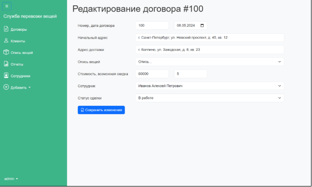

Рисунок 3.22 – Форма для редактирования договора

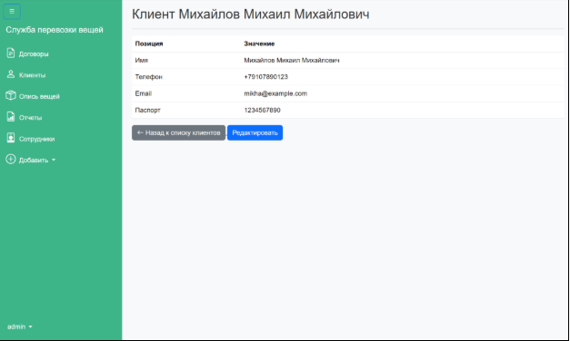

Рисунок 3.23 – Форма для редактирования клиента

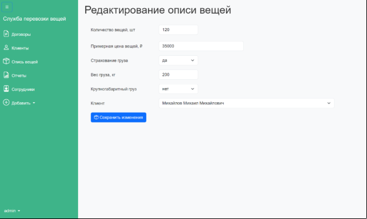

Рисунок 3.24 – Форма для редактирования описи вещей

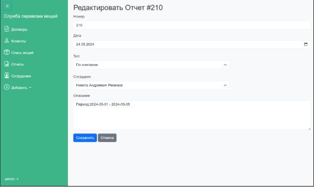

Рисунок 3.25 – Форма для редактирования отчета

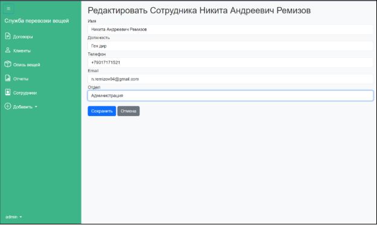

Рисунок 3.26 – Форма для редактирования сотрудника
### **3.2.7. Отправка электронного письма**
Для отправки электронного письма была создана html-страница send\_email.html. При переходе на страницу автоматически вставляется почта клиента и генерируется текст письма в таком формате: «Уважаемый [ФИО клиента], ваш договор №[НОМЕР] находится в статусе [СТАТУС]».

Реализованы следующие функции-обработчики для отправки электронного письма (таблица 3.13).

Таблица 3.13 – Реализованные функции для отправки электронного письма 

|Маршрут|Функция|Описание|
| - | - | - |
|/send\_email/<int:contract\_id>|send\_email|отображение страницы send\_email.html с формой ввода|
|/send\_email/<int:contract\_id> POST|send\_email|вызов функции для отправки письма|
|-|send\_email\_to\_client|функция отправки электронного письма|

На рисунке 3.27 показана форма для отправки письма.

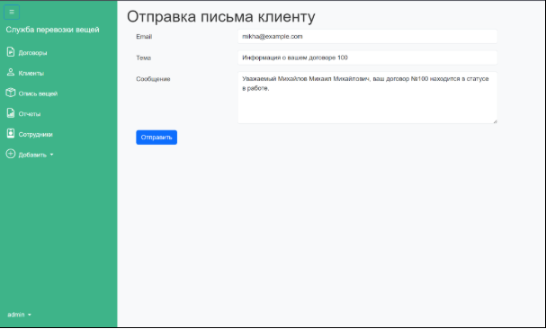

Рисунок 3.27 – Форма отправки письма
### **3.2.8. Корректная аутентификация и ограничение доступа к просмотру** 
Для корректной аутентификации и ограничения доступа к просмотру была создана html-страница login.html. Реализован следующий сценарий работы:

- если пользователь авторизуется под ролью admin, то ему доступны все функции приложения;
- если пользователь авторизуется под ролью user, то ему доступны только страницы «договоры» и «опись вещей».

Реализованы следующие функции-обработчики (таблица 3.14).

Таблица 3.14 – Реализованные функции для авторизации

|Маршрут|Функция|Описание|
| - | - | - |
|/login|login|отображение страницы login.html|
|/login POST|login|проверка логина и пароля, выдача ролей |
|-|admin\_required|декоратор для доступа на основе ролей|

На рисунке 3.28 показана форма для авторизации пользователя.

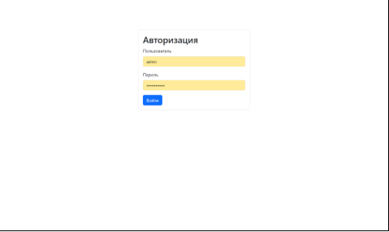

Рисунок 3.28 – Форма авторизации пользователя

На рисунке 3.29 показано ограничение права доступа, при попытке зайти на страницу отчеты.

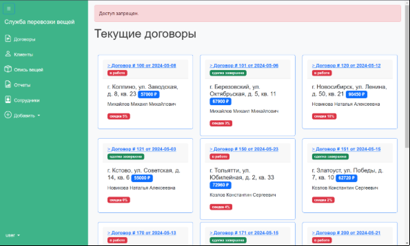

Рисунок 3.29 – Ограничение права доступа

# **Заключение**
В ходе выполнения курсовой работы была успешно разработана подсистема управления документами и рабочими потоками для службы перевозки вещей, что позволило значительно повысить эффективность и автоматизацию бизнес-процессов компании. На основе детального исследования предметной области и анализа текущих систем, была спроектирована и реализована база данных, включающая ключевую информацию о сотрудниках, клиентах, договорах и отчетах.

Созданное веб-приложение обеспечило пользователям широкий спектр функциональных возможностей, включая добавление, редактирование и отображение данных, а также автоматическую генерацию текстовых и табличных документов. Дополнительно, были внедрены механизмы аутентификации и защиты данных, что гарантирует безопасность и конфиденциальность информации.

Внедрение данной системы может привести к существенной оптимизации процессов управления документами и рабочими потоками, что, в свою очередь, может сократить временные затраты на обработку данных, но и увеличить производительность компании.  
**

# **Приложение А**
**Шаблон договора оказания услуг перевозки**

Договор № ==CONTRACT\_NUMBER==

об оказании услуг перевозки

`					                       `**=**=CONTRACT\_CITY==

Дата: ==CONTRACT\_DATE==.**  

`	`ООО «ПЕРЕВОЗКИ» в лице ==EMPLOYEE\_FULLNAME== (==EMPLOYEE\_POSITION==), действующий на основании ==EMPLOYEE\_ATTORNEY\_POWER== именуемый в дальнейшем **«Исполнитель»,** с одной стороны и ==CLIENT\_FULLNAME==, ==CLIENT\_BIRTHDATE== года рождения, серия и номер паспорта: ==CLIENT\_PASSPORT\_NUMBER==, место рождения: ==CLIENT\_BIRTHPLACE==, код подразделения: ==CLIENT\_PASSPORT\_DEPCODE==, именуемый в дальнейшем **«Заказчик»**, с другой стороны, заключили  настоящий договор о нижеследующем:

`            `**1. Предмет договора.**

`	`В соответствии с настоящим Договором **Исполнитель** обязуется осуществлять грузовые перевозки на собственном транспорте от адреса: ==ADDRESS\_START==, до адреса: ==ADDRESS\_FINISH== а также погрузо-разгрузочные работы по поручению **Заказчика**, а **Заказчик** обязуется оплатить предоставленные транспортные услуги в порядке и сроки, предусмотренные Договором.

`          `**2. Права и обязанности сторон.**

2\.1. Права и обязанности **Заказчика**:

2\.1.1. **Заказчик** обязуется заблаговременно предоставить **Исполнителю** полную информацию для оказания данного вида услуг.

2\.1.2**. Заказчик** обязуется своевременно оплатить оказанные **Исполнителем** транспортные услуги.

2\.1.3.  **Заказчик** имеет право контролировать ход выполнения работ.

2\.2**.** Права и обязанности **Исполнителя**:

1. **Исполнитель** обязуется осуществить перевозку груза **Заказчика**, выполнить погрузо-разгрузочные работы. 

`          `**3.Стоимость услуг и порядок расчетов.**

3\.1. Стоимость услуг по настоящему Договору** составляет **==**CONTRACT\_SUM== рублей **(без налога НДС).**

3\.2. Расчет за оказанные услуги осуществляется на основании действующего Договора, при этом **Исполнитель** оставляет за собой право на изменение стоимости услуг, в зависимости от изменения цен на рынке транспортных услуг. Новый тарифный план предоставляется **Заказчику** в уведомительном порядке.

3\.3.  Оплата услуг **Заказчиком Исполнителю** производится до/в процессе/после окончания выполнения работ.

`          `**4.Ответственность сторон.**

4\.1. За неисполнение или ненадлежащее исполнение обязательств по настоящему Договору Стороны несут ответственность в соответствии с законодательством Российской Федерации.

4\.2. **Заказчик** несет ответственность за несвоевременную оплату оказанных **Исполнителем** услуг в размере **1%** за каждый день просрочки. 

4\.3. Стороны освобождаются от ответственности за частичное или полное невыполнение своих обязательств по настоящему Договору, если оно является следствием обстоятельств непреодолимой силы. Срок исполнения договорных обязательств автоматически пролонгируется на период действия этих обстоятельств. По окончании действия обстоятельств непреодолимой силы стороны восстанавливают отношения до полного выполнения своих обязательств по настоящему Договору. 

4\.4. Сторона, для которой создалась невозможность выполнения обязательств по Договору, обязана немедленно известить другую сторону о наступлении или прекращении вышеуказанных обязательств. Несвоевременное извещение об обстоятельствах непреодолимой силы лишает соответствующую сторону права считать их причиной невыполнения условий настоящего Договора.

`          `**5.Срок действия договора.**

5\.1. Договор действует с момента подписания до момента окончания работ, оплаты счета и подписания сторонами акта выполненных работ.

5\.2. Если ни одна из сторон не расторгла договор до истечения срока действия, договор пролонгируется.

5\.3. **Заказчик** в праве расторгнуть договор в одностороннем порядке после завершения всех расчетов с **Исполнителем**.

5\.4. **Исполнитель** в праве расторгнуть договор в одностороннем порядке в случае несвоевременной оплаты **Заказчиком** оказанных услуг.

5\.5. **Исполнитель** в праве расторгнуть договор в одностороннем порядке с уведомлением **Заказчика** за **10 (десять)** суток.

`          `**6. Реквизиты и подписи сторон.**

**Исполнитель:**                                                           

**ООО «ПЕРЕВОЗКИ»**				                          

ИНН: 782570148860			

КПП : 771301001			

Расчетный счет: 40802810332410001244	

Название Банка: АЛЬФА-БАНК                                                              \_\_\_\_\_\_\_\_\_\_\_\_\_\_\_\_\_\_\_\_\_\_\_\_

Кор.счет: 30101810600000000786                                                                            подпись

БИК банка: 044030786

**Заказчик:**

ФИО: ==CLIENT\_FULLNAME==

РС: ==CLIENT\_RS==

Банк: ==CLIENT\_BANK==                                                                    

БИК: ==CLIENT\_BIK==                                                                                           

**								           \_\_\_\_\_\_\_\_\_\_\_\_\_\_\_\_\_\_\_\_

`                                                                                                                    `подпись

# **Приложение Б**
**Пример отчета по компании** 

Отчет №213 об оказанных услугах по компании

организация: ООО «ПЕРЕВОЗКИ»

дата формирования отчета: 2024-05-07

исполнитель: Никита Андреевич Ремизов

параметры отчета:

ПЕРИОД 2024-05-01 - 2024-05-24

Оказанные услуги:

|№|договор|Адрес начальный |Адрес доставки|сумма сделки|Сотрудник|
| - | - | - | - | - | - |
|1|№100 от 2024-05-08|г. Санкт-Петербург, ул. Невский проспект, д. 45, кв. 12|г. Колпино, ул. Заводская, д. 8, кв. 23|57000|Иванов Алексей Петрович|
|2|№101 от 2024-05-06|г. Екатеринбург, ул. Малышева, д. 120, кв. 34|г. Березовский, ул. Октябрьская, д. 5, кв. 11|67900|Иванов Алексей Петрович|
|3|№120 от 2024-05-12|г. Зеленодольск, ул. Советская, д. 9, кв. 3|г. Новосибирск, ул. Ленина, д. 50, кв. 21|90450|Смирнова Елена Викторовна|
|4|№121 от 2024-05-03|г. Нижний Новгород, ул. Большая Покровская, д. 30, кв. 45|г. Кстово, ул. Советская, д. 14, кв. 6|55000|Смирнова Елена Викторовна|
|5|№150 от 2024-05-23|г. Самара, ул. Ленинградская, д. 5, кв. 22|г. Тольятти, ул. Юбилейная, д. 2, кв. 33|72960|Кузнецов Дмитрий Сергеевич|
|6|№151 от 2024-05-15|г. Челябинск, ул. Кирова, д. 55, кв. 11|г. Златоуст, ул. Победы, д. 7, кв. 10|62720|Кузнецов Дмитрий Сергеевич|
|7|№170 от 2024-05-13|г. Волгоград, ул. Аллея Героев, д. 23, кв. 9|г. Волжский, ул. Карбышева, д. 6, кв. 25|17000|Попова Анна Александровна|
|8|№171 от 2024-05-15|г. Уфа, ул. Ленина, д. 12, кв. 37|г. Стерлитамак, ул. Чапаева, д. 14, кв. 5|15000|Попова Анна Александровна|
|9|№200 от 2024-05-21|г. Ростов-на-Дону, ул. Пушкинская, д. 45, кв. 7|г. Батайск, ул. Мира, д. 12, кв. 25|28200|Соколов Сергей Владимирович|
|10|№201 от 2024-05-12|г. Воронеж, ул. Плехановская, д. 42, кв. 26|г. Нововоронеж, ул. Энергетиков, д. 5, кв. 18|11760|Соколов Сергей Владимирович|

итоги:

|№|Итог|Параметр|
| - | - | - |
|1|10|общее количество|
|2|477990|суммарная стоимость сделок|

2
